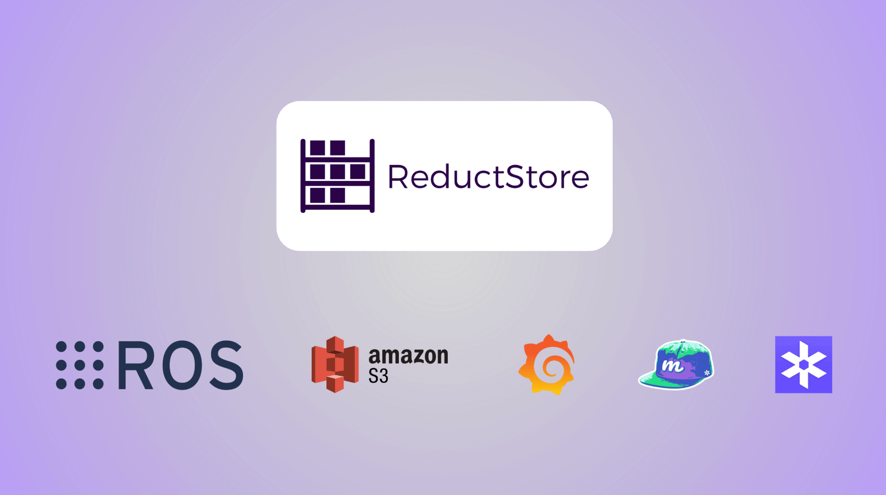
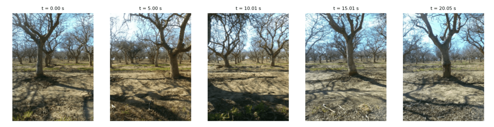
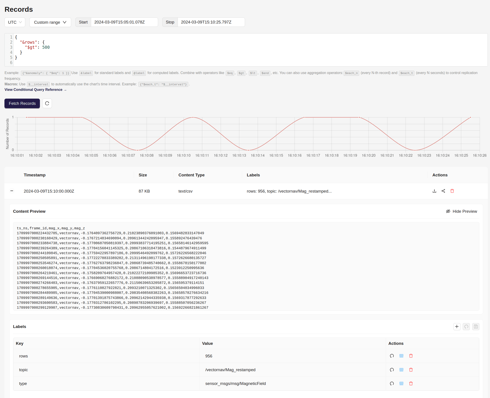
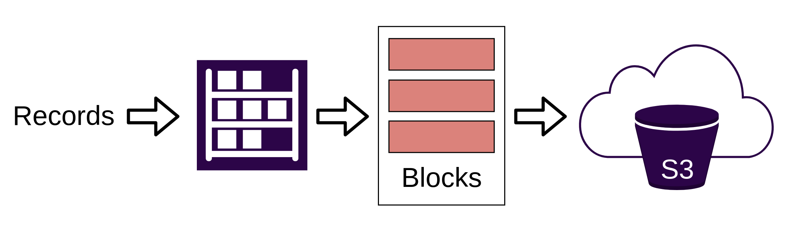
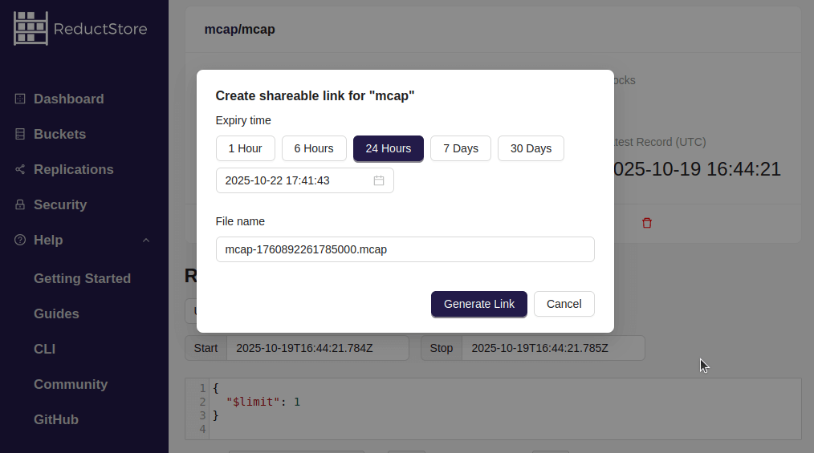
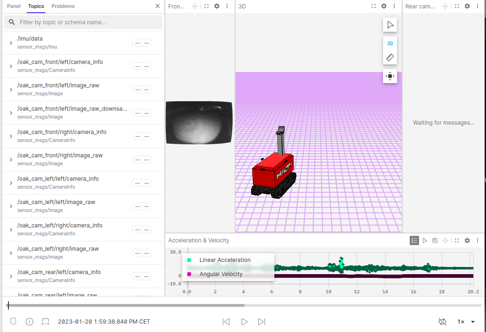
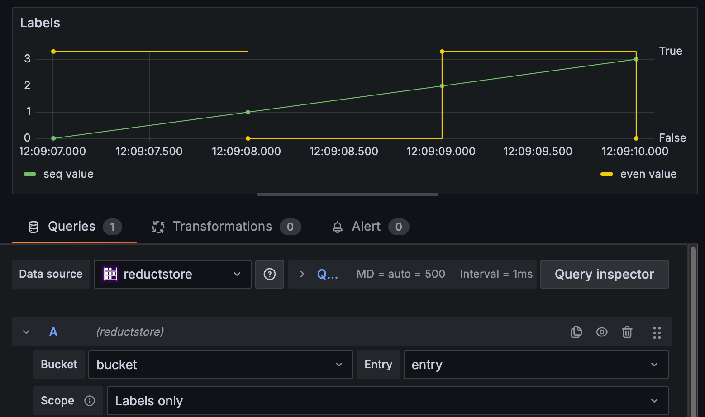
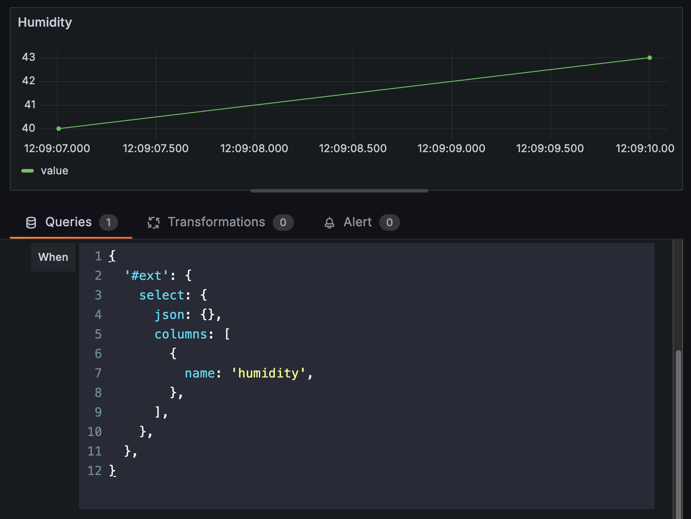
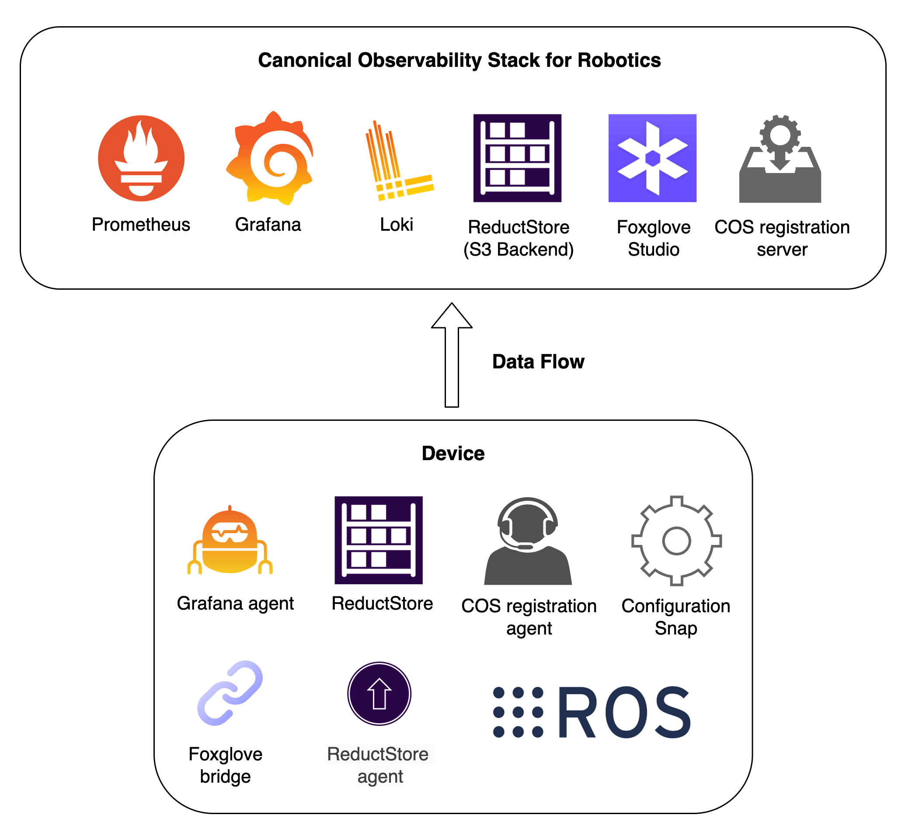
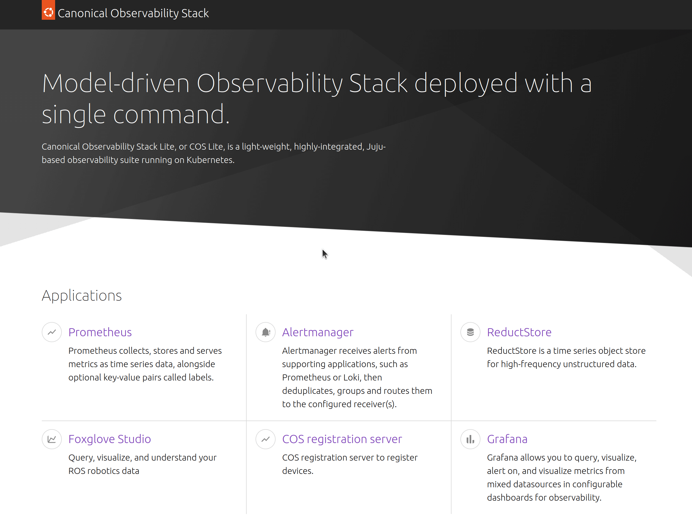

Robotics teams today wrestle with data that grows faster than their infrastructure. Every robot generates streams of images, sensor readings, logs, and events in different formats. These data piles are fragmented, expensive to move, and slow to analyze. Teams often rely on generic cloud tools that are not built for robotics. They charge way too much per gigabyte (when it should cost little per terabyte), hide the raw data behind proprietary APIs, and make it hard for robots (and developers) to access or use their own data.

ReductStore introduces a new category: a database purpose built for robotics data pipelines. It is open, efficient, and developer friendly. It lets teams store, query, and manage any time series of unstructured data directly from robots to the cloud.

{/* truncate */}

## What Makes It a New Category

ReductStore treats robotics with the respect it deserves. It captures everything in its raw form and stores it with a time index and labels for flexible querying and management. It ingests and streams any type of data (images, sensor frames, logs, MCAP files, CSVs, JSON, etc) without forcing developers to convert or reformat it.

It works on robots and in the cloud using the same interface and SDKs (Python, C++, Rust, Javascript, Go). This means developers can build data pipelines that run the same way on robots or in the cloud without needing to change code or learn new tools.

Developers can run ReductStore on an edge device for local data capture and replicate to a cloud instance (with S3 backend) for cloud analytics or archiving.

> It is the first and only database designed specifically for unstructured, time series robotics data.

## Data Handling and Querying

Developers can work directly with data using simple queries and SDKs. The focus is speed and flexibility.

### 1. MCAP topic filtering

You can filter topics directly from multiple MCAP files stored in ReductStore without needing to download and reprocess everything locally.

```python
import json
import pandas as pd
from reduct import Client

# Extract only the IMU topic from MCAP files
ext = {
    "ros": {"extract": {"topic": "/imu/data"}},
}

async with Client("https://test.reduct.store") as client:
    bucket = await client.get_bucket("my-robotics-data")
    parts = []
    async for rec in bucket.query("mcap-entry", ext=ext):
        blob = await rec.read_all()
        data = json.loads(blob.decode("utf-8"))
        rows = [
            {
                "ts": data["header"]["stamp"]["sec"] * 1_000_000_000
                + data["header"]["stamp"]["nanosec"],
                "linear_acceleration_x": data["linear_acceleration"]["x"],
                "linear_acceleration_y": data["linear_acceleration"]["y"],
                "linear_acceleration_z": data["linear_acceleration"]["z"],
            }
        ]
```

This allows you to extract only the relevant topics from multiple bags. In this example, we extract only the IMU topic as a stream of JSON records, which would look like this:

| ts            | linear_acceleration_x | linear_acceleration_y | linear_acceleration_z |
| ------------- | --------------------- | --------------------- | --------------------- |
| 1633024800000 | 0.1                   | 0.3                   | -9.8                  |
| 1633024801000 | 0.0                   | 0.1                   | -9.7                  |
| ...           | ...                   | ...                   | ...                   |

### 2. CSV/JSON field extraction and filtering

You can extract specific JSON fields or CSV columns when querying data.
This lets you select only the information you need, for example, filtering and visualizing certain fields from streams of JSON or CSV sensor readings.

```python
import io
import pandas as pd
from reduct import Client

# Select specific CSV columns and filter rows
ext = {
    "select": {
        "csv": {"has_headers": True},
        # Use "json": {}, for JSON data
        "columns": [
            {"name": "ts"},
            {"name": "linear_acceleration_x", "as_label": "acc_x"},
            {"name": "linear_acceleration_y"},
            {"name": "linear_acceleration_z"},
        ],
    },
    "when": {"$gt": [{"$abs": ["@acc_x"]}, 10]},
}

async with Client("https://test.reduct.store") as client:
    bucket = await client.get_bucket("my-robotics-data")

    # Loop over filtered CSV entries
    async for rec in bucket.query("csv_sensor_readings", ext=ext):
        blob = await rec.read_all()
        csv_data = pd.read_csv(io.BytesIO(blob))
```

The tabular result will only include the selected columns and rows that match the filter `abs(linear_acceleration_x) > 10`:

| ts            | linear_acceleration_x | linear_acceleration_y | linear_acceleration_z |
| ------------- | --------------------- | --------------------- | --------------------- |
| 1633024800000 | 12.5                  | 0.3                   | -9.8                  |
| 1633024801000 | -15.2                 | 0.1                   | -9.7                  |
| ...           | ...                   | ...                   | ...                   |

### 3. Query any type of data

ReductStore automatically batches small records and streams large ones for efficient storage and access. You can query any type of data, from lightweight telemetry to high-resolution images or point clouds, efficiently.

```python
import io
from PIL import Image
from reduct import Client

# Every 5 seconds, limit to 5 records
when = {"$each_t": "5s", "$limit": 5}

async with Client("https://test.reduct.store") as client:
    bucket = await client.get_bucket("my-robotics-data")
    async for rec in bucket.query("camera_frames", when=when):
        blob = await rec.read_all()
        img = Image.open(io.BytesIO(blob))
```

The example above retrieves camera frames at 5-second intervals. You can then process or visualize these images as needed.



### 4. Browse petabytes of data

ReductStore is designed to handle massive volumes of data. Its indexing and storage architecture allows you to efficiently browse data at scale without downloading everything locally.

For example, you can quickly navigate records and preview your data directly in the ReductStore [**web console**](/docs/glossary#web-console), even when working with petabytes of robotics data.



:::info
You can build custom applications on top of ReductStore using its SDKs for Python, C++, Rust, Javascript, and Go. This makes it easy to build data pipelines, dashboards that works in the browser, or integrate with existing tools.
:::

## Cloud Integration and Cost Savings

ReductStore connects robots and the cloud in a simple and flexible way. It works with S3-compatible storage and includes a robust replication system to transfer data from robots to the cloud (even when the network is unstable or intermittent), making it perfect for field robots that often go offline.

Replication tasks can be configured to replicate only specific data based on labels or any criteria (for example, only replicate data when the confidence score is below a threshold, or **replicate everything from a 10-minute window around a specific event**).

In the cloud, by batching multiple records into single data blocks, ReductStore minimizes both the number of blobs and the number of API calls to S3. This design reduces storage and retrieval costs by leveraging S3's pricing model.



> This approach can deliver major savings when working with large volumes of robotics data.

## Observability Stack Integration

ReductStore works with the tools robotics engineers already trust.

### Foxglove Studio

Foxglove is an amazing tool for visualizing robotics data and debugging robots for the MCAP format.

To share data from ReductStore to Foxglove, you can use the ReductStore web console (or the SDKs) to generate a [**query link**](/docs/glossary#query-link) that Foxglove can open directly.



You can then paste the query link into Foxglove Studio to visualize the data.



### Grafana

Grafana is a popular open-source tool for creating dashboards and visualising time-series data. You can connect Grafana to ReductStore using the ReductStore data source plugin, which allows you to query and visualise data stored in ReductStore.

You can query data using labels, for example, localization coordinates, object detected, confidence score, etc:



Or you can query based on content, such as JSON files with sensor readings or other structured data:



### Canonical Observability Stack (COS)

Canonical's COS (Canonical Observability Stack) for robotics is an end to end observability framework built on open source tools such as Prometheus, Loki, Grafana, and Foxglove.

The missing piece in this stack has always been a purpose built system for storing and managing robotics data efficiently from robot to cloud.



ReductStore closes that gap. It provides a data storage and streaming solution optimized for both edge and cloud environments, along with an agent that captures data directly from ROS and streams it into the observability pipeline.



## Closing Thoughts

Robotics teams no longer need to choose between control and convenience. ReductStore gives full ownership of data from robot to cloud. It removes vendor lock, cuts cost, and keeps everything observable and connected. It is the new foundation for robotics data infrastructure (the missing database for robotics).

If you are interested to compare ReductStore with other databases (like MongoDB or InfluxDB), you can read our [**white paper**](/whitepaper) that goes deeper into the architecture and design choices.

---

I hope you found this article helpful! If you have any questions or feedback, don't hesitate to reach out on our [**ReductStore Community**](https://community.reduct.store/signup) forum.
