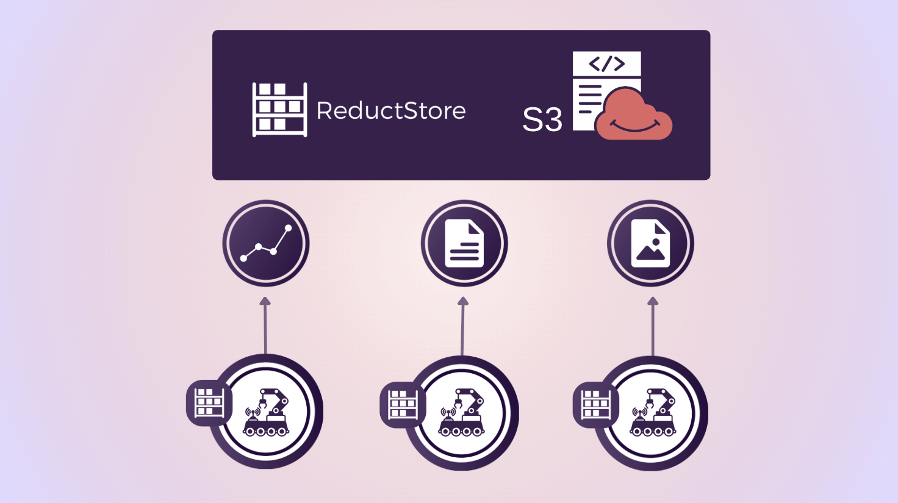

Mobile robots produce a **lot** of data (camera images, IMU readings, logs, etc). Storing this data reliably on each robot and syncing it to the cloud can be hard. **ReductStore** makes this easier: it's a lightweight, time-series object store built for robotics and industrial IoT. It stores binary blobs (images, logs, CSV sensor data, MCAP, JSON) with timestamps and labels so you can quickly find and query them later.

This introduction guide explains a simple setup where each robot stores data locally and automatically syncs it to a cloud ReductStore instance backed by Amazon S3.

{/* truncate */}

## Edge-to-Cloud Architecture

The architecture has three main components:

- **Each robot runs a small ReductStore server** in order to save images and IMU data locally on disk (this let the robot operate offline).
- **A cloud ReductStore instance runs on a server (e.g., EC2)** and uses S3 for long-term storage.
- **ReductStore replication tasks** copies data from robot to cloud based on labels, events, or rules (e.g., 1 record every minute).

Each robot pushes its data to the cloud whenever it is connected to the network. This approach provides the robots with offline capability, allows you to decide which data to replicate, and easily scales to support many robots.

## How Replication Works

ReductStore uses an **append-only** replication model:

- The robot stores new data locally.
- ReductStore automatically detects new records.
- It sends them to the cloud in batches (or streams large files).
- If the network disconnects, replication continues when the robot reconnects.

You can replicate:

- _everything_
- or only specific sensors
- or only records with certain labels
- or based on rules (e.g., 1 record every S seconds or every N records)

This can be configured per robot using environment variables (provisioning), with the web console or via the CLI (as shown in this guide).

## Cloud ReductStore With S3 Backend

ReductStore supports storing all records directly in S3. It keeps a local cache for fast access and batches many small blobs into larger blocks to save on S3 costs.

:::info
By batching data into S3 objects, you can save **significantly** on storage costs compared to storing many small files individually.
:::

Here is an example `docker-compose.yml` to run a ReductStore server that uses S3 as the remote backend and provisions buckets for robots:

```yaml
services:
  reductstore:
    image: reduct/store:latest
    container_name: reductstore
    ports:
      - "8383:8383"
    environment:
      # AWS credentials and S3 bucket configuration
      RS_REMOTE_BACKEND_TYPE: s3
      RS_REMOTE_BUCKET: <YOUR_S3_BUCKET_NAME>
      RS_REMOTE_REGION: <YOUR_S3_REGION>
      RS_REMOTE_ACCESS_KEY: <YOUR_AWS_ACCESS_KEY_ID>
      RS_REMOTE_SECRET_KEY: <YOUR_AWS_SECRET_ACCESS_KEY>
      RS_REMOTE_CACHE_PATH: /data/cache
      # Bucket provisioning
      RS_BUCKET_ROBOT_1_NAME: robot1-data
      RS_BUCKET_ROBOT_2_NAME: robot2-data
      # .. additional buckets as needed
    volumes:
      - ./cache:/data/cache
```

Run it with:

```bash
docker compose up -d
```

This starts a ReductStore server that writes to S3 automatically. There are many more configuration options available in the **[configuration documentation](/docs/configuration)**.

## Setting Up Replication

First spin up a local ReductStore on each robot. Here with Snap:

```bash
sudo snap install reductstore
```

That starts a ReductStore server on port `8383` by default. Then you can use the **[Reduct CLI](https://github.com/reductstore/reduct-cli)** to set up replication from the robot to the cloud instance:

```bash
# Point the CLI to the robot's local ReductStore
reduct-cli alias add local -L http://localhost:8383 -t "<ROBOT_API_TOKEN>"

# Create a bucket for that robot
reduct-cli bucket create local/robot1-data

# Create a replication task to the cloud
reduct-cli replica create local/robot1-to-cloud \
    robot1-data \
    https://<CLOUD_API_TOKEN>@<cloud-address>/robot1-data
```

This creates a replication task called `robot1-to-cloud` that copies all data from the robot's local `robot1-data` bucket to the cloud instance. You can customize replication further by adding filters or rules. See the **[replication guide](/docs/guides/data-replication)** for more details.

## Storing Sensor Data

There are many ways to store data. When it comes to high-frequency sensor data like IMU readings, a common approach is to store them in 1-second files. Images can be stored as binary blobs (e.g., JPEG or PNG files). Here is an example of storing IMU data as CSV files and images as binary blobs using the Python SDK (this stores 10,000 samples and one camera image for a given timestamp as an example):

```python
import asyncio
import time
import random
from reduct import Client


async def main():
    async with Client("http://localhost:8383", api_token="<ROBOT_API_TOKEN>") as client:
        bucket = await client.get_bucket("robot1-data")

        # Current timestamp to index the data by time in ReductStore
        timestamp = int(time.time() * 1_000_000)  # microseconds

        # Generate 10'000 IMU samples
        rows = []
        for i in range(10_000):
            rows.append(
                {
                    "ts": timestamp + i * 100,  # microseconds
                    "linear_acceleration_x": round(random.uniform(-2, 2), 3),
                    "linear_acceleration_y": round(random.uniform(-2, 2), 3),
                    "linear_acceleration_z": round(random.uniform(8.0, 10.0), 3),
                }
            )

        # Convert to CSV (store 1 seconds of data per file)
        csv = (
            "ts,linear_acceleration_x,linear_acceleration_y,linear_acceleration_z\n"
            + "\n".join(
                f"{r['ts']},{r['linear_acceleration_x']},"
                f"{r['linear_acceleration_y']},{r['linear_acceleration_z']}"
                for r in rows
            )
        )

        # Write the IMU batch
        await bucket.write(
            entry_name="imu_logs",
            data=csv.encode(),
            timestamp=timestamp,
            labels={"sensor": "imu", "rows": "1000"},
            content_type="text/csv",  # MIME type
        )

        # Write one camera image
        with open("camera_image.png", "rb") as img:
            await bucket.write(
                entry_name="images",
                data=img.read(),
                timestamp=timestamp,
                labels={"sensor": "camera"},
                content_type="image/png",
            )


asyncio.run(main())
```

:::warning
If you are considering storing all IMU data as individual records in a time series database (TSDB) like Timescale or InfluxDB, keep in mind that high-frequency sensors (e.g., 1000 Hz) can lead to performance and cost issues. Batching samples into files (e.g., one second of data per CSV file) is a more efficient storage and querying method.
:::

## Querying Sensor Data Using ReductSelect

If your IMU data is stored as CSV, the **ReductSelect extension** lets you:

- extract only certain columns
- filter rows based on conditions

Example: filter CSV rows where `acc_x > 10`:

```json5
{
    "#ext": {
        "select": {
            "csv": {"has_headers": True},
            "columns": [
                {"name": "ts", "as_label": "ts_ns"},
                {"name": "linear_acceleration_x", "as_label": "acc_x"},
                {"name": "linear_acceleration_y"},
                {"name": "linear_acceleration_z"},
            ],
        },
        "when": {"@acc_x": {"$gt": 1.9}},
    }
}
```

Python example:

```python
import asyncio
from reduct import Client

when = { ... } # the JSON condition from above

async def main():
    async with Client("https://<cloud-address>", api_token="<TOKEN>") as client:
        bucket = await client.get_bucket("robot1-data")

        async for rec in bucket.query("imu_logs", when=when):
            data = await rec.read_all()
            print(data.decode())

asyncio.run(main())
```

This returns only the rows where `linear_acceleration_x > 1.9`, along with the timestamp.

## Why This Setup Works Well for Robotics

There are several advantages to using a specialized storage solution like ReductStore for mobile robotics:

- **Robots can store data locally** and operate offline without network connectivity.
- **Automatic replication when connected** to avoid manual uploads and simplify data management.
- **Selective replication** lets you control what data is sent to the cloud (i.e. decide on your reduction strategy) to save bandwidth and storage.
- **Labels and timestamps** make it easy to organize and query sensor data later.
- **Store files of any type** (images, CSV, logs, MCAP) in a single system without needing separate storage solutions for each data type.

## Next Steps

ReductStore also integrates into robotics observability stacks such as the Canonical Observability Stack (COS) for robotics. You can visualize sensor data, logs, and metrics in Grafana dashboards alongside your other robot telemetry. More details in our blog post **[The Missing Database for Robotics Is Out](blog/database-for-robotics)**.

---

I hope you found this article helpful! If you have any questions or feedback, don't hesitate to reach out on our [**ReductStore Community**](https://community.reduct.store/signup) forum.
