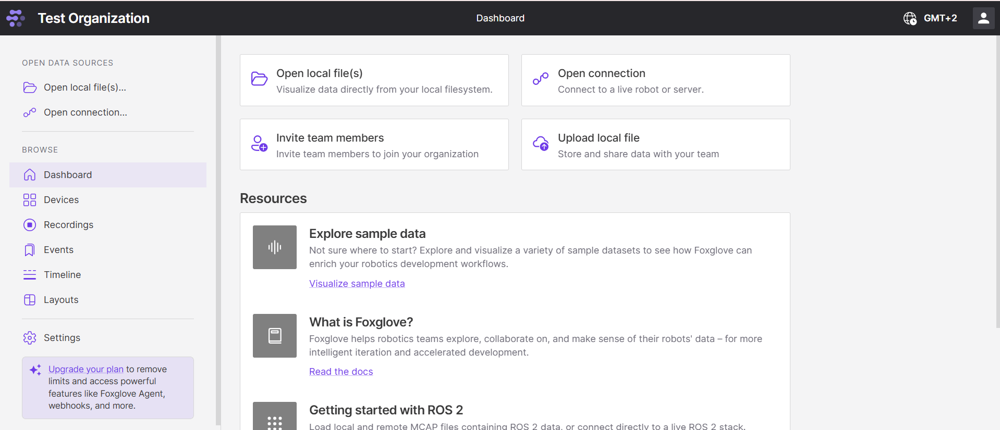
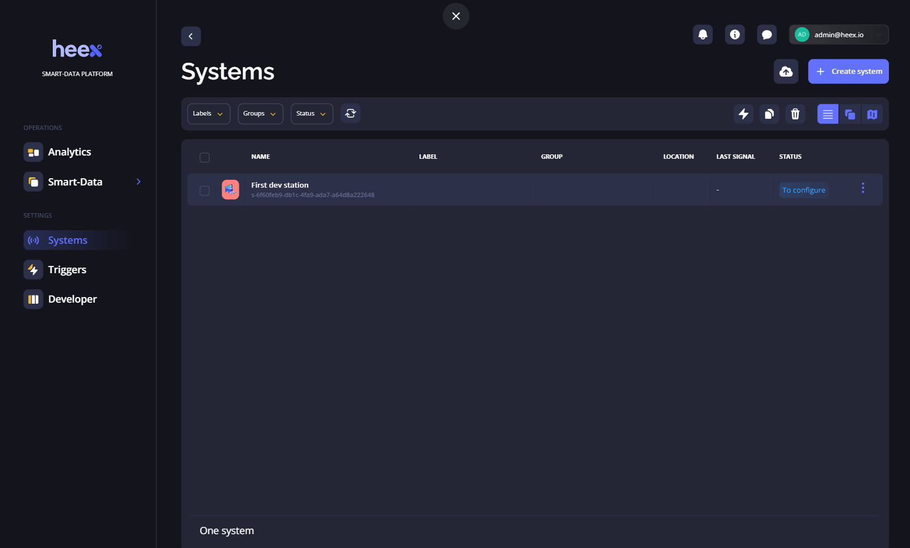

Modern robots collect a lot of data from sensors, cameras, logs, and system outputs. Managing this data well is important for debugging, performance tracking, and training machine learning models.

Over the past few years, we've been building a storage system from scratch. As part of that work, we spoke with many robotics teams across different industries to understand their challenges with data management.

Here's what we heard often:

- Only a subset of what robots generate is actually useful
- Network connections are not always stable or fast
- On-device storage is limited (hard drive swaps is not practical)
- Teams rely on manual workflows with scripts and raw files
- It's hard to find and extract the right data later
- ROS bag files get large quickly and are difficult to manage

In this article, we compare four tools built to handle robotics data: **ReductStore**, **Foxglove**, **Rerun**, and **Heex**. We look at how they work, what they're good at, and which use cases they support.

If you're working with robots and need to organize, stream, or store data more effectively, this overview should help.

{/* truncate */}

## Key Criteria for Comparison

When picking a data tool for robotics, focus on these areas:

- **Data Types**
  Robotics is a large field with many sensor types. The tool should support the data you work with, such as:
  - _Telemetry:_ Lightweight (GPS, IMU, joints), ideal for monitoring.
  - _Downsampled Data:_ Lower-rate images or lidar for incident review without high storage cost.
  - _Full-Resolution:_ Raw sensor outputs for deep debugging or training. This is storage-intensive but essential for some applications.
- **Integration**
  The tool should work with what you already use, like ROS, Grafana, MQTT, cloud platforms (S3, Azure, Google Cloud), and your development environment to avoid extra glue code and simplify workflows.
- **Performance and Scalability**
  Data must move quickly (both locally and to the cloud). Large files or slow queries can block robots or delay analysis.
- **Ease of Use and APIs**
  A simple UI and solid API support make it easier to automate, scale, and adapt the tool to different use cases.

## Tool Overviews

### ReductStore

**ReductStore** is a storage and streaming system designed for robotics data. It works both on the robot and in central storage (on-premise/self-hosted or in the cloud) with the same interface and SDKs (in Python, C++, Go, Javascript/TypeScript or Rust). That means your code stays the same whether you're reading local, remote data (or creating a browser-based dashboard).

To move data to the cloud, ReductStore uses **conditional replication**. You can define rules to upload only certain records: by label, rules, or event. For example, replicate all incident data, or just 1 out of 10 entries for routine monitoring.

ReductStore handles storage limits on edge devices with **FIFO retention**. Old data is deleted only when the device is full. Each bucket can have different rules, so you can keep more images and less telemetry, for example.

With an **S3 backend**, ReductStore batches small records together before uploading. This cuts down the number of requests and lowers cloud storage costs. For observability, you can connect **Grafana** to ReductStore to create dashboards with system metrics and sensor data. For MCAP files, ReductStore supports shareable query links that open directly in **Foxglove v1/v2**.

It also lets you **filter or merge records server-side**. For example, you can pull all temperature readings above a threshold over a time range without downloading full datasets.

Want more technical detail? Check out [**The Missing Database for Robotics Is Out**](/blog/database-for-robotics).

### Foxglove and MCAP

**Foxglove** is a browser-based visualization and observability tool for robotics. It supports **ROS 1, ROS 2**, and **MCAP logs**, and handles data types like telemetry, camera feeds, lidar, and depth maps.

It uses **MCAP**, an open-source log format built for robotics, to store high-resolution data efficiently. You can explore MCAP files interactively in **Foxglove Studio** or stream them programmatically.

Foxglove provides an **agent** that detects new MCAP files on the robot and uploads them to the cloud automatically. This requires robots to record short rosbag segments (typically a few minutes each) which are closed and rotated continuously.

It integrates natively with **ROS topics, services, and actions**, and offers **WebSocket and REST APIs**. It also connects to major cloud providers like **AWS, Azure,** and **Google Cloud** for scalable storage.

The interface is built for time-series and sensor data, with interactive 2D/3D views, plots, and drag-and-drop panels for quick setup and review.

### Rerun

**Rerun** is an open-source visualization solution for time-series and multimodal data. It supports data types like images, point clouds, lidar, depth maps, tensors, and other sensor streams.

Its main strength is combining flexible logging with a fast, built-in 3D viewer designed for robotics and extended reality (XR) applications. For large datasets, Rerun provides a **column-oriented API** to speed up ingestion and reduce memory usage. It also uses efficient internal structures to minimize allocations and optimize performance on edge devices.

Rerun doesn't offer native ROS integration yet, but it can be used in ROS projects by adding custom logging to nodes.

You can embed Rerun in **Jupyter notebooks** or web pages, and use loggers for **Python, Rust, and C++** to stream data into the viewer.

The UI is built for **real-time 3D exploration**, with overlays and live tracking that make it easy to inspect different data types in the same visual space.

### Heex

**Heex** is a data capture and review platform for autonomous systems that focuses on collecting only key moments—like errors or specific events instead of logging everything. This reduces bandwidth and storage needs while keeping important context.

Robots using Heex record data continuously in short ROSbag segments. A small agent on the robot watches for triggers and uploads only selected segments to the cloud based on rules.

A core feature is **RDA (Resource and Data Automation)** for ROS 2, which automates what to record and when. Rules can be changed remotely without restarting the robot.

Data is stored in **ROSbag** and can be reviewed directly in the **Heex dashboard**, which includes built-in open-source version of **Foxglove**. This setup makes it easy to manage data across fleets and locations.

Heex supports both **ROS 1 and ROS 2**, and integrates with other systems through **SDKs, APIs, and a CLI**.

The interface includes customizable dashboards to monitor sensor data, errors, and system status. Timelines and streams are easy to navigate for quick analysis.

## Comparative Analysis Table

To help visualize the differences between the tools, here is a comparison table summarizing their main characteristics:

| **Tool**        | **Core Focus**                                            | **Data Types**                                | **Storage Strategy**                                                               | **Visualization**                        | **ROS Integration**                | **Unique Features**                                                              |
| --------------- | --------------------------------------------------------- | --------------------------------------------- | ---------------------------------------------------------------------------------- | ---------------------------------------- | ---------------------------------- | -------------------------------------------------------------------------------- |
| **ReductStore** | Time-series storage and streaming for robotics            | Telemetry, camera images, lidar, logs         | Local + cloud with same API (supports S3, FIFO retention, conditional replication) | Grafana, Foxglove (via MCAP links)       | Integrated with ROS via extensions | Filter/merge on server, batch uploads, topic-level control, efficient on edge    |
| **Foxglove**    | Visualization and observability for robotics logs         | MCAP logs (telemetry, lidar, camera, depth)   | ROSbag short segments, auto-upload with agent                                      | Foxglove Studio (2D/3D, timeline, plots) | Native ROS 1 & 2                   | Drag-and-drop views, real-time stream inspection, cloud integration              |
| **Rerun**       | Real-time 3D visualization of multimodal time-series data | Images, lidar, point clouds, tensors, metrics | User-defined logging; logs streamed into viewer or embedded in notebooks           | Built-in viewer (3D overlays, tracking)  | Not native (custom logging)        | Column-oriented API, fast ingestion, selective logging, notebook/web integration |
| **Heex**        | Event-driven data capture for fleets of robots            | ROSbag (telemetry, images, lidar, metrics)    | Continuous recording, uploads filtered by event-based rules via onboard agent      | Built-in Foxglove in dashboard           | Native ROS 1 & 2                   | RDA (automated capture rules), remote config, scalable fleet-wide dashboards     |

## Conclusion

Each tool addresses a different part of the robotics data workflow. **ReductStore** is ideal for distributed storage across many robots, with selective replication to the cloud and flexible integration with tools like Grafana and Foxglove. **Foxglove** excels at visualizing MCAP logs and ROS topics. **Rerun** offers flexible, real-time 3D inspection for custom applications. **Heex** focuses on capturing just the important moments for efficient fleet analysis.

Choosing the right tool depends on what kind of data you collect, how you process it, and where you need it to go. In many cases, combining tools can give you the best of all worlds.

---

Thanks for reading. I hope this article helps you decide on the right storage strategy for your vibration data.
If you have questions or comments, feel free to visit the [**ReductStore Community Forum**](https://community.reduct.store/signup).
