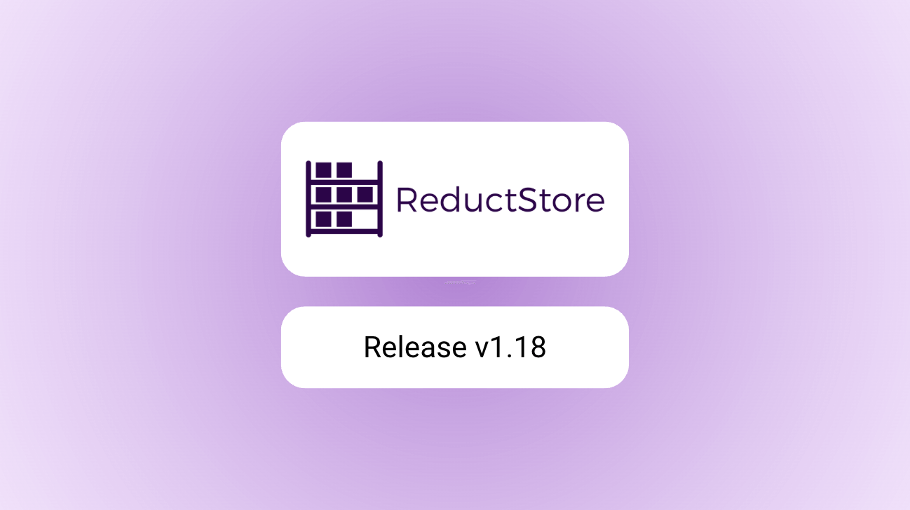
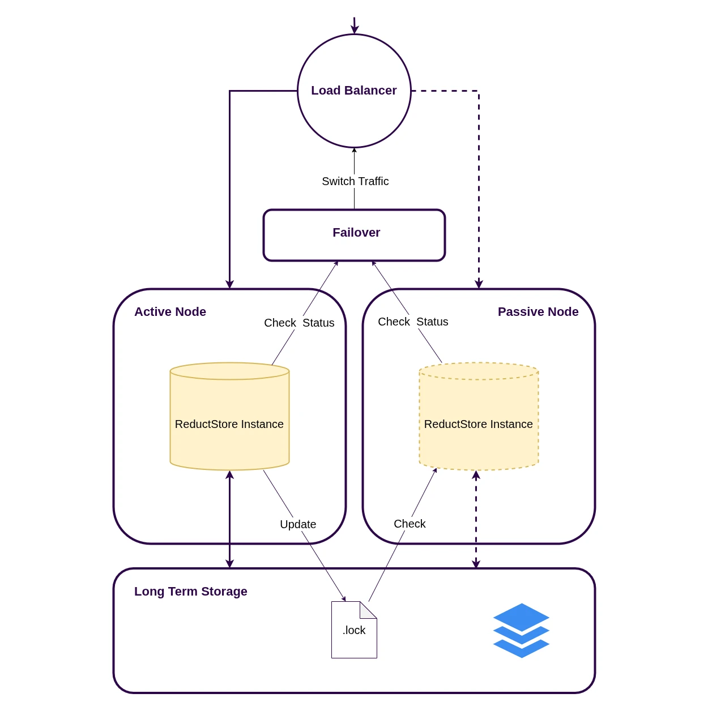
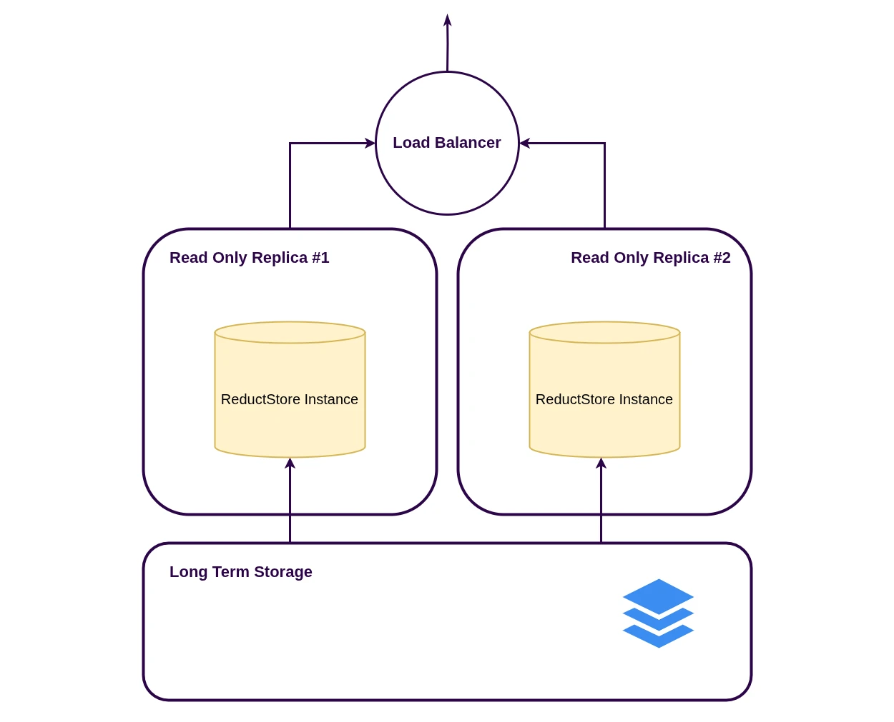

We are pleased to announce the release of the latest minor version of [**ReductStore**](/), [**1.18.0**](https://github.com/reductstore/reductstore/releases/tag/v1.18.0). ReductStore is a high-performance storage and streaming solution designed for storing and managing large volumes of historical data.

To download the latest released version, please visit our [**Download Page**](/download).

## What's new in 1.18.0?

In this release, we have added support for resilient deployments to build a more robust, fault-tolerant, and highly available ReductStore cluster.
Now, you can implement hot-standby configurations, automatic failover, and seamless recovery to ensure uninterrupted service even in the face of hardware failures or network issues. You can also elastically scale read-only nodes to handle increased read workloads without impacting the performance of the primary nodes.

Additionally, we have introduced a new Multi-entry API that allows you to efficiently manage and query multiple entries in a single request. This API is designed to optimize performance and reduce latency when working with large datasets, making it easier to retrieve and manipulate data in bulk.

{/* truncate */}

## Resilient Deployments

In ReductStore v1.18.0, resilient deployments are now a first-class feature. Using the `RS_INSTANCE_ROLE` setting, you can build topologies that keep your ingestion endpoint available during node failures and scale reads independently from writes.

### Hot standby (active-passive) for write availability

Run two nodes against the same backend (a shared filesystem or the same remote backend). Only one node is active at a time: the active node holds a lock file and refreshes it, while the standby waits and takes over when the lock becomes stale.



- Set `RS_INSTANCE_ROLE=PRIMARY` for the active node and `RS_INSTANCE_ROLE=SECONDARY` for the standby.
- Put both nodes behind a single virtual endpoint (load balancer / reverse proxy).
- Route traffic only to the node that returns `200 OK` on `GET /api/v1/ready` (the inactive node returns `503`).
- Tune failover behavior with `RS_LOCK_FILE_TTL` (how long the standby waits) and `RS_LOCK_FILE_TIMEOUT` (how long a node waits to acquire the lock).

To avoid split-brain writes, don’t run both nodes in `STANDALONE` mode against the same dataset.

### Read-only replicas for read scaling

Add one or more `REPLICA` nodes to serve queries from the same dataset. Replicas never write and periodically refresh bucket metadata and indexes from the backend, so newly written data may appear with a small delay.



- Route writes to a dedicated ingestion node (or the active node in a hot-standby pair).
- Route reads to replicas to scale query workloads horizontally.
- Tune staleness with `RS_ENGINE_REPLICA_UPDATE_INTERVAL`.

For an end-to-end walkthrough (including S3-based standalone, active-passive, and replicas), see the **[S3 Backend](/docs/integrations/s3)** tutorial. For architecture options and operational notes, see the **[Disaster Recovery](/docs/guides/disaster-recovery)** guide.

## Multi-entry API

The new **Multi-entry API** makes it possible to work with multiple entries in a single request. In practice, this is most useful for **querying**: instead of running one query per sensor/stream and merging results on the client, you can request all the entries you need at once and process a single result stream (each returned record includes its `entry` name).

Here is a Python example using `reduct-py` to query multiple entries in one call:

```python
import asyncio

from reduct import Client


async def main() -> None:
    async with Client("http://localhost:8383", api_token="my-token") as client:
        bucket = await client.get_bucket("my-bucket")

        # Query multiple entries in a single request (since ReductStore v1.18).
        # You can mix exact names and wildcards.
        entries = ["sensor-*", "camera"]
        async for record in bucket.query(
            entries,
            start="2026-02-05T10:00:00Z",
            stop="2026-02-05T10:05:00Z",
            when={"&score": {"$gte": 10}},
        ):
            payload = await record.read_all()
            print(record.entry, record.timestamp, len(payload))


if __name__ == "__main__":
    asyncio.run(main())
```

## What’s Next

We’re already working on the next improvements to make ReductStore easier to integrate into real-world data pipelines:

### Native Zenoh API

Zenoh is becoming a common choice for data exchange in distributed, edge-first systems (robotics, industrial IoT, and telemetry). In upcoming releases, we plan to add a **native Zenoh API** so ReductStore can join Zenoh networks seamlessly.

This will make it easier to ingest and serve data directly through Zenoh—without custom bridges—so your storage layer fits naturally into existing Zenoh-based deployments.

### Entry attachments (metadata)

Today, labels work well for filtering and replication, but many projects also need structured metadata tied to an entry itself: data format, schema version, units, encoding, calibration details, and other context.

We plan to introduce **attachments for entries**, allowing you to store and retrieve this kind of metadata alongside your data streams, making datasets more self-describing and easier to consume across teams and tools.

---

I hope you find those new features useful. If you have any questions or feedback, don’t hesitate to use the [**ReductStore Community**](https://community.reduct.store/signup) forum.

Thanks for using [**ReductStore**](/)!
