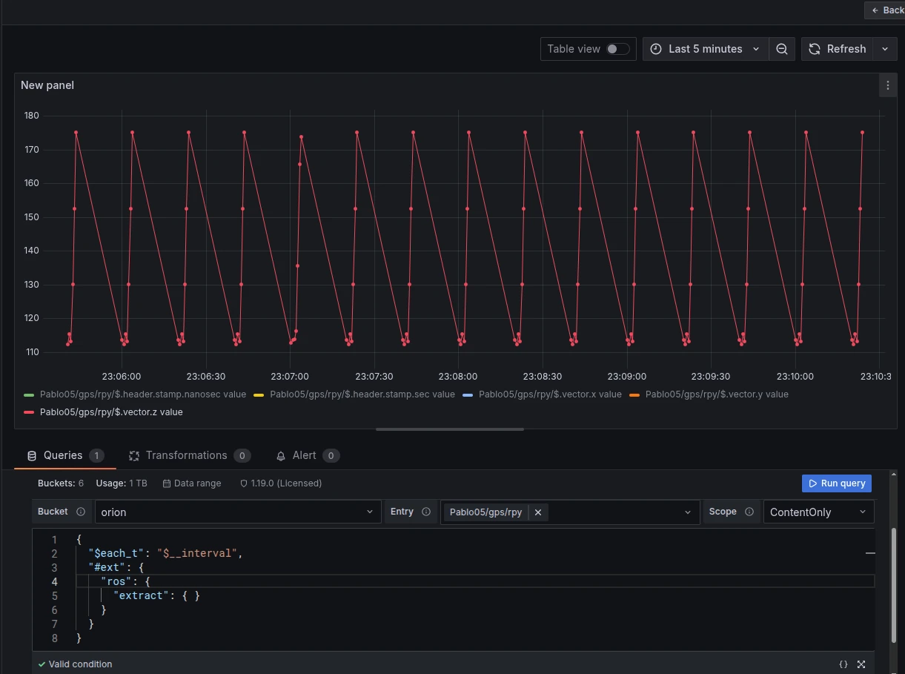
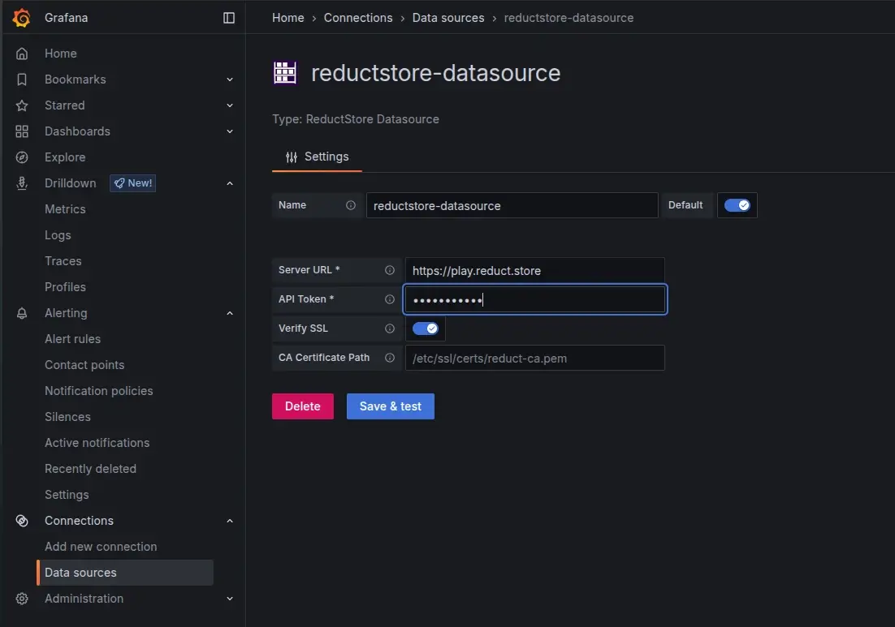

**Grafana** is a powerful tool for visualizing time-series data, and it is widely used for monitoring and analysis.
However, it does not natively understand robotics data formats, such as ROS 2 messages, since they are usually stored in binary formats (e.g., CDR).
**[ReductStore's](/)** flexible query engine and extension system can bridge this gap. With the **[ReductROS](/docs/extensions/official/ros-ext)** extension,
you can extract ROS 2 messages as JSON directly in Grafana queries.
This enables you to build rich dashboards and alerts on your robotics data without preprocessing it into a different format.



{/* truncate */}

In this tutorial, we will create a Grafana dashboard supported by the ReductStore data source plugin.
Using the ReductROS extension, the dashboard will convert ROS 2 messages to JSON upon query, enabling us to visualize and analyze the data directly in Grafana.

## Prerequisites

This tutorial assumes that you have the following set up:

- A ReductStore instance with ROS 2 data (either your own or from the demo instance). Some robotics data is available on **[our demo ReductStore instance](https://play.reduct.store/replica)**.
- A Grafana 10+ instance (local or cloud) with the ReductStore data source plugin installed. You can use our Docker image, or install Grafana separately and add the plugin manually, following the documentation.

## Set up the ReductStore data source in Grafana

Let's run Grafana locally using Docker and connect it to ReductStore:

```bash
docker run -d -p 3000:3000 reduct/grafana:latest
```

Open Grafana at `http://localhost:3000` and log in with the default credentials, **admin/admin**.
Then, go to the "Data Sources" panel. There, you can find the default ReductStore data source if you are using our Docker image.
Otherwise, you can add it manually on the "Add new connection" page.

Once the data source has been added, configure it using the following parameters:

- Name: `reductstore-datasource`
- Server URL: `https://play.reduct.store/replica` (or your ReductStore instance URL)
- API Token: `reductstore` for the demo instance (or your API token)



Click "Save & Test" to verify the connection. You should see a success message confirming that Grafana can connect to ReductStore.

## Query and extract ROS 2 data to JSON

Now we can create a new dashboard and add a panel to query ROS 2 data from ReductStore. Go to Dashboards -> New Dashboard -> Add new panel. In the query editor, select the ReductStore data source and provide the following query parameters to extract a ROS 2 topic as JSON:

- Bucket: `orion`
- Entry: any entry, you can use wildcards (e.g., `*`) to query multiple entries
- Scope: LabelAndContent , which allows us to view both labels and content of the messages if it's JSON

when the parameters are set, we can read data with the following query:

```json
{
  "$each_t": "$__interval",
  "#ext": {
    "ros": {
      "extract": {}
    }
  }
}
```

The magic happens in the `#ext` section, where we activate the `ros` extension and specify that we want to extract data.
The extension reads the serialized ROS content for the specified bucket/entry, decodes the ROS 2 messages, and returns them as JSON records with timestamps and labels.
You can read more about the query format in the **[ReductROS documentation](next/extensions/official/ros-ext/raw/ros-ext#query-format)**.

## Scale and performance

Since your data may be large and data extraction can be computationally intensive, here are some tips to ensure good performance:

- Use Grafana `$__interval` with `$each_t` for interval-based queries
- Add label filters to narrow down the data (e.g., filter by topic name or message type)
- Start with a narrow time range and expand as needed

## 10. Optional: Visualize binary topics (images)

If you're interested in visualizing binary data, such as images or point clouds, you might be interested in the ReductROS extension.
The ReductROS extension can encode binary data as base64 strings or in JPEG format.
This data can then be displayed in Grafana's "Text" panel with HTML rendering.
For instance, if your topic contains raw images, you can specify the encoding in the query.

```json
{
  "$each_t": "$__interval",
  "#ext": {
    "ros": {
      "extract": {
        "encode": { "data": "jpeg" }
      }
    }
  }
}
```

## Conclusion

Using ReductStore and the ReductROS extension allows you to easily extract and visualize ROS 2 data in Grafana without preprocessing it into a different format.
This enables you to build rich dashboards and alerts on your robotics data, allowing for better monitoring and analysis of your robotic systems.

Importantly, this approach preserves your data's original format, enabling flexible querying without the need for additional pipelines or transformations.
You can also combine it with other Grafana features, such as alerting and annotations, to gain additional insights from your robotics data.

---

I hope this tutorial gives you a good starting point for visualizing your ROS 2 data in Grafana using ReductStore.
If you have questions or want to discuss which edition fits your use case, please reach out on the **[ReductStore Community](https://community.reduct.store)** forum or via our **[contact page](/contact)**.
