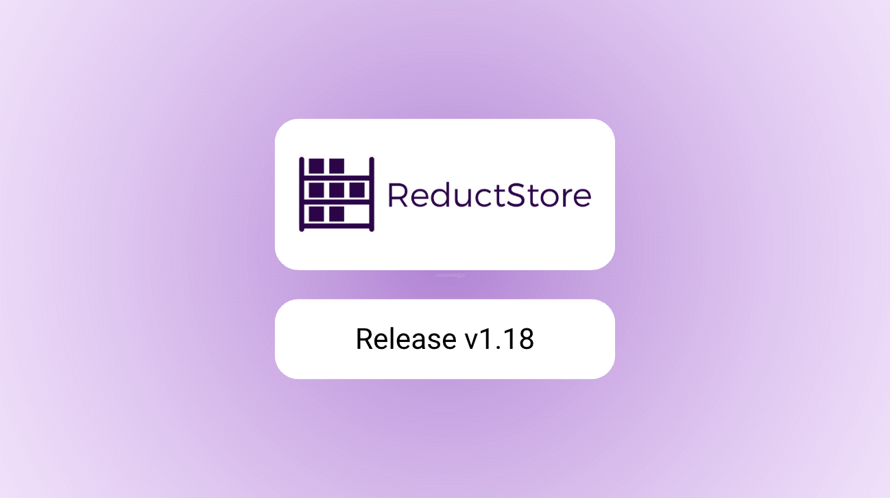
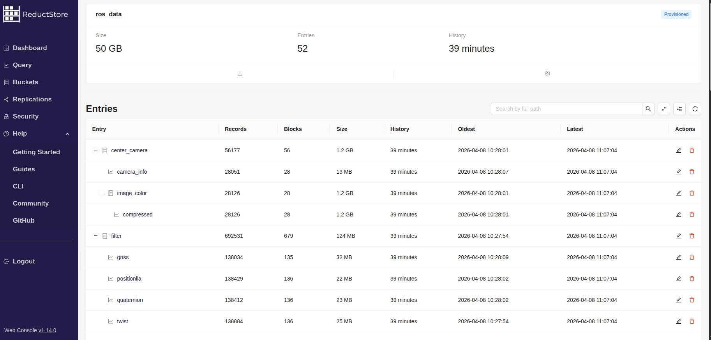

We are pleased to announce the release of the latest minor version of [**ReductStore**](/), [**1.19.0**](https://github.com/reductstore/reductstore/releases/tag/v1.19.0). ReductStore is a high-performance storage and streaming solution designed for storing and managing large volumes of historical data.

To download the latest released version, please visit our [**Download Page**](/download).

## What's new in 1.19.0?

ReductStore v1.19.0 introduces a major shift toward robotics and ROS by making [**ReductStore Core open-source under Apache 2.0**](/blog/2026-03-16-apache-2-license/index.mdx), enabling broader adoption and integration.
The data model now supports a nested entry structure similar to ROS topics, along with attachments for schemas and metadata, making it easier to organize and interpret complex robotics data.

This release also adds a [**native Zenoh API**](/docs/integrations/zenoh.mdx)  for efficient edge communication and distributed data flows.

Finally, [**ReductBridge**](/docs/reduct-bridge/index.mdx) simplifies integration with ROS1 and ROS2, allowing automatic data labeling and seamless connection between robotics pipelines and storage.

{/* truncate */}

### Nested Data Model with Attachments

The new hierarchical data model allows you to organize your data in a nested structure, similar to ROS/Zenoh/MQTT/.. topics.
Each entry can have attachments for schemas and metadata, making it easier to manage complex robotics data and ensure compatibility across different systems.
Attachemnts are used by the ROS Extension to parse serialized ROS messages or export then to MCAP files.



### Native Zenoh API

Zenoh is gettig increasingly popular in the robotics community as a lightweight, efficient communication protocol for edge computing and distributed systems.
With [**the new native Zenoh API**](/docs/integrations/zenoh.mdx), you can now directly interact with ReductStore using Zenoh, enabling seamless integration with other Zenoh-enabled systems and building distributed data flows at the edge.

You can simply enable the Zenoh API in ReductStore and start recording and querying data using Zenoh topics, without needing to set up additional bridges or connectors.

```shell
docker pull reduct/store:v1.19.0
docker run --env "RS_ZENOH_ENABLED=ON" \
  --env "RS_ZENOH_CONFIG={}" \
  --env "RS_ZENOH_SUB_KEYEXPRS=**" \
  -p 8383:8383 -p 36597:36597 -p 7446:7446 \
  reduct/store:main
```

Moreover, the API supports Zenoh attachments which can be use for labeling and query conditions in JSON format:

```python
import json
import zenoh

KEY = "factory/line1/camera"
PAYLOAD = b"<binary payload>"
LABELS = {"robot": "alpha", "status": "ok"}

with zenoh.open(zenoh.Config()) as session:
    session.put(
        KEY,
        PAYLOAD,
        attachment=json.dumps(LABELS).encode(),
    )
```

### ReductBridge for ROS Integration

We launched a new project called [**ReductBridge**](x) that provides seamless integration between ReductStore and ROS1/ROS2. ReductBridge automatically labels ROS messages


## What’s Next


---

I hope you find those new features useful. If you have any questions or feedback, don’t hesitate to use the [**ReductStore Community**](https://community.reduct.store/signup) forum.

Thanks for using [**ReductStore**](/)!
