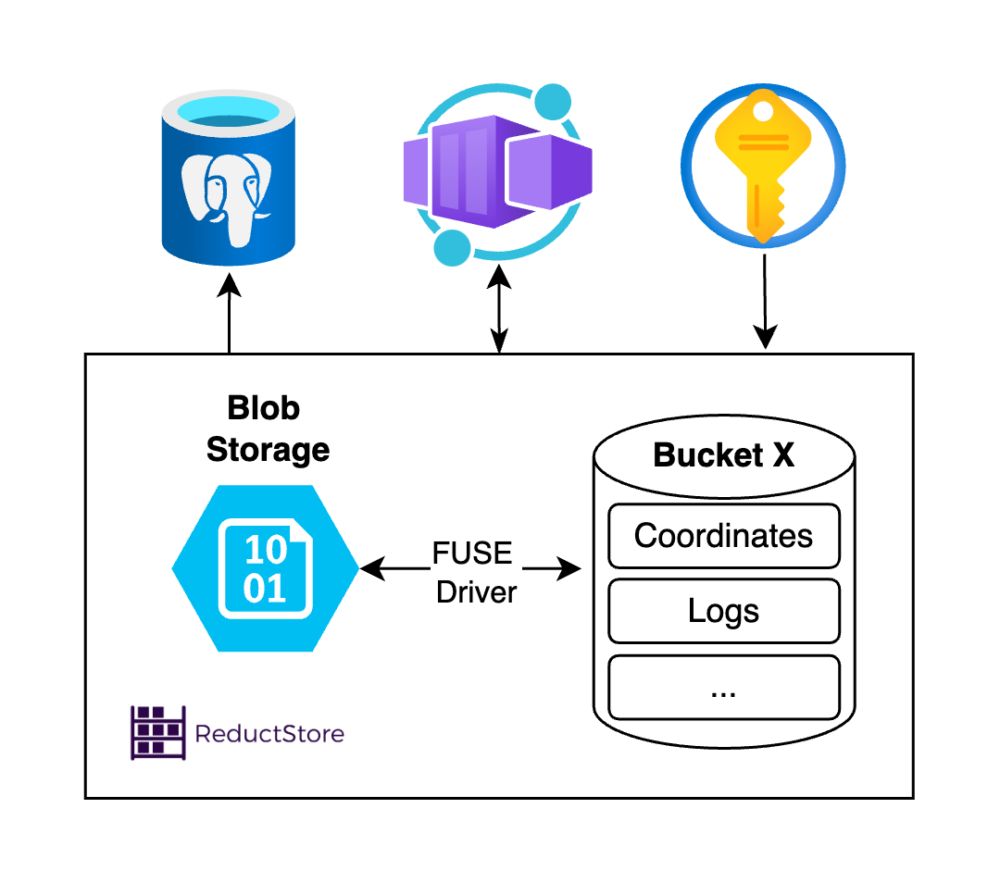
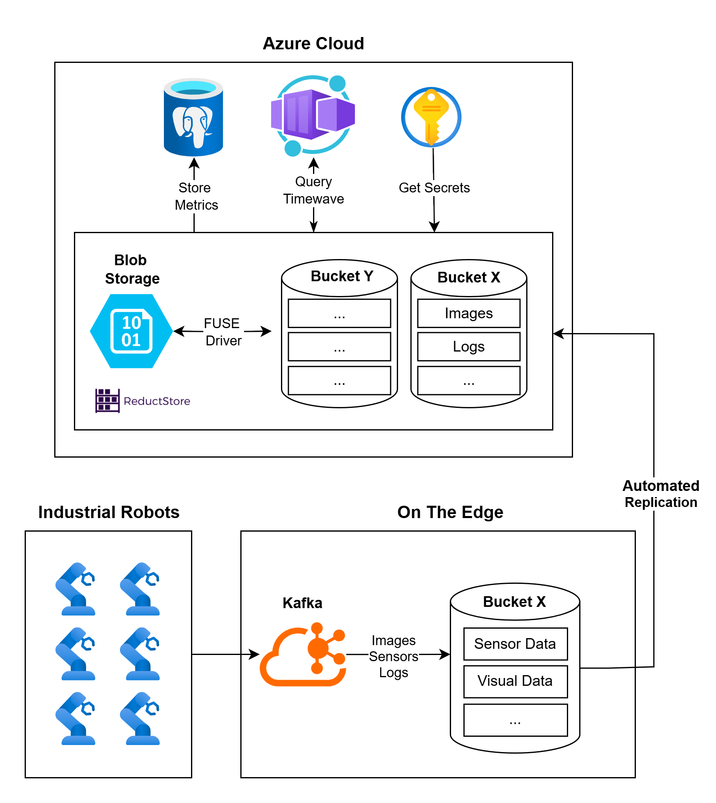
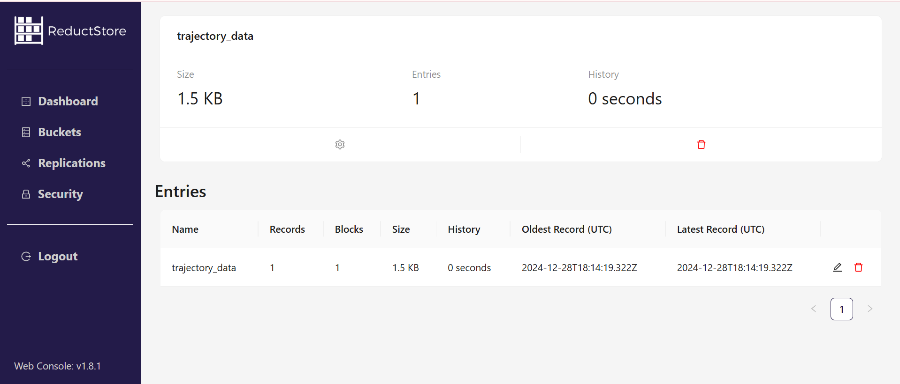

Robots generate massive amounts of data that must be managed effectively. Challenges like limited on device storage, the need for real time processing, and high cloud storage costs make it essential to find efficient solutions. Balancing edge and cloud storage while keeping data synchronized is a key part of effective management.

This article outlines those challenges and offers practical strategies, then introduces [**ReductStore**](/): a database built specifically for robotic systems. We also cover the latest ReductStore capabilities, including native ROS integration, Grafana dashboards, MCAP export for Foxglove, a Zenoh API, and direct cloud storage backends for S3 and Azure. Finally, we compare ReductStore with Rosbag and MongoDB to help you choose the right tool for your stack.

{/* truncate */}

## Challenges in Robotic Data Management

Robots often operate in dynamic and unpredictable environments and continuously generate large amounts of data. Finding an efficient way to store and manage this data can be challenging, mainly because of the following factors:

- **High Frequency and Real Time Requirements**: Robots often operate in real time environments. A drone navigating through a city must process camera and sensor data in milliseconds to avoid obstacles and stay on track. Storage solutions must handle these high frequency streams and make data quickly accessible for fast analysis and good decision making.

- **Limited On Device Storage**: Most robots cannot store all the data they generate due to size, weight, and power constraints. Engineers need effective data management strategies to retain important data without exceeding storage limits.

- **High Volume of Data**: An autonomous vehicle can produce up to [**5 terabytes of data every hour**](https://www.datacenterfrontier.com/connected-cars/article/11429212/rolling-zettabytes-quantifying-the-data-impact-of-connected-cars), including camera feeds, LiDAR scans, radar data, GPS logs, and sensor readings. Managing such large datasets requires systems built for scalability, which traditional relational databases often lack.

- **Cloud Storage Costs**: Sending all robotic data to the cloud is impractical and costly. Since robots generate many terabytes of data, costs can grow quickly. Balancing what to store locally and what to offload to the cloud is an important part of cost effective data management.

- **Data Reduction Challenges**: Good reduction strategies require balancing storage efficiency with keeping important information. Without a clear approach, valuable data might be lost, or storage fills up with unnecessary details.

## General Strategies for Managing Robotic Data

To build an effective data management system for robotic data, engineers need a clear strategy and the right specialized tools. The key is to handle high frequency data streams while optimizing storage space and costs.

- **Time Series Object Stores**: Time series object stores, such as ReductStore, are designed for high frequency, timestamped unstructured data streams. They offer efficient storage, real time querying, and high performance data writing, keeping costs manageable.

- **Balance Edge and Cloud Storage**: Keep critical data on edge devices for immediate access, while moving less time sensitive data to the cloud for long term analysis. This hybrid approach reduces cloud costs while keeping decision making data close to where it is needed.

- **Implement Retention Policies**: Retention policies automatically delete or archive outdated data. For edge devices with limited space, the best approach is a FIFO (first in, first out) quota based on storage volume, so older records are only removed when space is needed for new ones.

- **Compress and Optimize Data**: Compress large datasets such as images or videos to reduce storage while maintaining usability. Advanced formats like H.265 for video and JPEG for images can save significant storage space.

- **Prioritize Data Relevance**: Not all robotic data holds the same value. Engineers must distinguish between critical data that should be kept and data that can be safely discarded.

## ReductStore: A Purpose-Built Solution for Robotic Data

ReductStore is a high performance time series database built for the complex data needs of robotics systems. It handles unstructured data and is optimized for real time ingestion, making it well suited for high frequency sensor readings and large data streams from autonomous vehicles, drones, industrial robots, and more.

### ROS Integration with reduct-bridge

Getting ROS data into ReductStore is straightforward with [**reduct-bridge**](https://github.com/reductstore/reduct-bridge). This open source tool connects live ROS 1 and ROS 2 systems directly to ReductStore. You configure it with a simple TOML file that defines your inputs (ROS topics), pipelines, and the ReductStore destination.

reduct-bridge subscribes to ROS topics and stores each message as an individual record. It also writes a `$ros` attachment to each entry, containing the message schema, topic name, and encoding. This metadata powers advanced features like MCAP export and Grafana visualization, described below.

For teams already running ROS, this is the fastest path to persistent, queryable storage for all robot data.

### Cloud Storage Backend: S3 and Azure

ReductStore supports native cloud object storage backends for both [**Amazon S3 and Azure Blob Storage**](/docs/integrations/cloud-storage#azure-differences), without any FUSE drivers or intermediate file system layers. You run ReductStore with S3 or Azure as the actual storage backend, using a local cache for recent data and the cloud bucket for long term retention.

| Option             | What it means                                                                                   |
| ------------------ | ----------------------------------------------------------------------------------------------- |
| S3 compatible      | Works with AWS S3, MinIO, Ceph, Cloudflare R2, and any S3 compatible service                    |
| Azure Blob Storage | Switch backends by changing a few environment variables. The deployment patterns are identical. |
| Tiered access      | Recent data stays in the local cache for fast reads. Older data lives in the cloud bucket.      |
| Read replicas      | Add read only replicas that serve data from the same S3 bucket, placed close to your consumers. |

ReductStore can achieve 10 to 100x better performance at a fraction of the cost compared to traditional time series object stores when working with records around 100KB in size, which is typical for robotics sensor episodes.

### Visualize Robotics Data in Grafana

ReductStore supports live monitoring through a [**native Grafana integration**](/blog/grafana-visualization-ros-data). Using the ReductStore data source plugin and the ReductROS extension, you can query ROS 2 messages directly in Grafana without preprocessing them into a different format. The extension decodes binary ROS messages (CDR format) into JSON on the fly, so you can build rich dashboards and set up alerts on your robot data as it arrives.

This is useful for monitoring sensor streams in real time during a robot run, comparing data across multiple robots or recording episodes, and setting alerts when metrics go out of range.

To get started, run Grafana with the ReductStore plugin and point it at your ReductStore instance. You can also use the [**demo instance**](https://play.reduct.store/replica/) to explore a live dataset without any local setup.

### Export ROS Data to MCAP for Foxglove

If you want to replay or visually inspect recorded robot data, you can export raw ROS messages stored in ReductStore to MCAP format and open them directly in [**Foxglove**](https://foxglove.dev).

This is powered by the [**ReductROS extension**](/docs/extensions/official/ros-ext/raw). When records are ingested via reduct-bridge, a `$ros` attachment is written to each entry with the message schema and topic. The extension uses this metadata to reconstruct valid MCAP files from individual records.

You can export a time range spanning multiple ROS topics into a single MCAP file with a single query. The export also supports episode splitting by duration or file size, so long recordings can be broken into manageable chunks. You get fast, indexed storage in ReductStore for querying and analysis, and MCAP files for visual playback in Foxglove when needed.

### Zenoh Native API

ReductStore includes a [**Zenoh native API**](/docs/integrations/zenoh) alongside its HTTP API. Zenoh is a publish subscribe protocol designed for robotics and distributed systems, and it is widely used in next generation ROS 2 deployments. With the Zenoh API enabled, ReductStore opens a Zenoh session and registers both a subscriber (for writes) and a queryable (for reads), running in parallel with the HTTP API and sharing the same stored data.

This is a good fit for teams that already use Zenoh in their robot communication stack, want to avoid HTTP overhead for high frequency data streams, or need native pub/sub patterns for ingestion. Zenoh keys become ReductStore entry names, Zenoh encodings map to record content types, and Zenoh attachments map to record labels. Time range queries, conditional filters, and label based lookups all work through the Zenoh interface.

### Query Language and Batching

ReductStore uses a flexible [**query language based on JSON syntax**](/docs/next/conditional-query#query-syntax), optimized for robotics data. It supports both real time and historical analysis, with filtering, aggregation, and dataset joining.

You can analyze sensor data over specified time windows, query vibration data from a specific robot within a defined timeframe, or compare sensor data from different robots in parallel. SDKs are available for Python, C++, JavaScript, and Rust.

Data retrieval is optimized through **batching**, which groups multiple records into a single query based on a time range. This reduces the number of requests, improves performance, and lowers latency. For more details, visit the [**official guide on data querying**](/docs/guides/data-querying).

### Replication and Edge to Cloud Syncing



Industrial robots produce large amounts of data that gets stored locally at the edge. Replication then selectively pushes a subset of that data to the cloud. For instance, if sensor data is collected every second, only 1 in 10 records might be sent to the cloud, along with summary metrics useful for later analysis.

ReductStore replicates at the bucket level, not the entire dataset. You can replicate only high priority sensor data or logs while leaving less important data on the edge. Replication is incremental, so only new or changed data is sent. Labels stored alongside each record make it easy to define fine grained replication rules based on data content.

### Retention Strategies

[**ReductStore implements volume based retention policies**](/docs/guides/buckets#quota-type) that follow the FIFO (first in, first out) principle. Old data is only deleted when storage is full, making room for new data. These policies are customizable and can be set separately for each bucket.

Most other databases implement retention based on time periods, which can delete data even when storage is not full. For example, after an outage where the system was idle and nothing new was written, a time based policy may still clear recent data unnecessarily.

### Example Applications

| Application         | How ReductStore helps                                                                                                |
| ------------------- | -------------------------------------------------------------------------------------------------------------------- |
| Autonomous Vehicles | Handles high throughput sensor streams in real time, with efficient querying and selective edge to cloud replication |
| Industrial Robots   | Stores and analyzes diagnostic data for predictive maintenance and continuous performance monitoring                 |
| Drones and UAVs     | Supports offline operation in remote areas with limited connectivity, syncing data when a connection is available    |

## Comparing ReductStore with Rosbag and MongoDB

When choosing how to store robot data, three tools come up most often: Rosbag and MCAP, MongoDB, and ReductStore. Each serves a different purpose, and understanding the differences helps you pick the right tool for each part of your pipeline.

|                                  | Rosbag / MCAP          | MongoDB                   | ReductStore                |
| -------------------------------- | ---------------------- | ------------------------- | -------------------------- |
| Data type                        | Binary ROS messages    | Semi structured documents | Binary timestamped records |
| Query across recordings          | No                     | Yes                       | Yes                        |
| Large binary payloads            | Yes                    | Slow via GridFS           | Yes, natively              |
| Retention                        | Manual file management | Time based                | Volume based FIFO          |
| ROS integration                  | Native                 | None                      | Via reduct-bridge          |
| Cloud storage                    | No                     | Atlas                     | Native S3 and Azure        |
| Write performance vs ReductStore | —                      | 9x slower                 | Baseline                   |
| Read performance vs ReductStore  | —                      | 23x slower                | Baseline                   |

**Rosbag and MCAP** are the standard formats for recording ROS data during a robot run. They are great for capturing a self contained snapshot of all topics during a test or deployment. However, they are file formats, not databases. You cannot query across many recordings without writing custom scripts, there is no built in indexing on data content, and managing thousands of bag files on disk becomes its own problem. They are the right choice for short term recording and local playback, not for long term storage or fleet wide analysis.

**MongoDB** is a flexible database for semi structured data. It works well for storing metadata, labels, and structured records. But it was not designed for large binary payloads. For large files, MongoDB relies on GridFS, which adds complexity and reduces performance. MongoDB also uses time based retention, which can delete data even when storage is not full.

**ReductStore** is designed specifically for the kind of data robots produce: large, binary, timestamped records at high frequency. It connects directly to ROS via reduct-bridge, exports to MCAP for Foxglove, streams to Grafana dashboards, and replicates selectively to S3 or Azure.

A practical way to think about it: use Rosbag or MCAP for short recordings during testing, use MongoDB for structured metadata and event logs, and use ReductStore for raw sensor data that needs to be stored at scale, queried efficiently, and managed over time.

For a deeper comparison, read: [**MongoDB vs ReductStore: Choosing the Right Database for Robotics Applications**](/blog/robotics-mongodb-vs-reductstore).

## Hands-On Example: Storing and Handling Robotic Data in ReductStore

In this section, we will walk through a [**practical example of how to store and handle robotic data using ReductStore**](https://github.com/reductstore/reduct-robotics-example/blob/main/StoreQueryData.py). ReductStore is very efficient for storing episodes: for example, 10 second raw data with all the logs generated by a robot, around 100KB each. For simplicity, we will show how to store trajectory data, but in practice engineers work with larger and more diverse datasets.

For this example, we will use Python, so make sure you have _Python 3.8+_ installed in your environment.

### Setting Up ReductStore

We will use Docker to set up ReductStore in a containerized environment. Create a folder on your system and inside it create a _docker-compose.yaml_ file with the following configuration:

```yaml
version: "3.8"

services:
  reductstore:
    image: reduct/store:latest
    ports:
      - "8383:8383"
    volumes:
      - data:/data
    environment:
      - RS_API_TOKEN=my-token

volumes:
  data:
    driver: local
```

Then start the container by running:

```bash
docker compose up -d
```

Once running, ReductStore will be available at http://127.0.0.1:8383. You can check the container status with:

```bash
docker ps
```

Install the necessary Python libraries before we begin:

```bash
pip install reduct-py numpy
```

### Store and Manage Data

Now that ReductStore is running, let us look at how to store robotic data. In our example, we will work with trajectory data such as coordinates, speed, and orientation.

#### Create (or Get) a Bucket

First, create a new bucket for storing the robot trajectory data named _trajectory_data_.

```python
async def create_trajectory_bucket():
 async with Client("http://localhost:8383", api_token="my-token") as client:
  settings = BucketSettings(
	 quota_type=QuotaType.FIFO,
	 quota_size=1000_000_000,
	)
  await client.create_bucket("trajectory_data", settings, exist_ok=True)
```

The quota type of this bucket will be FIFO and its size will be 1 GB. If no settings are defined, the bucket will be created with a default quota type of _NONE_.

#### Generate Trajectory Data

Now, let us create a _generate_trajectory_data_ function that simulates trajectory data points for a robot moving in a 2D space.

```python
async def generate_trajectory_data(frequency: int = 10, duration: int = 1):
 interval = 1 / frequency
 start_time = datetime.now()

  for i in range(frequency * duration):
    time_step = i * interval
    x = np.sin(2 * np.pi * time_step) + 0.2 * np.random.randn()
    y = np.cos(2 * np.pi * time_step) + 0.2 * np.random.randn()
    yaw = np.degrees(np.arctan2(y, x)) + np.random.uniform(-5, 5)
    speed = abs(np.sin(2 * np.pi * time_step)) + 0.1 * np.random.randn()
    timestamp = start_time + timedelta(seconds=time_step)

    yield {
      "timestamp": timestamp.isoformat(),
      "position": {"x": round(x, 2), "y": round(y, 2)},
      "orientation": {"yaw": round(yaw, 2)},
      "speed": round(speed, 2),
    }
    await asyncio.sleep(interval)
```

The frequency is the number of data points generated per second (default is 10 Hz), while the duration is the total time in seconds (default is 1 second). _X_ and _y_ are the robot position coordinates, _yaw_ is its orientation, _speed_ is its approximate speed based on position changes, and _timestamp_ is the current timestamp for the data point.

#### Calculate Metrics

Now, we will calculate some important metrics for further analysis. In this example, we calculate the average speed and total distance of the robot:

```python
def calculate_trajectory_metrics(trajectory: list) -> tuple:
  positions = np.array([[point["position"]["x"], point["position"]["y"]] for   point in trajectory])
  speeds = np.array([point["speed"] for point in trajectory])

  deltas = np.diff(positions, axis=0)
  distances = np.sqrt(np.sum(deltas**2, axis=1))
  total_distance = np.sum(distances)

  average_speed = np.mean(speeds)

  return total_distance, average_speed
```

#### Storing Data in ReductStore

```python
async def store_trajectory_data():
  trajectory_data = []
  async for data_point in generate_trajectory_data(frequency=10, duration=1):
    trajectory_data.append(data_point)

  total_distance, average_speed = calculate_trajectory_metrics(trajectory_data)

  labels = {
    "total_distance": total_distance,
    "average_speed": average_speed
  }

  packed_data = pack_trajectory_data(trajectory_data)

  timestamp = datetime.now()

  async with Client("http://localhost:8383", api_token="my-token") as client:
    bucket = await client.get_bucket("trajectory_data")
    await bucket.write("trajectory_data", packed_data, timestamp, labels=labels)


def pack_trajectory_data(trajectory: list) -> bytes:
  """Pack trajectory data json format"""
  return json.dumps(trajectory).encode("utf-8")
```

In the _store_trajectory_data_ function, we generate the data, calculate the metrics, pack the data into bytes, and write it to ReductStore. The labels (total distance and average speed) are stored alongside each record and can later be used for filtering and replication rules.

Now, if we take a look at the **Buckets** section in ReductStore, we will see that our bucket has data inside.



#### Retrieving Data

The next step is to retrieve the data we just stored, queried by a specific label:

```python
async def query_by_label(bucket_name, entry_name, label_key, label_value):
  async with Client("http://localhost:8383", api_token="my-token") as client:
    bucket = await client.get_bucket(bucket_name)

    async for record in bucket.query(
      entry_name,
      when={
        label_key: {"$gt": label_value}
      },
    ):
      # Do something with the record
```

To get all records without any filtering, simply remove the _'when'_ condition.

#### Running Everything

This is our main function, calling the bucket creation, data storage, and label based retrieval:

```python
async def main():
  await create_trajectory_bucket()
    await store_trajectory_data()
    label_query_result = await query_by_label("trajectory_data", "trajectory_data", "&total_distance", HIGH_DISTANCE)
    if label_query_result:
      print(f"Data queried by label: {label_query_result}")

asyncio.run(main())
```

## Conclusion

Managing robotic data does not have to be complicated. With the right tools and strategies, you can handle large amounts of data efficiently while keeping costs low. ReductStore offers a practical solution for the unique needs of robotics systems: from real time processing to smart storage management, from Grafana dashboards to MCAP exports for Foxglove, and from native ROS ingestion via reduct-bridge to cloud storage backends on S3 and Azure.

By implementing these approaches, robotics teams can focus less on data management and more on building better robots.

Ready to improve your robotic data management? Try ReductStore today at [**reduct.store**](/) or check out our [**documentation**](/docs/how-does-it-work) to get started.

Thanks for reading.
If you have any questions or comments, feel free to use the [**ReductStore Community Forum**](https://community.reduct.store/signup).
