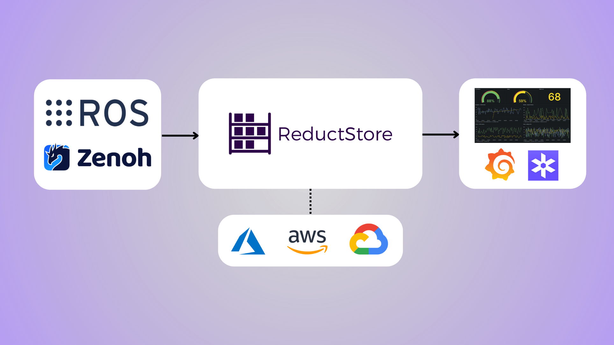
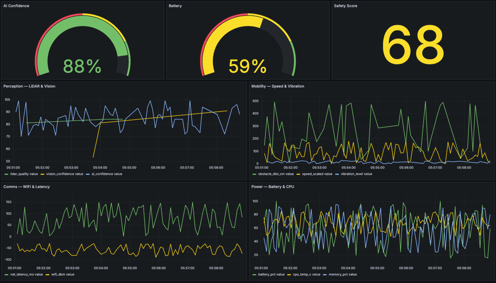
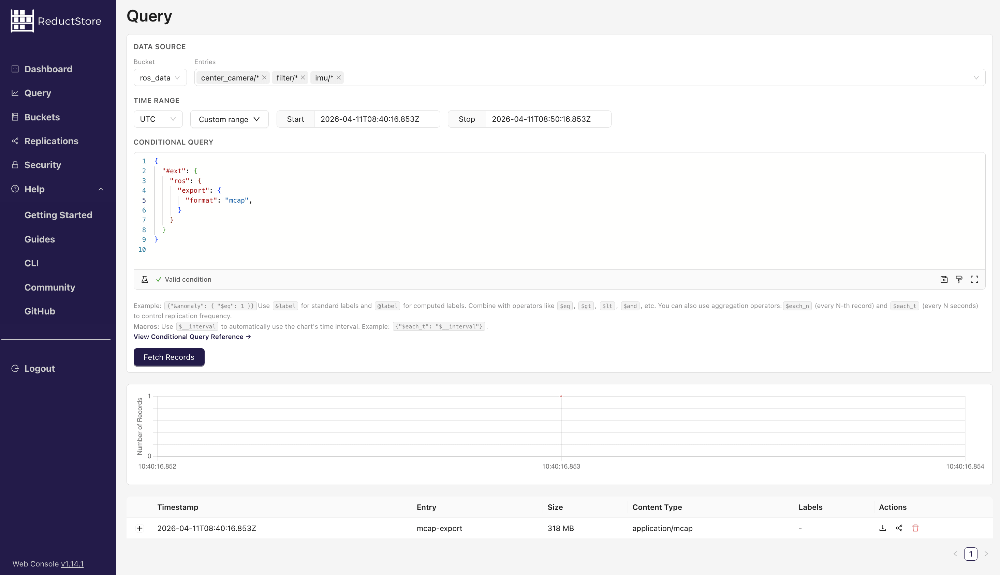
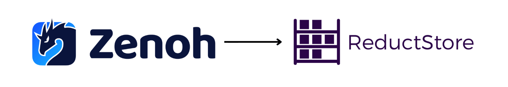
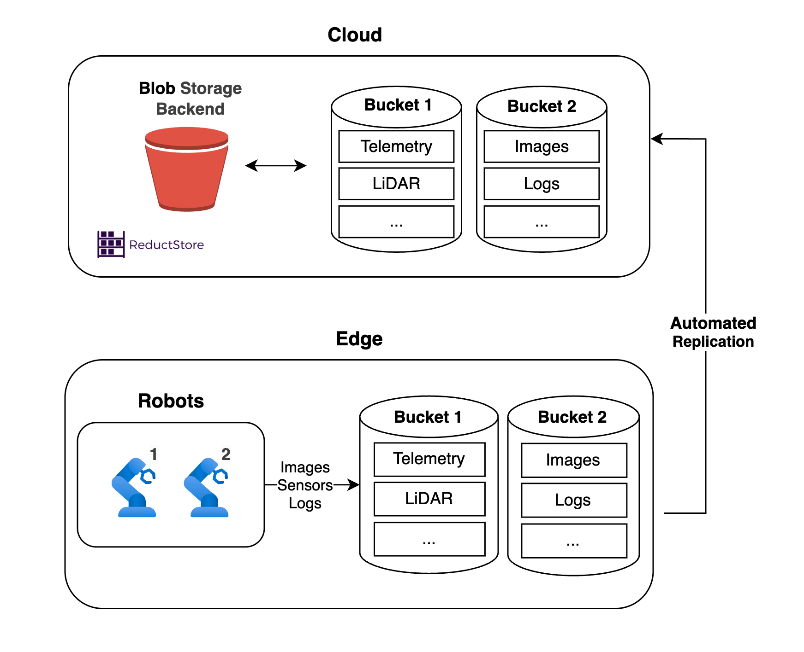
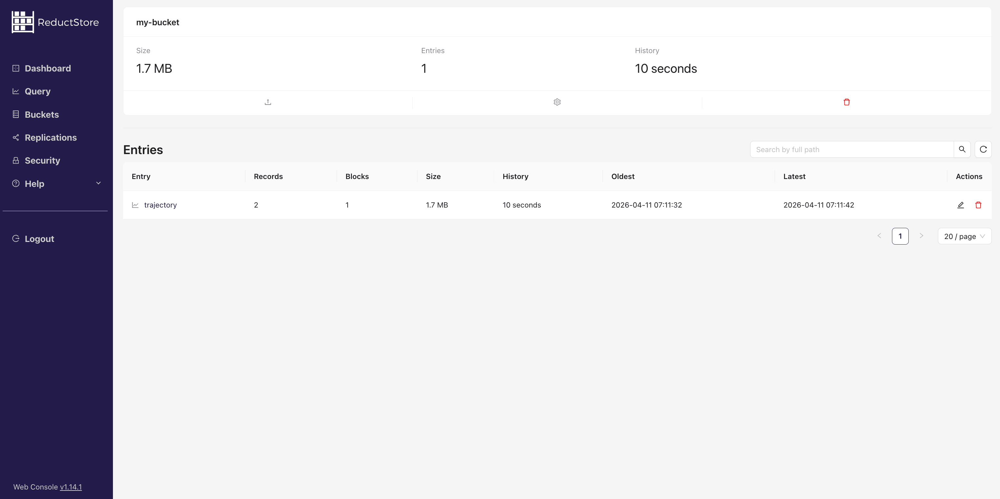

Robots generate _massive_ amounts of data, and managing it well is harder than it looks. Storage fills up fast, cloud transfer gets expensive, and real time ingestion is unforgiving when you're running cameras and sensors at high frequency.

This article covers practical strategies for handling robotic data, introduces [**ReductStore**](/), and walks through a hands on example. Along the way, we cover native ROS integration, Grafana dashboards, MCAP export for Foxglove, a Zenoh API, and native S3 and Azure backends. We also compare ReductStore against Rosbag and MongoDB so you can pick the right tool for each part of your stack.

{/* truncate */}

## Challenges in Robotic Data Management

Robots operate in dynamic environments and continuously produce large volumes of data. The core challenges engineers run into are:

- **High frequency, real time requirements**: A drone navigating a city must process camera and sensor data in milliseconds. Storage solutions need to keep up with these streams and make data accessible fast enough for real time decision making.
- **Limited on device storage**: Most robots can't store everything they generate. Size, weight, and power constraints limit local capacity, so good data management strategies are essential.
- **High data volume**: An autonomous vehicle can produce up to [**5 terabytes per hour**](https://www.datacenterfrontier.com/connected-cars/article/11429212/rolling-zettabytes-quantifying-the-data-impact-of-connected-cars) across camera feeds, LiDAR, radar, GPS, and sensors. Most databases weren't designed around that kind of throughput.
- **Cloud storage costs**: Pushing everything to the cloud isn't practical. Providers charge per gigabyte stored and transferred, and with robots producing terabytes, the bill adds up fast. What you send to the cloud is a decision worth making deliberately.
- **Data reduction complexity**: Filtering out irrelevant data without losing important information is tricky. Without a clear strategy, you either waste storage or throw away data you later need.

## General Strategies for Managing Robotic Data

A few approaches that work well in practice:

- **Use a time series object store**: Systems like ReductStore are designed specifically for high frequency, timestamped binary data. They offer fast writes, efficient querying, and manageable costs at scale.
- **Balance edge and cloud storage**: Keep recent, critical data on the robot for fast access. Move older or lower priority data to the cloud for long term storage and analysis. Splitting storage this way cuts costs without adding much latency to what matters.
- **Use volume based retention policies**: Rather than deleting data based on age, use a FIFO (first in, first out) quota. Data is only removed when the storage limit is reached, which avoids unnecessary deletion during downtime or low activity periods.
- **Compress where it makes sense**: H.265 for video, JPEG for images. The right format can cut storage by an order of magnitude without losing anything you actually need.
- **Prioritize what to keep**: Not all sensor data has equal value. Define what's critical upfront and discard the rest early in the pipeline.

## ReductStore: Built for Robotic Data

[**ReductStore**](/) is a time series database built specifically for unstructured, binary data. It's designed to handle high frequency sensor streams from autonomous vehicles, drones, industrial robots, and more. It stores data with timestamps and labels, supports fast real time ingestion, and comes with batching, filtering, and edge to cloud replication built in.

Here's what's available today.

### ROS Integration with reduct-bridge

[**reduct-bridge**](https://github.com/reductstore/reduct-bridge) connects live ROS 1 and ROS 2 systems directly to ReductStore. You configure it with a simple TOML file that defines your ROS topic inputs, pipelines, and the ReductStore destination. It subscribes to topics and stores each message as an individual record.

It also writes a `$ros` attachment to each entry with the message schema, topic name, and encoding — that metadata is what powers MCAP export and Grafana visualization, both covered below. If your stack is already on ROS, setup takes minutes.

### Cloud Storage: Native S3 and Azure

ReductStore supports native cloud storage backends for both [**Amazon S3 and Azure Blob Storage**](/docs/integrations/cloud-storage#azure-differences), no FUSE drivers needed. It uses a local cache for hot data and the cloud bucket for long term retention.

| Option             | What it means                                                                              |
| ------------------ | ------------------------------------------------------------------------------------------ |
| S3 compatible      | Works with AWS S3, MinIO, Ceph, Cloudflare R2, and any S3 compatible service               |
| Azure Blob Storage | Switch backends by changing a few environment variables. Same deployment patterns.         |
| Tiered access      | Recent data stays in the local cache for fast reads. Older data lives in the cloud bucket. |
| Read replicas      | Add read only replicas pointing at the same S3 bucket, close to your consumers.            |

For records around 100KB (a typical robotics sensor episode), ReductStore can be 10 to 100x faster than traditional time series object stores at a fraction of the cost.

### Visualize ROS Data in Grafana

ReductStore has a [**native Grafana integration**](/blog/grafana-visualization-ros-data) through the ReductStore data source plugin and the ReductROS extension. You can query ROS 2 messages directly in Grafana without any preprocessing. The extension decodes binary CDR messages into JSON on the fly.



You can monitor sensor streams live, compare data across multiple robots, and set up alerts when metrics drift. Our [**demo instance**](https://play.reduct.store/replica/) is public if you want to try it without any local setup.

### Export to MCAP for Foxglove

You can export raw ROS messages stored in ReductStore directly to MCAP and open them in [**Foxglove**](https://foxglove.dev). This is powered by the [**ReductROS extension**](/docs/extensions/official/ros-ext/raw).



When records are ingested via reduct-bridge, the `$ros` attachment carries the schema and topic information. The extension uses this to reconstruct valid MCAP files on demand. You can cover a full time range across multiple topics in a single query, and split by duration or file size for long recordings.

The data stays in ReductStore for fast querying, and you pull MCAP files from it on demand for visual inspection in Foxglove.

### Zenoh Native API

ReductStore now includes a [**Zenoh native API**](/docs/integrations/zenoh) alongside the existing HTTP API. Zenoh is a pub/sub protocol designed for robotics and distributed systems, and it's widely used in next generation ROS 2 deployments.



When enabled, ReductStore opens a Zenoh session with a subscriber for writes and a queryable for reads, both running in parallel with HTTP and sharing the same data. Zenoh keys become entry names, encodings map to content types, and attachments map to labels. Time range queries, conditional filters, and label lookups all work the same way they do over HTTP.

It's a natural fit if your robot stack already speaks Zenoh, or if you want to skip HTTP overhead on high frequency ingestion paths.

### Query Language and Batching

ReductStore uses a [**JSON based query language**](/docs/next/conditional-query#query-syntax) that supports filtering, aggregation, and time range operations. You can query data from a specific robot within a time window, compare sensor streams across robots in parallel, or filter by any label.

Retrieval is optimized through **batching**: multiple records are grouped into a single response based on a time range, which cuts down on request overhead and improves throughput. SDKs are available for Python, C++, JavaScript, and Rust. More in the [**querying guide**](/docs/guides/data-querying).

### Replication and Edge to Cloud Replication



ReductStore replicates at the bucket level, not the full dataset. That means you can choose to send only high priority sensor data to the cloud while keeping the rest at the edge. Replication is incremental, so only new data is transferred. Labels stored alongside records let you define fine grained rules based on content, for example, only replicate records flagged as anomalies or sampled at 1 in 10 seconds.

### Retention Strategies

[**Volume based retention**](/docs/guides/buckets#quota-type) follows the FIFO principle: data is only deleted when storage is full, making room for new records. This is different from time based retention, which deletes data after a fixed age regardless of whether storage is full. After an outage, a time based policy might delete data the system never had the chance to process. Volume based retention avoids that.

### Example Applications

| Application         | How ReductStore helps                                                                                  |
| ------------------- | ------------------------------------------------------------------------------------------------------ |
| Autonomous Vehicles | Handles high throughput sensor streams with efficient querying and selective edge to cloud replication |
| Industrial Robots   | Stores diagnostic data for predictive maintenance and continuous performance monitoring                |
| Drones and UAVs     | Supports offline operation in remote areas and syncs data when connectivity is restored                |

## Comparing ReductStore with Rosbag and MongoDB

Three tools come up most often when robotics teams think about data storage: Rosbag and MCAP, MongoDB, and ReductStore. They're built for different things.

|                            | Rosbag / MCAP          | MongoDB                   | ReductStore                |
| -------------------------- | ---------------------- | ------------------------- | -------------------------- |
| Data type                  | Binary ROS messages    | Semi structured documents | Binary timestamped records |
| Query across recordings    | No                     | Yes                       | Yes                        |
| Large binary payloads      | Yes                    | Slow via GridFS           | Yes, natively              |
| Retention                  | Manual file management | Time based                | Volume based FIFO          |
| ROS integration            | Native                 | None                      | Via reduct-bridge          |
| Cloud storage              | No                     | Atlas                     | Native S3 and Azure        |
| Write speed vs ReductStore | —                      | 9x slower                 | Baseline                   |
| Read speed vs ReductStore  | —                      | 23x slower                | Baseline                   |

**Rosbag and MCAP** are the standard for recording ROS sessions. They're great for capturing a snapshot during a test run. But they're file formats, not databases. Querying across many recordings requires custom scripts, there's no built in content indexing, and managing thousands of bag files quickly becomes its own problem. Use them for short recordings and local playback, not long term storage or fleet wide analysis.

**MongoDB** is flexible and works well for structured metadata, labels, and event logs. But it wasn't built for large binary payloads. For blob data, it relies on GridFS, which adds complexity and hurts performance. It also uses time based retention, so data can be deleted during idle periods even when storage isn't full.

**ReductStore** is designed specifically for the data robots actually produce: large, binary, timestamped records at high frequency. It connects to ROS via reduct-bridge, exports to MCAP for Foxglove, plugs into Grafana, and replicates selectively to S3 or Azure.

In practice: use Rosbag or MCAP for short test recordings, MongoDB for structured metadata and event logs, and ReductStore for raw sensor data that needs to be stored at scale, queried efficiently, and managed over time.

For a deeper look: [**MongoDB vs ReductStore: Choosing the Right Database for Robotics Applications**](/blog/robotics-mongodb-vs-reductstore).

## Hands-On Example: Storing Robotic Data in ReductStore

Let's walk through a [**practical example**](https://github.com/reductstore/reduct-robotics-example/blob/main/StoreQueryData.py) of storing and querying robotic data with ReductStore. We'll use trajectory data (coordinates, speed, orientation) to keep things simple, but the same approach works for any sensor stream.

You'll need _Python 3.8+_ installed.

### Setting Up ReductStore

Create a folder and add a _docker-compose.yaml_ file:

```yaml
version: "3.8"

services:
  reductstore:
    image: reduct/store:latest
    ports:
      - "8383:8383"
    volumes:
      - data:/data
    environment:
      - RS_API_TOKEN=my-token

volumes:
  data:
    driver: local
```

Start it with:

```bash
docker compose up -d
```

ReductStore will be available at http://127.0.0.1:8383. Check the container is running with `docker ps`, then install the Python libraries:

```bash
pip install reduct-py numpy
```

### Store and Query Data

#### Create a Bucket

```python
async def create_trajectory_bucket():
 async with Client("http://localhost:8383", api_token="my-token") as client:
  settings = BucketSettings(
	 quota_type=QuotaType.FIFO,
	 quota_size=1000_000_000,
	)
  await client.create_bucket("trajectory_data", settings, exist_ok=True)
```

The bucket uses a FIFO quota of 1 GB. Old data is only deleted when the limit is reached.

#### Generate Trajectory Data

```python
async def generate_trajectory_data(frequency: int = 10, duration: int = 1):
 interval = 1 / frequency
 start_time = datetime.now()

  for i in range(frequency * duration):
    time_step = i * interval
    x = np.sin(2 * np.pi * time_step) + 0.2 * np.random.randn()
    y = np.cos(2 * np.pi * time_step) + 0.2 * np.random.randn()
    yaw = np.degrees(np.arctan2(y, x)) + np.random.uniform(-5, 5)
    speed = abs(np.sin(2 * np.pi * time_step)) + 0.1 * np.random.randn()
    timestamp = start_time + timedelta(seconds=time_step)

    yield {
      "timestamp": timestamp.isoformat(),
      "position": {"x": round(x, 2), "y": round(y, 2)},
      "orientation": {"yaw": round(yaw, 2)},
      "speed": round(speed, 2),
    }
    await asyncio.sleep(interval)
```

This simulates a robot moving in 2D at 10 Hz for 1 second. _X_ and _y_ are position coordinates, _yaw_ is orientation, and _speed_ is derived from position changes.

#### Calculate Metrics

```python
def calculate_trajectory_metrics(trajectory: list) -> tuple:
  positions = np.array([[point["position"]["x"], point["position"]["y"]] for   point in trajectory])
  speeds = np.array([point["speed"] for point in trajectory])

  deltas = np.diff(positions, axis=0)
  distances = np.sqrt(np.sum(deltas**2, axis=1))
  total_distance = np.sum(distances)

  average_speed = np.mean(speeds)

  return total_distance, average_speed
```

#### Write to ReductStore

```python
async def store_trajectory_data():
  trajectory_data = []
  async for data_point in generate_trajectory_data(frequency=10, duration=1):
    trajectory_data.append(data_point)

  total_distance, average_speed = calculate_trajectory_metrics(trajectory_data)

  labels = {
    "total_distance": total_distance,
    "average_speed": average_speed
  }

  packed_data = pack_trajectory_data(trajectory_data)

  timestamp = datetime.now()

  async with Client("http://localhost:8383", api_token="my-token") as client:
    bucket = await client.get_bucket("my-bucket")
    await bucket.write("trajectory", packed_data, timestamp, labels=labels)


def pack_trajectory_data(trajectory: list) -> bytes:
  """Pack trajectory data json format"""
  return json.dumps(trajectory).encode("utf-8")
```

The labels (total distance and average speed) are stored alongside each record. You can later filter or replicate records based on these values.

Once data is written, you'll see the bucket populate in ReductStore:



#### Query by Label

```python
async def query_by_label(bucket_name, entry_name, label_key, label_value):
  async with Client("http://localhost:8383", api_token="my-token") as client:
    bucket = await client.get_bucket(bucket_name)

    async for record in bucket.query(
      entry_name,
      when={
        label_key: {"$gt": label_value}
      },
    ):
      # Do something with the record
```

Remove the _'when'_ condition to return all records with no filtering.

#### Main Function

```python
async def main():
  await create_trajectory_bucket()
    await store_trajectory_data()
    label_query_result = await query_by_label("my-bucket", "trajectory", "&total_distance", HIGH_DISTANCE)
    if label_query_result:
      print(f"Data queried by label: {label_query_result}")

asyncio.run(main())
```

## Conclusion

Robotics data pipelines don't have to be a mess of bag files, overpriced cloud storage, and custom scripts duct taped together. ReductStore covers ingestion, retention, replication, and querying in one place, with direct integrations into ROS, Foxglove, Grafana, S3, and Azure.

Start with what you need, and add the rest as your system grows. Check out [**reduct.store**](/) or read through the [**documentation**](/docs/how-does-it-work) to get going.

---

If you have any questions or comments, feel free to use the [**ReductStore Community Forum**](https://community.reduct.store/signup).
