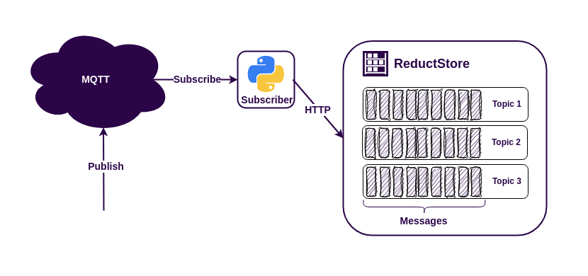

The MQTT protocol is an easy way to connect sensors, machines, robots, and other IoT data sources to applications. Some MQTT brokers can persist messages for a short time, but long-term history, retention policies, and efficient querying usually belong in a time series database.

There are [**many databases available for storing MQTT data**](/blog/advice/database/mqtt-data-storage), but if your payloads include JSON telemetry, images, vibration samples, protobuf messages, or other blob-like data, [**ReductStore**](/) is a good fit. It is designed for time-stamped unstructured data at the edge and supports labels for filtering, querying, and replication.

In previous MQTT tutorials, we used Rust, Python, or Node.js code to subscribe to MQTT topics and write records to ReductStore. This tutorial uses a different approach: **ReductBridge** subscribes to MQTT, extracts labels from payloads, and forwards data to [**ReductStore**](https://github.com/reductstore/reductstore) using only a TOML configuration file.

{/* truncate */}

## Prerequisites

For this example, you need:

- Docker and Docker Compose
- Optional: `mosquitto_pub` for manual MQTT publishing

You can find the full source code for this tutorial in the [**mqtt-bridge-example repository**](https://github.com/reductstore/mqtt-bridge-example).

## Architecture Overview

The example runs four services with Docker Compose:

- **sensor**: a demo publisher that sends JSON temperature and pressure data every second.
- **mosquitto**: an MQTT broker that receives messages from the sensor.
- **reduct-bridge**: a ReductBridge container that subscribes to the MQTT topic, maps the JSON `temperature` field to a ReductStore label, and writes records to ReductStore.
- **reductstore**: the database that stores all MQTT records and replicates high-temperature records into a second bucket.

The data path looks like this:

```text
Sensor -> Mosquitto MQTT Broker -> ReductBridge -> ReductStore
```

ReductStore is provisioned with two buckets:

- `all-data`: stores every MQTT record from the bridge.
- `high-temp`: receives only records where the extracted `temp` label is greater than `40`.

The filtering happens inside ReductStore with a replication rule. ReductBridge only needs to extract the label once when it writes each record.

## Docker Compose Setup

The whole demo is defined in one `docker-compose.yml` file:

```yaml
services:
  # Eclipse Mosquitto MQTT broker
  mosquitto:
    image: eclipse-mosquitto:2
    ports:
      - "1883:1883"
    volumes:
      - ./mosquitto/mosquitto.conf:/mosquitto/config/mosquitto.conf:ro

  # ReductStore instance receiving data from ReductBridge and replicating to a high-temp bucket based on the defined replication rule
  reductstore:
    image: reduct/store:latest
    ports:
      - "8383:8383"
    environment:
      # ReductStore configuration via environment variables
      RS_API_TOKEN: reduct
      RS_INSTANCE_NAME: iot-demo

      # Provisioning buckets for storing all data and high-temperature data
      RS_BUCKET_1_NAME: all-data
      RS_BUCKET_2_NAME: high-temp

      # Replication rule to replicate data from all-data to high-temp when temperature exceeds 40 degrees
      RS_REPLICATION_1_NAME: high-temp-replication
      RS_REPLICATION_1_SRC_BUCKET: all-data
      RS_REPLICATION_1_DST_BUCKET: high-temp
      RS_REPLICATION_1_DST_HOST: http://localhost:8383
      RS_REPLICATION_1_DST_TOKEN: reduct
      RS_REPLICATION_1_WHEN: '{"&temp": {"$$gt": 40}}'
    volumes:
      - reductstore-data:/data

  # ReductBridge instance bridging MQTT data to ReductStore based on the defined configuration
  reduct-bridge:
    image: reduct/bridge:latest-iot
    command: ["reduct-bridge", "/config/bridge-config.toml"]
    volumes:
      - ./bridge-config.toml:/config/bridge-config.toml:ro
    depends_on:
      - mosquitto
      - reductstore

  sensor:
    build:
      context: ./sensor
    depends_on:
      - mosquitto

volumes:
  reductstore-data:
```

The `mosquitto` service listens on port `1883` and uses a minimal local configuration:

```text
listener 1883
allow_anonymous true
```

The `reductstore` service publishes the Web Console and HTTP API on `http://localhost:8383`. It also uses environment variables to provision an API token, two buckets, and a replication rule.

The `reduct-bridge` service uses the `reduct/bridge:latest-iot` image. The `-iot` image variant includes MQTT support, so no custom bridge image is required.

The `sensor` service builds a small Python container that publishes MQTT messages to the broker. The publisher is only there to generate sample data; you can inspect it in [`sensor/main.py`](https://github.com/reductstore/mqtt-bridge-example/blob/main/sensor/main.py) or replace it with any MQTT producer.

## Configuring ReductBridge

ReductBridge is configured with `bridge-config.toml`:

```toml
# Connection details for the reduct remote. This is where the bridge will send data to.
[[remotes.reduct]]
name = "local"
url = "http://reductstore:8383"
token_api = "reduct"
bucket = "all-data"
prefix = ""

# MQTT connection details.
# This section defines an MQTT input that will connect to the specified broker and subscribe to the defined topics.
[inputs.mqtt.sensor]
broker = "mqtt://mosquitto:1883"
client_id = "reduct-bridge"
version = "v3"
qos = 1
entry_prefix = ""

# MQTT topic subscription details.
# In this example, we subscribe to the "sensor/data" topic and specify that the content type is JSON.
# We also define a label mapping to extract the "temperature" field from the JSON payload and label it as "temp".
[[inputs.mqtt.sensor.topics]]
name = "sensor/data"
entry_name = "sensor-data"
content_type = "application/json"
labels = [
  { field = "temperature", label = "temp" },
]

# Connect the input to the pipeline. This tells the bridge to take the data from the "sensor" input and send it to the "reduct" remote.
[pipelines.sensor_pipeline]
remote = "local"
inputs = ["sensor"]
```

The configuration has three important parts.

First, `[[remotes.reduct]]` defines where records should be written. In this example, ReductBridge writes to the `all-data` bucket in the `reductstore` container and authenticates with the `reduct` token.

Second, `[inputs.mqtt.sensor]` defines the MQTT broker connection. The bridge connects to Mosquitto with MQTT v3 and QoS 1.

Third, `[[inputs.mqtt.sensor.topics]]` defines the subscription. The bridge subscribes to `sensor/data`, writes every message under the ReductStore entry name `sensor-data`, sets the content type to `application/json`, and extracts the JSON field `temperature` into a ReductStore label named `temp`.

The pipeline connects the MQTT input to the ReductStore remote. That is the main zero-code advantage: MQTT subscription, record naming, content type assignment, label extraction, and forwarding are all configured declaratively.

## Configuring ReductStore Replication

The ReductStore service is also configured without code. This environment block provisions the storage and filtering behavior:

```yaml
environment:
  # ReductStore configuration via environment variables
  RS_API_TOKEN: reduct
  RS_INSTANCE_NAME: iot-demo

  # Provisioning buckets for storing all data and high-temperature data
  RS_BUCKET_1_NAME: all-data
  RS_BUCKET_2_NAME: high-temp

  # Replication rule to replicate data from all-data to high-temp when temperature exceeds 40 degrees
  RS_REPLICATION_1_NAME: high-temp-replication
  RS_REPLICATION_1_SRC_BUCKET: all-data
  RS_REPLICATION_1_DST_BUCKET: high-temp
  RS_REPLICATION_1_DST_HOST: http://localhost:8383
  RS_REPLICATION_1_DST_TOKEN: reduct
  RS_REPLICATION_1_WHEN: '{"&temp": {"$$gt": 40}}'
```

The token protects the ReductStore API. The two bucket variables create `all-data` and `high-temp` at startup.

The replication rule reads records from `all-data` and writes matching records to `high-temp`. The `RS_REPLICATION_1_WHEN` condition uses the label query syntax `{"&temp": {"$gt": 40}}`, which means "replicate only records whose `temp` label is greater than `40`." In YAML, the dollar sign is escaped as `$$gt`, so the container receives `$gt`.

This is useful for edge deployments because you can keep the full local stream while maintaining a smaller filtered bucket for alerts, dashboards, cloud sync, or downstream processing.

## Running the Example

Clone the example repository and start the stack:

```bash
$ git clone https://github.com/reductstore/mqtt-bridge-example
$ cd mqtt-bridge-example
$ docker compose up
```

After the images are built and started, you should see the sensor publishing messages and the bridge forwarding them to ReductStore:

```text
sensor-1         | Connected to MQTT broker at mosquitto:1883
sensor-1         | Published to sensor/data: {'temperature': 47.32, 'pressure': 1018.64}
sensor-1         | Published to sensor/data: {'temperature': 29.41, 'pressure': 978.11}
sensor-1         | Published to sensor/data: {'temperature': 53.08, 'pressure': 1004.22}
```

Open the ReductStore Web Console at `http://localhost:8383` and use the API token `reduct`. You should see the `all-data` and `high-temp` buckets. The `all-data` bucket contains the complete stream under the `sensor-data` entry. The `high-temp` bucket contains only records whose extracted `temp` label matched the replication rule.

You can also publish a manual MQTT message if you have `mosquitto_pub` installed:

```bash
$ mosquitto_pub -h localhost -p 1883 -t sensor/data -m '{"temperature": 55.5, "pressure": 1001.0}'
```

This message is written to `all-data` and replicated to `high-temp` because `temperature` becomes the `temp` label and `55.5 > 40`.

## Using Stored MQTT Data

Once MQTT records are in ReductStore, they are available for querying, visualization, and downstream processing:

- Query JSON payloads by time interval and label conditions with [**ReductStore data querying**](/docs/guides/data-querying). In this example, the `temp` label extracted by ReductBridge lets you request only records that match conditions such as `temp > 40`.
- Visualize time-series data in dashboards with the [**ReductStore Grafana data source plugin**](/docs/integrations/grafana). This is useful for monitoring sensor trends, alerting on thresholds, and comparing filtered buckets like `all-data` and `high-temp`.
- Use the [**ReductStore SDKs**](/docs/sdk/py) to read data into your own data pipelines, ML jobs, ETL workers, or robotics applications.
- Run SQL queries, analyze JSON/CSV/Parquet records, batch results, and export them as CSV or Parquet with the [**ReductSelect extension**](/docs/extensions/official/select-ext).

## Conclusion

ReductBridge removes the need to write and maintain custom MQTT subscriber code. In this tutorial, the ingestion pipeline is configured with Docker Compose and one TOML file: Mosquitto receives MQTT messages, ReductBridge subscribes to `sensor/data`, ReductStore stores every record in `all-data`, and a server-side replication rule copies only high-temperature records into `high-temp`.

This configuration-only approach is especially useful at the edge, where deployments should be simple, reproducible, and easy to update. You can find the full source code in the [**mqtt-bridge-example repository**](https://github.com/reductstore/mqtt-bridge-example), read more about [**ReductBridge**](/docs/reduct-bridge), and learn how to tune [**ReductStore replication rules**](/docs/guides/data-replication) for your own MQTT workloads.

---

I hope this tutorial was helpful. If you have any questions or feedback, use the [**ReductStore Community**](https://community.reduct.store/signup) forum.
