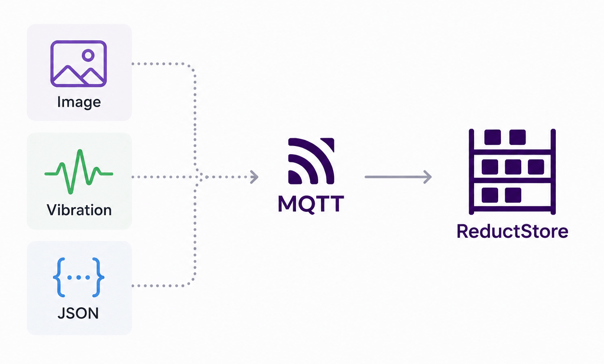

MQTT is a common choice for the communication stack in IoT and robotics applications because it is lightweight and easy to integrate.
But many of those applications do not send only small JSON telemetry messages.
They also publish JPEG frames, vibration waveforms, audio clips, protobuf messages, and other binary payloads that need to be stored and queried later.

This is where a regular MQTT broker or a traditional time-series database starts to fall short.
Brokers are designed for message delivery, not long-term historical storage, and many databases either expect structured numeric fields or make it hard to keep large binary records tied to accurate timestamps.

In this tutorial, we will use [**ReductBridge**](https://github.com/reductstore/reduct-bridge) to subscribe to MQTT topics and write the raw binary payloads into [**ReductStore**](https://github.com/reductstore/reductstore) with a time index.
This lets you keep camera frames and sensor payloads as they are, while still querying them by time range, labels, and entry name for replay, debugging, and offline analysis.

{/* truncate */}

## Why Existing Stacks Fail for Binary MQTT Payloads

Most MQTT storage solutions work well for small structured telemetry: temperature, pressure, status values, or JSON events.
They start to break down when the same system needs to store camera frames, audio chunks, vibration buffers, protobuf messages, or other binary payloads.
These records are larger, often opaque to the storage layer, and still need to be queried later by time, device, topic, and process metadata.

Traditional SQL databases can store binary objects, but they are not a good default for this workload.
Large blobs quickly make tables heavy, backups slow, and queries expensive.
They also do not give you a natural way to keep an append-only history of records by topic and timestamp.
You can build this model yourself, but then you need to manage schema, indexes, retention, and cleanup logic on top of the database.

Time-series databases are closer to the problem, but they are usually designed for metrics.
They work best when each record is a small set of numeric fields with tags.
Binary MQTT payloads do not fit that shape.
If you base64-encode a frame into JSON, the payload becomes larger and harder to process.
If you store only a file path in the time-series database and put the binary data somewhere else, you now have two systems that must stay in sync.

Object storage and local files solve the blob part, but not the history part.
They are good at storing large objects, but they do not provide a proper time index for range queries.
Putting timestamps into file names or object keys works for a demo, but it becomes fragile when you need to ask practical questions such as: give me all frames from this camera between two timestamps, only for this production line, and only when this label was present.

Disk usage is another problem.
Binary data can fill a disk very quickly, and the rate is not always predictable.
A camera may switch to a higher resolution, a sensor may start publishing faster, or a fault may produce more events than usual.
For this kind of workload, retention based only on time is not always safe.
You often need retention based on storage size too, for example keeping the newest records while the bucket stays under a fixed disk limit.

Replication also needs a different model.
For MQTT binary data at the edge, copying the whole database or mirroring all files is usually too expensive.
Most teams need to stream only new records that match metadata: a site, a device, a topic, a camera, an event type, or an error label.
That way, important data can be moved to another node or to the cloud, while raw high-volume data can stay close to the device.

So the storage layer needs to handle three things together: raw binary payloads, a time index, and metadata for filtering.
Without all three, the system becomes a collection of workarounds instead of a queryable history of MQTT data.

## The Timestamp Problem: MQTT Does Not Timestamp Messages

MQTT is good at moving messages between devices and services, but it does not define when the data inside a message was created.
A broker may know when it received a publish packet, and a subscriber may know when it processed the message.
For historical storage, however, you usually need a different timestamp: when the camera captured the frame, when the waveform was sampled, or when the sensor event happened.

If you store MQTT data by arrival time, the history can look correct but still be shifted from reality.
Network delay, broker queues, reconnects, QoS retries, batching, and slow consumers can all move the stored timestamp away from the capture time.
This may be acceptable for simple monitoring, but it becomes a problem when you need to replay data or compare several streams.

For example, you may need to match a camera frame with a PLC state, a vibration buffer with a machine alarm, or an audio clip with a robot event.
If each stream uses a different idea of time, the correlation becomes unreliable.

For binary MQTT payloads, the timestamp should usually come from the producer and stay outside the payload.
You should not need to decode a JPEG frame, waveform buffer, or protobuf message only to find its time.
It is better to pass the timestamp as metadata, for example in an MQTT user property, a topic convention, or another field that can be mapped to the stored record.

When the producer cannot provide a timestamp, using ingestion time is still useful.
But it should be treated as the time when the bridge received the message, not necessarily the time when the data was captured.

## Architecture Overview

In this tutorial, we use MQTT as the transport layer and ReductStore as the historical storage layer.
ReductBridge connects them together and converts MQTT messages into time-indexed records.

The data flow looks like this:

```svgbob
                                             .----------------------.
                                            /      ReductStore       \
                                           /--------------------------\
                                           | * FIFO quota             |
                                           | * queries                |
                                           | * replication            |
                                           +--------------------------+
                                                         ^
                                                         |
                                                         |
                                     "raw data + timestamp + labels"
                                                         |
                                                         |
                         .-----------.        +----------+---------+
                        /             \       |                    |
                       +  MQTT broker  +----->|  ReductBridge      |
                        \             /       |                    |
                         '-----------'        +--------------------+
                               ^
                               |
                               |
             "MQTT v5 payload + user properties"
             +-----------------+-------------------+
             |                 |                   |
             |                 |                   |
        +----+----+     +------+------+     +------+-------+
        | Camera  |     | Vibration   |     | Automation   |
        | frames  |     | waveforms   |     |"state/events"|
        +---------+     +-------------+     +--------------+
```

Several producers can publish different types of data to the same broker.
A camera may publish JPEG frames, a vibration sensor may publish waveform buffers, and an automation system may publish the current machine state or events.

We use MQTT v5 because it can attach user properties to every message.
The binary payload stays unchanged, while metadata travels next to it.
For example, a camera frame can include properties such as `device_id`, `line`, `content_type`, and `event_time`.

The `event_time` property contains the original capture timestamp as Unix time with microsecond resolution.
ReductBridge reads this property and uses it as the timestamp of the ReductStore record.
Other MQTT user properties are mapped to ReductStore labels, so the data can be filtered later without decoding the binary payload.

ReductBridge can also use metadata from one topic to enrich data from another topic.
For example, an automation topic may publish the current machine `state`.
The bridge can remember this label and apply it to camera frames or sensor buffers, so later you can query data by both time and process state.

ReductStore stores the resulting records as append-only time-indexed data.
It keeps the original binary payload, stores labels for filtering, applies FIFO quota rules to control disk usage, and can optionally replicate selected data to another storage node.

## Install ReductStore and ReductBridge

This tutorial assumes that your MQTT v5 broker is already running and that your producers already publish binary payloads to it.
The broker can be Mosquitto, EMQX, HiveMQ, or another MQTT v5-compatible broker.
We only need to add two components: ReductStore for storage and ReductBridge for moving MQTT messages into the store.

The quickest way to start ReductStore is with Docker:

```bash
mkdir -p ./reduct-data
sudo chown -R 10001:10001 ./reduct-data

docker run -d --name reductstore \
  -p 8383:8383 \
  -e RS_API_TOKEN="my-token" \
  -v "$PWD/reduct-data:/data" \
  reduct/store:latest
```

ReductStore will listen on `http://127.0.0.1:8383` and store data in `./reduct-data`.
The `RS_API_TOKEN` value is used later by ReductBridge and `reduct-cli`.

For ReductBridge, use the `iot` build because it includes the MQTT input:

```bash
docker pull reduct/bridge:latest-iot
```

After creating the configuration file in the next section, run the bridge with:

```bash
docker run --rm --network host \
  -v "$PWD/bridge.toml:/etc/reduct-bridge/config.toml:ro" \
  reduct/bridge:latest-iot /etc/reduct-bridge/config.toml
```

The `--network host` option keeps the example short because the container can reach `127.0.0.1:8383` and a broker running on the host.
In production, you can run ReductStore and ReductBridge as systemd services or in your own container stack.

If you do not use Docker, download a ReductStore binary from the [**ReductStore releases**](https://github.com/reductstore/reductstore/releases/latest) and the `iot` ReductBridge build from the [**ReductBridge releases**](https://github.com/reductstore/reduct-bridge/releases/latest).
Then run them with the same data path, API token, and config file:

```bash
RS_DATA_PATH=./reduct-data RS_API_TOKEN="my-token" ./reductstore
reduct-bridge ./bridge.toml
```

## Configure ReductBridge for Binary Payloads

Create `bridge.toml` with the MQTT input, a pipeline, and a ReductStore remote:

```toml
# MQTT input named "factory". It connects to the existing broker and
# subscribes to the topics declared below.
[inputs.mqtt.factory]
broker = "mqtt://127.0.0.1:1883"
client_id = "reduct-bridge-mqtt-binary"
version = "v5"
qos = 1

# Camera frames are binary JPEG payloads. The MQTT topic becomes the source,
# while entry_name controls where records are stored in ReductStore.
[[inputs.mqtt.factory.topics]]
name = "factory/camera/+"
entry_name = "camera_frames"
content_type = "image/jpeg"
timestamp = { property = "event_time", format = "unix_us" }
labels = [
  { property = "device_id", label = "device_id" },
  { property = "line", label = "line" },
  { static = { source = "mqtt", kind = "camera" } }
]

# Vibration messages are also stored as raw bytes. Only MQTT v5 properties are
# read for timestamp and labels, so the waveform payload is not decoded.
[[inputs.mqtt.factory.topics]]
name = "factory/vibration/+"
entry_name = "vibration"
content_type = "application/octet-stream"
timestamp = { property = "event_time", format = "unix_us" }
labels = [
  { property = "device_id", label = "device_id" },
  { property = "line", label = "line" },
  { static = { source = "mqtt", kind = "vibration" } }
]

# Automation state is a lightweight JSON stream. The state label is extracted
# from the JSON payload and can be copied to other entries by the pipeline.
[[inputs.mqtt.factory.topics]]
name = "factory/automation/state"
entry_name = "automation_state"
content_type = "application/json"
timestamp = { property = "event_time", format = "unix_us" }
labels = [
  { property = "line", label = "line" },
  { field = "state", label = "state" },
  { static = { source = "mqtt", kind = "automation" } }
]

# Pipeline routes records from the MQTT input to the ReductStore remote.
# The label rule copies the latest JSON-derived automation state to records.
[pipelines.mqtt_to_store]
remote = "local"
inputs = ["factory"]
labels = [
  { from = "automation_state", labels = ["state"], to = "*" },
]

# ReductStore remote. All records are written to this bucket, and the prefix is
# prepended to each entry name, for example mqtt/camera_frames.
[remotes.reduct.local]
url = "http://127.0.0.1:8383"
token_api = "my-token"
bucket = "mqtt-binary"
prefix = "mqtt/"

# Create the bucket on startup with a FIFO quota so the edge node keeps the
# newest data when the storage budget is reached.
[remotes.reduct.local.create_bucket]
quota_type = "FIFO"
quota_size = "20GB"
```

The camera and vibration topics are treated as binary streams.
ReductBridge does not decode their payloads.
It writes the MQTT payload bytes as the ReductStore record body and uses metadata from MQTT v5 properties.

The important part is the `timestamp` line:

```toml
timestamp = { property = "event_time", format = "unix_us" }
```

This tells ReductBridge to read the MQTT v5 user property `event_time` and use it as the ReductStore record timestamp.
The value must be Unix time in microseconds.
Other supported formats include `unix_s`, `unix_ms`, `unix_ns`, `iso8601`, and `ros_stamp`.
If the property is missing or cannot be parsed, ReductBridge falls back to ingest time.

The `labels` arrays copy metadata into ReductStore labels.
For binary topics, labels come from MQTT v5 properties so the payload remains untouched.
For the automation topic, `state` comes from the JSON payload field:

```toml
{ field = "state", label = "state" }
```

For example, a camera publisher can send these user properties with each JPEG frame:

```text
event_time=1780582163840000
device_id=cam-01
line=line-a
```

ReductBridge stores that frame in the `mqtt/camera_frames` entry because the remote adds the `mqtt/` prefix.
It also stores labels such as `device_id=cam-01`, `line=line-a`, and `kind=camera`.
The record content type is handled separately by the topic-level `content_type = "image/jpeg"` setting.

The pipeline-level `labels` rules show the enrichment pattern from the architecture section.
When the `automation_state` entry receives a `state` label extracted from JSON, the pipeline can copy the latest value to later records.
That lets you query camera frames not only by time and device, but also by process state:

```toml
labels = [
  { from = "automation_state", labels = ["state"], to = "*" },
]
```

The remote section creates the `mqtt-binary` bucket automatically with a FIFO quota.
With this setting, ReductStore keeps accepting new records and removes the oldest data when the bucket reaches `20GB`.
Adjust this value to the disk budget of your edge node:

```toml
[remotes.reduct.local.create_bucket]
quota_type = "FIFO"
quota_size = "20GB"
```

## Query Data by Time Range

After ReductBridge is running and messages are arriving, use the Python SDK to verify the entries and query records by time range and labels:

```python
import asyncio
from pathlib import Path

from reduct import Client


async def main():
    async with Client("http://127.0.0.1:8383", api_token="my-token") as client:
        bucket = await client.get_bucket("mqtt-binary")

        output_dir = Path("records")
        output_dir.mkdir(exist_ok=True)

        async for record in bucket.query(
            "mqtt/*",
            start="2026-06-04T10:00:00Z",
            stop="2026-06-04T10:05:00Z",
            when={
                "&state": {"$eq": "running"},
            },
        ):
            payload = await record.read_all()
            entry = record.entry.replace("/", "_")
            extension = {
                "image/jpeg": ".jpg",
                "application/json": ".json",
            }.get(record.content_type, ".bin")
            filename = output_dir / f"{entry}-{record.timestamp}{extension}"
            with open(filename, "wb") as output:
                output.write(payload)
            print(filename, record.content_type, record.labels)


if __name__ == "__main__":
    asyncio.run(main())
```

You should see entries such as `mqtt/camera_frames`, `mqtt/vibration`, and `mqtt/automation_state`.
The timestamps should match the producer-provided `event_time` property when it is present.
The query uses the `mqtt/*` wildcard to select all entries, then filters records by time range and the copied `state=running` label.
Each payload is saved as-is, with the file extension selected from the record content type where possible.

## Next Steps

This tutorial focused on the bridge configuration because the MQTT broker and data sources were assumed to exist.
From here, you can adapt the same pattern to your own topics, labels, and retention policy.

- Learn how to store MQTT data with the [**Python MQTT tutorial**](/blog/tutorials/iot/how-to-keep-mqtt-data-python).
- See a Rust implementation in the [**Rust MQTT tutorial**](/blog/tutorials/iot/how-to-keep-mqtt-data-rust).
- Compare storage choices in [**How to Choose the Right MQTT Database**](/blog/advice/database/mqtt-data-storage).
- Review the [**ReductBridge documentation**](/docs/next/reduct-bridge) and the [**MQTT input reference**](/docs/next/reduct-bridge/input/mqtt).
- Read about ReductStore [**data querying**](/docs/guides/data-querying), [**bucket quotas**](/docs/guides/buckets), and [**data replication**](/docs/guides/data-replication).

---

I hope you found this article helpful. If you have any questions or feedback, don't hesitate to use the [**ReductStore Community**](https://community.reduct.store/signup) forum.

Thanks for reading!
