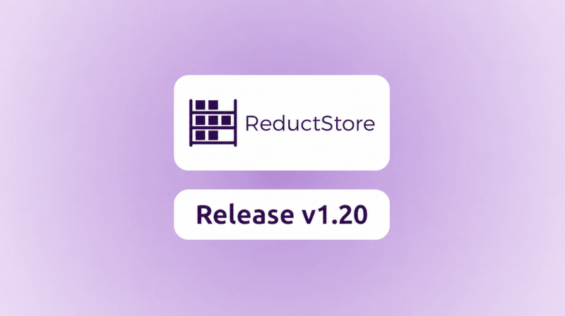

ReductStore [**1.20.0**](https://github.com/reductstore/reductstore/releases/tag/v1.20.0) is now available. This release adds lifecycle policies for automated retention and compression, expands Protobuf support across the ingestion and query ecosystem, and brings SQL and Parquet workflows to the ReductSelect extension.

To download the latest release, visit the [**Download Page**](/download).

## What's new in 1.20.0?

The first major change in v1.20 is [**lifecycle policies**](/docs/guides/lifecycle-policies). ReductStore can now run background tasks that delete or compress old records based on age, entry names, and optional label conditions. This makes retention and storage-efficiency rules part of the database configuration instead of an external cleanup script.

The second major change is Protobuf support across the ecosystem. [**ReductBridge**](/docs/reduct-bridge) can ingest Protobuf payloads from MQTT, extract labels from message fields, and store schema metadata as a `$schema` entry attachment. [**ReductSelect**](/docs/extensions/official/select-ext) can then use the same attachment to decode records and run SQL over the decoded fields.

The release also extends ReductSelect with SQL processing for structured records and Parquet support for analytics-oriented pipelines. You can query CSV, JSON, Protobuf, and Parquet records with the same `ENTRY()` table function and export selected results as Parquet files.

{/* truncate */}

### Lifecycle Policies

Lifecycle policies are background tasks that automatically manage old records in a bucket. A policy can delete records or compress persisted blocks with zstd, and it can be scoped by entry names, record age, and, for delete policies, conditional expressions.

This is useful when data has different operational and historical value over time. For example, recent telemetry can stay uncompressed for frequent access, older telemetry can be compressed to reduce storage usage, and very old data can be deleted later by a separate policy.

Policies support three modes: `enabled`, `dry_run`, and `disabled`. Every run writes diagnostics to the `$system/lifecycle` system entry, so operators can inspect policy behavior before and after enabling automatic actions.

Here is a provisioning example for deleting temperature records older than 30 days from selected sensor entries:

```yaml
version: "3"
services:
  reductstore:
    image: reduct/store:v1.20.0
    ports:
      - "8383:8383"
    volumes:
      - ./data:/data
    environment:
      RS_API_TOKEN: my-api-token
      RS_BUCKET_1_NAME: telemetry
      RS_LIFECYCLE_1_NAME: purge-sensors-30d
      RS_LIFECYCLE_1_BUCKET: telemetry
      RS_LIFECYCLE_1_TYPE: delete
      RS_LIFECYCLE_1_OLDER_THAN: 30d
      RS_LIFECYCLE_1_INTERVAL: 10m
      RS_LIFECYCLE_1_ENTRIES: "sensor-1,sensor-2"
      RS_LIFECYCLE_1_WHEN: |
        {
          "&sensor_type": { "$eq": "temperature" }
        }
```

For the full configuration reference and SDK examples, see the [**Lifecycle Policies**](/docs/guides/lifecycle-policies) guide.

### Protobuf Support in the Ecosystem

v1.20 connects Protobuf ingestion, storage, and querying through a shared schema-attachment convention. This makes binary telemetry easier to keep compact at ingest time while preserving the metadata required for downstream processing.

#### ReductSelect Extension

ReductSelect processes Protobuf records with content types such as `application/protobuf`, `application/x-protobuf`, and `application/vnd.google.protobuf`. By default, it reads the message descriptor from the entry's `$schema` attachment and exposes decoded fields to SQL.

The attachment stores the payload encoding, message type, and base64-encoded `FileDescriptorSet`:

```json
{
  "encoding": "protobuf",
  "schema_name": "pkg.SensorReading",
  "schema": "<base64-encoded FileDescriptorSet>"
}
```

With the schema attached to the entry, a ReductSelect query can stay small:

```json
{
  "protobuf": {},
  "sql": "SELECT device_id, temperature FROM ENTRY() WHERE temperature > 20"
}
```

For lightweight cases, ReductSelect can also extract top-level scalar fields directly by Protobuf field number without a full descriptor. See the [**ReductSelect Protobuf documentation**](/docs/extensions/official/select-ext) for both modes.

#### ReductBridge

ReductBridge's MQTT input can now ingest Protobuf payloads and extract labels from message fields. In schema mode, the bridge stores the descriptor as a `$schema` attachment so the same data can later be decoded by ReductSelect or exported by ReductROS.

```toml
[[inputs.mqtt.main.topics]]
name = "factory/electrical/+/power"
entry_name = "power"
content_type = "application/protobuf"
schema_path = "./factory.desc"
schema_name = "factory.PowerReading"
labels = [
  { field = "device_id", label = "meter_id" },
  { field = "panel", label = "panel" }
]
```

If a pipeline only needs a few top-level scalar fields, ReductBridge can also extract labels from raw wire fields without a schema. For details, see the [**MQTT input documentation**](/docs/reduct-bridge/input/mqtt).

### SQL and Parquet Support in ReductSelect

ReductSelect is now better suited for structured data processing directly inside ReductStore queries. The extension exposes each queried record through the `ENTRY()` table function, allowing SQL selection, filtering, aggregation, and computed output columns over supported structured payloads.

Parquet records are processed when the record content type is `application/vnd.apache.parquet` or when the query explicitly enables Parquet parsing. The same extension can export query results as Parquet, with batching controlled by row count or duration.

```json
{
  "parquet": {},
  "sql": "SELECT name, value FROM ENTRY() WHERE value > 10",
  "export": {
    "format": "parquet",
    "rows": 100
  }
}
```

SQL result columns can also be written back as computed labels, which is useful when a pipeline extracts metadata from payloads and wants later queries or replication rules to use it as regular ReductStore labels.

For query parameters and examples, see the [**ReductSelect extension**](/docs/extensions/official/select-ext) documentation.

## What's Next

The next area of work is making ReductStore's integration ecosystem easier to operate in production. We plan to keep improving ReductBridge pipelines, schema-aware tooling, and examples that connect MQTT, ROS, Zenoh, and analytics workflows around a shared storage layer.

We are also continuing to improve the extension model so data can be transformed, queried, and exported closer to where it is stored, without forcing every workflow to move raw payloads into separate processing systems first.

## Compatibility and Migration

This release is expected to be compatible with existing v1.19 deployments. Lifecycle policies are opt-in, and ReductSelect and ReductBridge additions only affect deployments that enable those workflows.

The `$audit` bucket is deprecated in v1.20. Audit events are now written to the `$system/audit` entry, together with other system events. Persistence of system events is enabled by default and can be disabled with `RS_SYSTEM_EVENTS_ENABLED=false`; quota and replication-related options are documented in the [**System Event Settings**](/docs/configuration/settings#system-event-settings) section.

---

If you have questions or feedback, join the [**ReductStore Community**](https://community.reduct.store) forum.

Thanks for using [**ReductStore**](/)!
