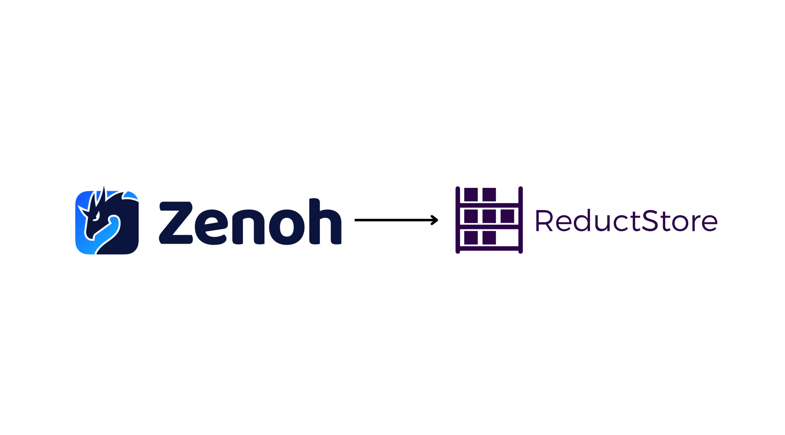

If you're running Zenoh, whether as `rmw_zenoh` in ROS 2 or as the transport between a robot, a gateway, and the cloud, you'll eventually run into the same question:

_"Where does this data actually go? I need to replay yesterday's run, debug a fault from a remote robot, and pull a few thousand frames for training."_

There's plenty of material on the communication layer itself: pub/sub primitives, how Zenoh compares to DDS, multi-node setups down to a Raspberry Pi. `rmw_zenoh` reached Tier-1 status starting with ROS 2 Kilted Kaiju, and it's getting real attention at events like ROSCon.

What's harder to find is the next layer: what happens to a sample _after_ it's published. Connecting a live Zenoh network to something persistent and queryable usually means working around the limits of Zenoh's existing storage options.

This post shows another way. By the end you'll have a Python publisher sending data over Zenoh, a storage backend persisting it automatically, and a query client pulling exact time ranges back out, all without a custom backend or a bridge process.

{/* truncate */}

## What the existing storage backends leave out

Zenoh ships official storage backends: a built-in `memory` volume, plus S3, InfluxDB, RocksDB, and filesystem via the `zenoh-plugin-storage-manager`. Point one at a set of key expressions and, per Zenoh's own docs, other nodes can then "query the most recent values associated with these keys."

```svgbob
+-----------------+       +--------------+
|    Publisher    |       |    Client    |
+-----------------+       +--------------+
         |                       |
         |                       |
 "put(key, value)"          "get latest"
         |                       |
         v                       v
       +-+-----------------------+-+
       |          zenohd           |
       |    * "storage manager"    |
       +-------------+-------------+
                     |
                     |
           "latest value per key"
                     |
                     v
           +--------------------+
           |       Volume       |
           |    * S3            |
           |    * InfluxDB      |
           |    * RocksDB       |
           |    * filesystem    |
           +--------------------+
```

_A publisher writes via `put(key, value)` to zenohd's storage manager, which persists into a backend volume. A client's `get` is answered from that stored value. By default all backends return only the latest value per key; the InfluxDB backend can return a time range when a `_time` selector is added._

The closest thing to a turnkey solution is the InfluxDB backend. Because InfluxDB is a time-series database, the storage manager adds a `_time` selector argument that lets you query historical data over Zenoh:

```
robot/alpha/**?_time=[..]                                            # full history
robot/alpha/**?_time=[2020-01-01T00:00:00Z..2020-01-02T00:00:00Z]  # fixed range
robot/alpha/**?_time=[now(-2d)..now(-1d)]                           # relative range
```

For structured telemetry where every sample is a number or a short string, that works well. The friction shows up with the data types that dominate robotics workloads. InfluxDB stores each value as a field in a measurement; binary payloads (camera frames, LiDAR point clouds, compressed IMU bursts) get base64-encoded into a string field. Wildcard key expressions (`**`) only work with InfluxDB v1.x; the v2 API dropped support for the approach the backend uses. The Zenoh sample attachment, the natural place to carry per-sample metadata for filtering, doesn't map to InfluxDB tags automatically.

The other backends (memory, RocksDB, filesystem, S3) don't have a `_time` equivalent at all. They return the latest value per key on GET, nothing more.

That's the gap: no backend that stores every sample, as-is regardless of size or encoding, indexed by time, with queryable metadata, and where the data model maps cleanly to Zenoh's own model. ReductStore's architecture fits naturally. It's a time-series object store that keeps every record, indexed by timestamp and labels, with no constraint on payload type or size. Adding a native Zenoh API meant registering a subscriber for writes and a queryable for reads, so ReductStore joins your network as a regular peer rather than a bridge process sitting beside it.

## New in 1.19: a storage backend that speaks Zenoh natively

Starting with version 1.19, [**ReductStore**](/) (an open source time series object store built for robotics and edge data) ships a native Zenoh API. It keeps every sample, not just the latest, indexed by time and label, so the queries above just work. A ReductStore instance joins your Zenoh network as a regular peer: it registers a **subscriber** for writes and a **queryable** for reads, talking directly to the storage engine. No bridge process, no extra protocol, no custom Rust backend to maintain.

```svgbob
+-----------------+    +--------------------+
|    Publisher    |    |    Query Client    |
+-----------------+    +--------------------+
         |                       |
         |                       |
 "pub: robot/alpha"      "get: time range"
         |                       |
         v                       v
       +-+-----------------------+-+
       |      "Zenoh network"      |
       +-------------+-------------+
                     |
                     |
             "sub + queryable"
                     |
                     v
           +--------------------+
           |    ReductStore     |
           |    * subscriber    |
           |    * queryable     |
           +--------------------+
```

_A publisher writes to the Zenoh network with `pub: robot/alpha`. ReductStore joins as a peer with a subscriber for writes and a queryable for reads, indexing every sample by time and label. A query client sends `get: time range` over the same network and gets back the matching records, not just the latest value._

The mapping between Zenoh and ReductStore's data model is close to one-to-one:

| Zenoh sample | ReductStore record |
| ------------ | ------------------ |
| Key          | Entry name         |
| Timestamp    | Timestamp          |
| Payload      | Payload            |
| Attachment   | Labels             |

A Zenoh key like `robot/alpha/camera` becomes an entry in a bucket. The attachment, Zenoh's mechanism for attaching metadata to a sample, becomes a set of labels you can later filter on. Everything else (HTTP API, SDKs, web console, retention policies, replication) works on that same data, regardless of whether it arrived via Zenoh or HTTP.

## Setting it up

The full runnable example, two simulated robots, a Zenoh router, ReductStore, and a query client, is on GitHub at [**reductstore/zenoh-example**](https://github.com/reductstore/zenoh-example). Clone it and `docker compose up` if you want to follow along directly. Below is the minimal setup, piece by piece.

### 1. Run ReductStore as a Zenoh peer

The entire integration is configuration, with no code changes to ReductStore itself. Add this service to your `docker-compose.yml`:

```yaml
services:
  zenoh-router:
    image: eclipse/zenoh:latest
    command: ["--no-multicast-scouting"]
    ports:
      - "7447:7447"

  reductstore:
    image: reduct/store:latest # v1.19+ has a native Zenoh API
    environment:
      RS_API_TOKEN: "my-token"
      RS_ZENOH_ENABLED: "true"
      RS_ZENOH_CONFIG: "mode=client;connect/endpoints=[tcp/zenoh-router:7447]"
      RS_ZENOH_BUCKET: "fleet"
      RS_ZENOH_SUB_KEYEXPRS: "robot/**"
      RS_ZENOH_QUERY_KEYEXPRS: "robot/**"
    ports:
      - "8383:8383"
    depends_on:
      - zenoh-router
```

`RS_ZENOH_SUB_KEYEXPRS` and `RS_ZENOH_QUERY_KEYEXPRS` are key expressions, wildcard patterns like `robot/**`, that define which keys ReductStore subscribes to and answers queries for. The `fleet` bucket is created automatically on first write.

### 2. Publish from your ROS 2 / Zenoh node

Any node publishing on a matching key gets persisted automatically. No SDK calls, no extra client, just publish the way you already do, with timestamps and an optional attachment for metadata:

```python
import json
import zenoh

ROBOT_ID = "alpha"
KEY = f"robot/{ROBOT_ID}/telemetry"

with zenoh.open(zenoh.Config()) as session:
    pub = session.declare_publisher(KEY)

    telemetry = {"battery": 87, "status": "ok", "speed": 1.2}
    labels = {"robot": ROBOT_ID, "status": telemetry["status"]}

    pub.put(
        json.dumps(telemetry).encode(),
        encoding=zenoh.Encoding.APPLICATION_JSON,
        attachment=json.dumps(labels).encode(),
    )
```

The JSON attachment becomes record labels in ReductStore. ReductStore also adds two labels automatically to every record: `zenoh_source_id` (which node published it, useful for tracing data provenance across a fleet) and `zenoh_ts_ntp64` (the original Zenoh HLC timestamp at full precision).

### 3. Query a time range back out over Zenoh

This is the part that's usually missing: querying isn't bolted on as a separate HTTP step. It's the same Zenoh session, using `get()` with a selector that carries a time range:

```python
import zenoh

KEY = "robot/alpha/telemetry"
start_us = 1_700_000_000_000_000
stop_us = 1_700_000_600_000_000

with zenoh.open(zenoh.Config()) as session:
    replies = session.get(
        f"{KEY}?start={start_us};stop={stop_us}",
        consolidation=zenoh.ConsolidationMode.NONE,
    )
    for reply in replies:
        if reply.ok:
            print(reply.ok.payload.to_bytes())
```

`ConsolidationMode.NONE` matters here: without it, Zenoh may consolidate replies down to a single sample per key. For a time-series query you want every record in the range, so consolidation has to be disabled.

### 4. Filter by label while you're at it

Because the JSON attachment becomes labels, you can filter server-side using the same conditional query language ReductStore's HTTP API uses, with no client-side filtering required:

```python
import json
import zenoh

attachment = json.dumps({"when": {"&status": {"$eq": "warn"}}}).encode()

with zenoh.open(zenoh.Config()) as session:
    replies = session.get(
        f"robot/alpha/camera?start={start_us};stop={stop_us}",
        attachment=attachment,
        consolidation=zenoh.ConsolidationMode.NONE,
    )
    for reply in replies:
        if reply.ok:
            print(reply.ok.payload.to_bytes())
```

"Every camera frame from the last ten minutes where the robot was in a warn state" is one `get()` call. The `when` syntax supports comparison, logical, arithmetic, and aggregation operators. See the [**Conditional Query Reference**](/docs/conditional-query) for the full list.

### 5. Replay and inspect with the Python SDK

For replay, debugging, or building a training set, you don't have to stay on the Zenoh API. The same data is available over plain HTTP via the `reduct-py` SDK (or the JS, Go, Rust, and C++ SDKs):

```python
import asyncio
from reduct import Client, BucketSettings, QuotaType

async def main():
    async with Client("http://localhost:8383", api_token="my-token") as client:
        # The "fleet" bucket already exists (created by the Zenoh writes above)
        bucket = await client.create_bucket(
            "fleet",
            BucketSettings(quota_type=QuotaType.FIFO, quota_size=50_000_000_000),
            exist_ok=True,
        )

        async for record in bucket.query(
            "robot/alpha/camera",
            start="2026-06-15T00:00:00Z",
            stop="2026-06-15T01:00:00Z",
            when={"&status": {"$eq": "warn"}},
        ):
            print(record.timestamp, record.size)
            frame = await record.read_all()
            # feed `frame` into your replay tool, notebook, or training pipeline

asyncio.run(main())
```

Live ingestion via Zenoh and historical queries via HTTP (or Zenoh) both read from the same bucket, so there's no separate export or sync step.

## The same query works from anywhere on the network

This is Zenoh's location transparency at work: it routes a query to whoever answers for a key, so the same `get()` call works whether ReductStore is running next to the robot, on a gateway, or in the cloud:

```bash
# on the gateway
python query_zenoh.py --robot alpha --last 60

# from a laptop on a different network
python query_zenoh.py --robot alpha --last 60 \
    --endpoint tcp/gateway.example.com:7447
```

`RS_ZENOH_QUERY_LOCALITY` controls whether a given ReductStore instance answers local queries, remote queries, or both, useful if you want an edge instance to serve replay requests only from the robot itself, while a cloud instance serves everyone else.

## Retention and replication, for free

Once data is flowing in, two problems show up fast: disks fill up, and you want a long-term copy of _some_ of it in the cloud.

For retention, ReductStore buckets support a size-based FIFO quota: set a limit, and the oldest blocks are dropped to make room:

```yaml
environment:
  RS_BUCKET_1_NAME: "fleet"
  RS_BUCKET_1_QUOTA_TYPE: "FIFO"
  RS_BUCKET_1_QUOTA_SIZE: "50GB"
```

This is more robust at the edge than a time-based "keep the last 24 hours" policy: if a robot goes offline for a few days, a time-based rule would silently wipe everything by the time it reconnects. A size-based policy just keeps the most recent 50 GB, however long that takes to fill.

For replication, you can forward a filtered subset to a cloud instance using the same conditional query syntax, for example, only frames and telemetry around a "warn" event:

```yaml
environment:
  RS_REPLICATION_1_NAME: "warn_to_cloud"
  RS_REPLICATION_1_SRC_BUCKET: "fleet"
  RS_REPLICATION_1_DST_BUCKET: "fleet"
  RS_REPLICATION_1_DST_HOST: "https://reduct.example-cloud.com"
  RS_REPLICATION_1_DST_TOKEN: "${CLOUD_TOKEN}"
  RS_REPLICATION_1_ENTRIES: "robot/*/camera,robot/*/telemetry"
  RS_REPLICATION_1_WHEN: '{"&status": {"$eq": "warn"}}'
```

The label you attach at ingest, `status: warn`, is the same label that drives the read query, the retention policy, and the replication rule. One concept, three jobs.

## Try it yourself

The runnable version of everything above (two simulated robots, a router, ReductStore, and a query client) is on GitHub:

```bash
git clone https://github.com/reductstore/zenoh-example
cd zenoh-example
docker compose up --build
```

Once it's running, open the ReductStore web console at `http://localhost:8383` (API token: `reductstore`) to browse the `fleet` bucket, inspect labels, and preview frames directly in the browser. From a separate terminal, query over Zenoh:

```bash
cd query && pip install -r requirements.txt

# latest 60 seconds of telemetry for robot alpha
python query_zenoh.py --robot alpha --last 60

# last 10 minutes, only records where status was "warn"
python query_zenoh.py --robot alpha --last 600 --only-warn
```

## Next steps

If you're running `rmw_zenoh` in production or evaluating it for a fleet, the gap between "messages are flowing" and "I can replay, debug, and train on this data" is smaller than it looks. It's a Docker Compose service and a handful of environment variables, not a new component to build and maintain.

For the full configuration reference, including all `RS_ZENOH_*` settings, key expression syntax, and current limitations (single-bucket mode, no deletion via the Zenoh API), see the [**ReductStore Zenoh integration docs**](/docs/integrations/zenoh). For label-based filtering across queries, retention, and replication, see the [**Conditional Query Reference**](/docs/conditional-query) and the [**Data Replication guide**](/docs/guides/data-replication).

If you have any questions or comments, feel free to use the [**ReductStore Community Forum**](https://community.reduct.store/signup).
