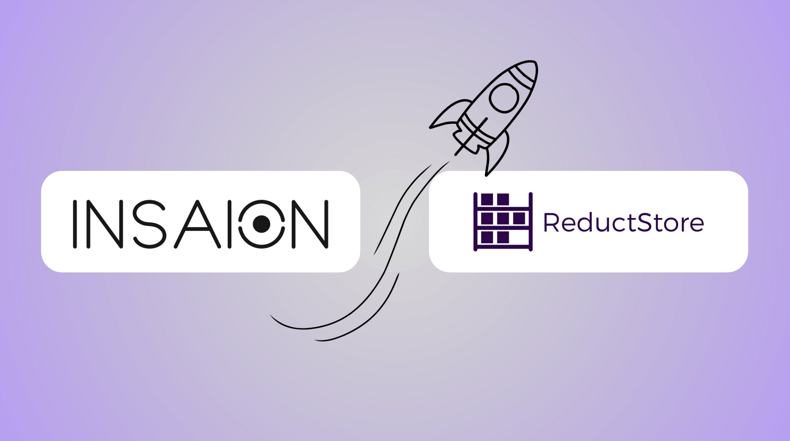

Your robot loses its uplink halfway through an eight hour shift. Cameras and sensors keep writing. Sending every frame to the cloud was never an option.

ReductStore and INSAION have formalized their partnership for robotics edge recording. It makes official what already ships in production: ReductStore is the storage engine behind INSAION's edge recording. Every Rolling Buffer, every device recording, and every Surgical Cloud Sync runs on ReductStore embedded directly in the INSAION Agent.

<!-- truncate -->

## Why it matters

A robot's most valuable data is also its heaviest: camera frames, LiDAR point clouds, high frequency control signals. Streaming all of it to the cloud is expensive and often impossible on real connectivity. Recording nothing leaves you blind when an incident happens.

So you keep it on the robot and pull only what matters. INSAION makes that same case from the platform side in its [**partnership announcement**](https://www.insaion.com/blog/reductstore-partnership).

## What ReductStore keeps on the robot

ReductStore is the storage layer inside the INSAION Agent, sitting next to the sensors. It stores each topic as its own entry and each message as a timestamped record, so data lands in the shape robots actually produce. That gives the agent a local store built to:

- **Ingest fast.** Absorb bursts from multi camera and LiDAR rigs as recording pipelines write their MCAP slices, without dropping messages.
- **Retain within a budget.** FIFO, HARD, or NONE quotas per device. FIFO is the Rolling Buffer: the newest data that fits the disk you set, so a robot never quietly fills up.
- **Retrieve precisely.** Every record is keyed by time and labeled with its recording session, so the agent pulls the exact window around an incident by time range and label, with no full scans.
- **Run anywhere, unattended.** A single Rust binary with no extra services to manage, embedded in the agent and identical on one prototype or a fleet of hundreds.

That mapping onto how robots generate data is why INSAION built its edge recording on ReductStore.

## What INSAION adds on top

ReductStore keeps the data. INSAION turns it into observability for the whole fleet:

- **Zero config discovery.** It finds ROS topics with no manual setup and keeps a per device inventory with access control.
- **Incident capture.** When an alarm fires, Surgical Cloud Sync reads the exact window from the local ReductStore instance and uploads only that.
- **Multimodal replay.** Camera, LiDAR, TF, and logs from that moment play back together, so an engineer sees the failure instead of a chart that hints at it.
- **AI diagnostics.** It summarizes what happened in plain language.

Recording continues on the robot through a dropped link, and uploads resume when the link is back. The robot decides what to keep. The platform decides what to pull.

## How it works in practice

Each recording pipeline writes MCAP slices into ReductStore as timestamped records: one `rolling-buffer` bucket per device, one entry per pipeline, each slice keyed by its start time and labeled with the recording session. The store runs embedded in the agent, bound to localhost and authenticated with the device's own token, so raw sensor data never leaves the machine unless you ask.

When an incident window is needed, INSAION queries ReductStore by time range and label, then streams those exact slices straight to S3, never routing the heavy data through its own servers.
