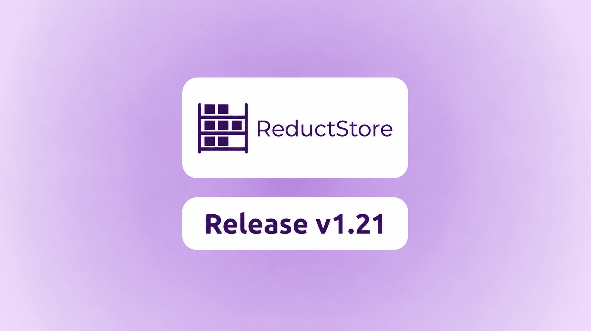
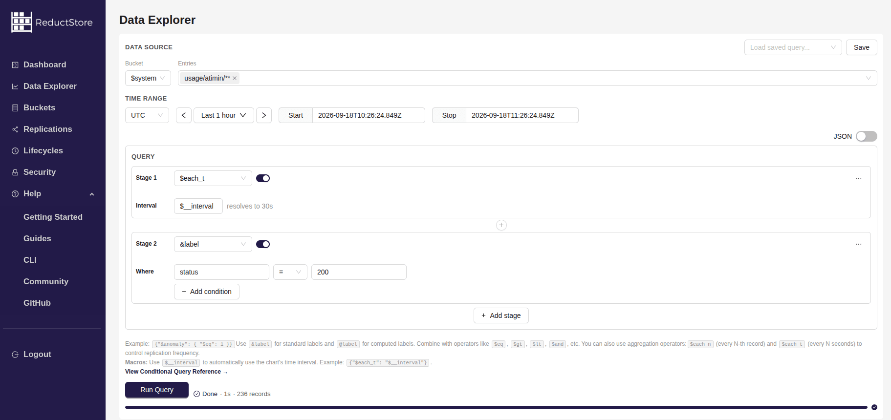

ReductStore [**1.21.0**](https://github.com/reductstore/reductstore/releases/tag/v1.21.0) is now available. This release brings the new Data Explorer to the Web Console and delivers many improvements to data replication, lifecycle policies, queries, and system diagnostics.

ReductStore v1.21 also reflects an important change in how the project is developed. Since moving ReductStore Core to the Apache License 2.0 in v1.19, the community has become an important part of the development process. This release cycle brought together 16 contributors across ReductStore, ReductStore CLI, and the Web Console.

To download the latest release, visit the [**Download Page**](/download).

## What's new in 1.21.0?

The main user-facing change is the new Data Explorer in Web Console v1.17.2. It provides a visual interface for building conditional queries, sampling and limiting results, and configuring ReductROS and ReductSelect processing steps without writing the complete JSON query by hand.

Replication is now more flexible and efficient. A replication task can add a prefix to destination entry names, compress batch transfers with gzip or zstd, and use path-aware entry patterns with `*`, `**`, and exclusions. Lifecycle policies and regular queries use the same entry-pattern syntax, making filters consistent across the database.

The release also expands diagnostics in the `$system` bucket, adds bounded processing windows for lifecycle policies, and improves replication throughput and reliability.

{/* truncate */}

### Data Explorer

ReductStore v1.21 includes Web Console v1.17.2 with the new Data Explorer. The goal is to make the power of the [**ReductStore conditional query language**](/docs/conditional-query) accessible through a convenient visual interface while keeping the generated JSON available for advanced users.

You can select buckets and entries, choose a time range, filter records by labels, sample records by count or time, and limit the number of results. Query steps are shown as reorderable stages, so more complex processing pipelines can be assembled without manually nesting JSON expressions.

The Data Explorer also supports processing records with ReductStore extensions. ReductROS steps can filter and decode ROS messages, extract fields as labels, encode binary fields, or export episodes to MCAP. ReductSelect steps can configure SQL processing, structured data formats, exports, and computed labels. Queries can be saved in the browser and loaded again for later use.

### Replication, Lifecycle, and Query Improvements

Replication tasks now support a `dst_prefix` setting. This is useful when several robots, devices, or source buckets replicate into one destination bucket: a source entry such as `camera/front` can be stored as `robot-1/camera/front` without changing its name on the source instance.

You can also enable gzip or zstd compression for replication batch transfers. Compression reduces network bandwidth between instances, while the new pipelined sender prepares the next batch as the current batch is being transferred. ReductStore can also create a missing destination bucket automatically, which simplifies initial deployment and recovery workflows. See the [**Data Replication guide**](/docs/guides/data-replication) for configuration examples.

Queries, replication tasks, and lifecycle policies now share the same path-aware entry patterns:

- `*` matches within one path segment.
- `**` matches recursively across path segments.
- Patterns starting with `!` exclude matching entries.

Lifecycle policies also have a new `processing_interval` setting that limits the span of data time handled by one run. This prevents a policy from processing an unlimited backlog at once and makes its workload more predictable. See the [**Lifecycle Policies guide**](/docs/guides/lifecycle-policies) for details.

### Better System Diagnostics

ReductStore now emits per-bucket usage statistics under `$system/usage/<instance>/<bucket>`, including written entries, read entries, and record counts. The server can also capture its own warning and error messages under `$system/logs/<instance>/messages`, with the minimum severity controlled by `RS_SYSTEM_EVENTS_LOG_LEVEL`.

These events use the same storage and query model as regular ReductStore data, so operators can inspect them with the Web Console, HTTP API, SDKs, or CLI. The internal event pipeline has also been unified to improve the reliability of audit, usage, lifecycle, replication, and log events.

### Open-Source Contributions

In v1.19, we changed the license of ReductStore Core to Apache License 2.0 and invited the community to contribute. The response exceeded our expectations. Fourteen contributors helped us improve replication, lifecycle policies, queries, diagnostics, the CLI, and the Web Console during this release cycle.

I would like to give special recognition to several contributors who have consistently helped the project:

- **[Ashren (@Marrii00)](https://github.com/Marrii00)** created the Data Explorer, including its visual conditional query builder, extension processing steps, and saved-query workflow.
- **[Dibbayajyoti Roy (@DibbayajyotiRoy)](https://github.com/DibbayajyotiRoy)** worked on the diagnostics subsystem, added per-bucket usage statistics and captured server logs to the `$system` bucket, and improved replication throughput.
- **[Malhar Vora (@vbmade2000)](https://github.com/vbmade2000)** removed deprecated code and added many practical features to ReductStore CLI, including a single-record write command and JSON output for administrative commands.
- **[Rohan Dubey (@rohankumardubey)](https://github.com/rohankumardubey)** improved the replication subsystem with destination prefixes, automatic destination bucket creation, and path-aware entry filters, and refactored the data block management layer.

Many thanks to everyone who powered this release. The server and CLI contributions are listed in the [**ReductStore v1.21.0 changelog**](https://github.com/reductstore/reductstore/blob/v1.21.0/CHANGELOG.md#1210---2026-09-17) and the [**ReductStore CLI v0.13.0 changelog**](https://github.com/reductstore/reduct-cli/blob/v0.13.0/CHANGELOG.md#0130---2026-09-17):

    

    
    

    
    
    
    
    
    
    
    
    
    
    

## What's Next

We continue to improve ReductStore, but the database is reaching a level of maturity where a strong ecosystem is more valuable than adding isolated features. Our next focus is deeper ROS integration and better connections with the technologies used around robotics, industrial IoT, and edge data pipelines.

We will also continue improving the tools around ReductStore so that data can be ingested, explored, transformed, and exported through a consistent workflow.

## Compatibility and Migration

To support compliance with the EU Cyber Resilience Act (CRA), ReductStore now requires standalone, primary, and secondary instances to choose an authentication mode explicitly. Previous versions started without authentication when no API token was configured. Starting with v1.21, you must configure exactly one of the following options:

- Set `RS_API_TOKEN` to provision a fixed full-access token.
- Set `RS_INIT_API_TOKEN` to initialize a full-access token that can later be rotated or removed through the API.
- Set `RS_DISABLE_AUTH=true` to explicitly run without authentication.

Read-only replica behavior is unchanged. Disabling authentication exposes all data and administrative operations, so use `RS_DISABLE_AUTH=true` only in trusted environments. See the [**Access Control guide**](/docs/guides/access-control) for migration details.

This release also removes the deprecated `each_n` query and replication field. Use the `$each_n` operator in a conditional query instead. Deprecated SDK builder parameters for `include`, `exclude`, `each_s`, and `limit` have also been removed in favor of entry patterns and the `$each_t` and `$limit` conditional query operators.

---

If you have questions or feedback, join the [**ReductStore Community**](https://community.reduct.store) forum.

Thanks for using [**ReductStore**](/)!
