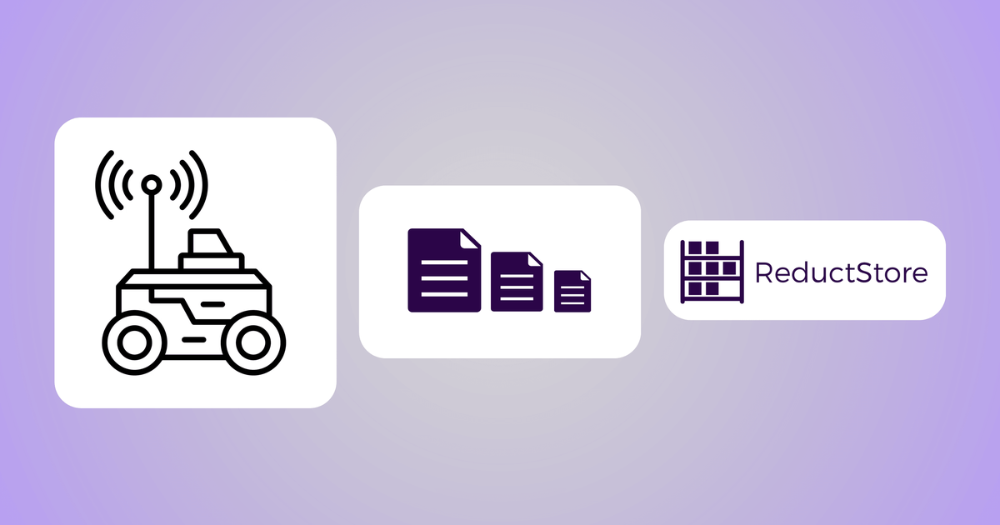

A rosbag recording is a file, and a file cannot grow forever. Something has to close it at some
point, so rosbag2 makes you pick: `ros2 bag record -a -b 100000` closes one every 100 kilobytes,
or `-d 9000` closes one every 9000 seconds. Either way, a recording that runs for hours
comes out as a directory of many small files instead of one file nobody could open.

Splitting a recording into five minute bags seems like a simple solution. The problem starts when
you need to turn them back into one file.

**[A rosbag2 user reported](https://github.com/ros2/rosbag2/issues/2335)** that merging 300 GB of
split recordings required roughly 600 GB of disk capacity. The original 300 GB
stays on disk while another 300 GB is written out as the merged bag.

Splitting solves one problem. Merging creates another, and it is easy to underestimate.

{/* truncate */}

## Why the interval is usually small

Nothing forces the interval down to five minutes specifically. Three practical limits push it
there. A robot that loses power mid recording loses only the file that was open, so a smaller
file loses less. A single file that grows for eight hours is awkward to copy off a machine. And
many tools that read bags slow down or run out of memory on files above a few gigabytes.

None of that is wrong. Splitting does what it was asked to do. It just moves the cost to the
other end of the workflow, where it is measured in disk, CPU and the hours between a recording
existing and being usable.

## Two more costs, beyond the merge

Merging is the most visible cost. Closing one file and opening the next creates two others.

**Recording does not stop when the disk fills.** The size and duration limits on `ros2 bag
record` cap each bag, not the total. Recording continues until the disk is full. On an embedded
robot, that can cause seemingly unrelated services to fail because they can no longer write
logs, temporary files, databases, caches, and anything else they expect to be able to save.

**Long recordings are where the bugs turn up.** An **[open report on
rosbag2](https://github.com/ros2/rosbag2/issues/2481)** describes CPU use growing without bound
when bags split often, traced to the list of files being rewritten into the manifest on every
split. A fix is already in review, so that particular problem should not last. It is worth
mentioning for its shape rather than its size: every split closes a file, updates a manifest and
carries state forward, and that is the part of a long running recording where things go wrong.

None of this is a criticism of rosbag2. Both problems come from the same place, the moment one
file is closed and another is opened. Fix them both and you still end up with a directory of
files, and something still has to put them back together.

## One entry per topic, one record per message

The other model is to stop producing files during recording.

**[Reduct Bridge](/docs/reduct-bridge)** subscribes to ROS 2 topics and writes each message straight
into ReductStore as a record. Payloads go in as serialized CDR with content type `application/cdr`,
so nothing is re-encoded on the way in. Each topic becomes its own entry, named after the topic
unless you set `entry_name`, and topic patterns like `/camera/*` are matched with a wildcard rather
than listed one by one.

Three things are stored alongside the message and matter later. The schema for the message type
goes into a `$ros` attachment, so the recording carries the definition needed to read it back.
Named fields from the message are copied into labels, decoded against that schema, so you can
later filter on camera id or frame type without opening any payloads. And the timestamp can come
from the message's own `ros_stamp` rather than from when the bridge received it.

Writes to the store are batched, by default at 80 records, 8 MB or 1000 ms, whichever comes first.
That's a flush, not a split. It creates no file, nothing downstream refers to it, and once a
record lands you address it by its timestamp on its entry. The bucket itself can be created with
a FIFO quota by volume, which is what stops the disk filling up: you set a size limit on the
bucket, the oldest records are deleted first, and the robot keeps recording.

Pull an interval back out and it is a query across entries, not a hunt through a directory for which
files overlap 10:31 to 10:34. The wider picture of what that changes on a fleet is in **[a database
for robotics](/blog/database-for-robotics)**, and the retention and edge to cloud side is in **[how
to store and manage robotics data](/blog/store-robotic-data)**.

There is no split, so there is no merge.

## What the bag could not do

Removing the merge is the immediate win. The four things below have no bag equivalent at all.

**You choose which data leaves the robot.** A replication task copies records from the
bucket on the robot to a bucket in the cloud, and it takes a `when` condition on labels, so what
crosses the link is chosen rather than scheduled. It also carries context. **[Conditional
replication](/docs/guides/data-replication)** accepts `#ctx_before` and `#ctx_after`, each taking
a duration, and pulls in the records around every match. Label an anomaly on the way in, replicate
on that label with `#ctx_before` set to ten minutes, and what lands in the cloud is the incident
plus the ten minutes that led to it. With bags, the unit you can move is the file, and the file
was cut where the recorder decided, not where the incident was.

**Older data moves to S3 or Azure Blob while the robot keeps writing locally.** ReductStore runs
on **[cloud object storage](/docs/integrations/cloud-storage)** with a local cache in front of it,
sized by `RS_REMOTE_CACHE_SIZE` at a path you choose and uploaded on `RS_REMOTE_SYNC_INTERVAL`.
Recent data stays on the node's own disk, which is where recording happens and where a robot with
no network link keeps working. Anything older sits in a cloud bucket you already pay for. Neither
half needs the recording to have been cut into files first.

**You ask the store a question instead of writing a script.** Labels are indexed, so narrowing to
one camera or one frame type is a query, not a pass over payloads. And the **[ReductSelect
extension](/docs/extensions/official/select-ext)** answers SQL against stored records, over JSON,
CSV, Protobuf and Parquet, and writes the result out as Parquet:

```sql
SELECT device_id, temperature FROM ENTRY() WHERE temperature > 20
```

Against a directory of bags, both of those are a script that opens every file in turn.

**Dashboards read the store directly.** The **[Grafana data
source](/docs/integrations/grafana)** pulls from buckets, so entries become panels and alerts with
no export step in between. It's a community plugin and isn't on the Grafana marketplace yet, so
installing it means permitting an unsigned plugin on Grafana 10 or later.

All of that runs on records as they land. None of it waits for a merge.

## What you give up

You no longer have a bag, and a lot of tooling wants one. `ros2 bag play` wants a directory with
metadata in it. Older Foxglove builds want a single file, since some versions cannot open several
mcap files at once, which is exactly why merging is tempting in the first place. Anything you have
scripted around **[loading bag files for analysis](/blog/boston-dynamic-example)** expects a path,
not a bucket.

The answer is to generate the bag on the way out instead of recording into one. The **[ReductROS
extension](/docs/extensions/official/ros-ext)** reads stored records back as JSON or exports them as
mcap, filters existing mcap files, and reads ROS 2 rosbag2 archives in either sqlite3 or mcap form.
It can also re-pack them into new episodes, keeping only the topics you name and splitting by
`duration` or `size`. So a bag still exists when you need one, built for the slice you asked for
rather than for every topic the robot published that afternoon.

Two things to be plain about. ReductROS is part of ReductStore Pro under a commercial licence, with
a free demo server and evaluation licences for testing, so the export path isn't the same kind of
free as `ros2 bag record`. And the bridge is another process to deploy on the robot, built against a
sourced ROS 2 environment, where `ros2 bag record` is already installed and needs no configuration
to start.

## When recording bags is still the right call

Record a bag when the recording is short and you are going to open it once. Dragging a file into a
visualiser is fewer moving parts than anything described above.

Record a bag when you are handing data to someone outside your infrastructure. A bag is a file and
you can send it. A bucket is an account, a token and a conversation.

Record a bag when the robot has no network path off it and the data has no life past the debug
session it was captured for.

And record a bag when the tool you actually need reads bags and nothing else. That's a real
constraint and no architecture argument beats it.

The split and merge cost only becomes a problem once recordings run for hours and reach hundreds
of gigabytes. Below that, bags are fine, and the tooling around them is better than anything you
would assemble yourself.
**[Three ways to store ROS topics](/blog/store-ros-topics)** covers the middle ground, where the bag
is still the recording unit but not the storage.

## Conclusion

Splitting will keep getting cheaper as rosbag2 improves. That doesn't remove the merge, because a
merge is what you do when the recording arrived as pieces, and pieces are what splitting produces
by design.

If you're already writing a script to work out which bags overlap the window you care about, you
have the split then merge problem, and making the split cheaper doesn't remove that script.
Recording each topic continuously does, because there's nothing to reassemble.

For the setup itself, the **[Reduct Bridge docs](/docs/reduct-bridge)** cover the ROS 2 input and
what it writes. The **[data querying guide](/docs/guides/data-querying)** covers reading an
interval back out once it's in there.

---

If you have any questions or comments, feel free to use the [**ReductStore Community Forum**](https://community.reduct.store).
