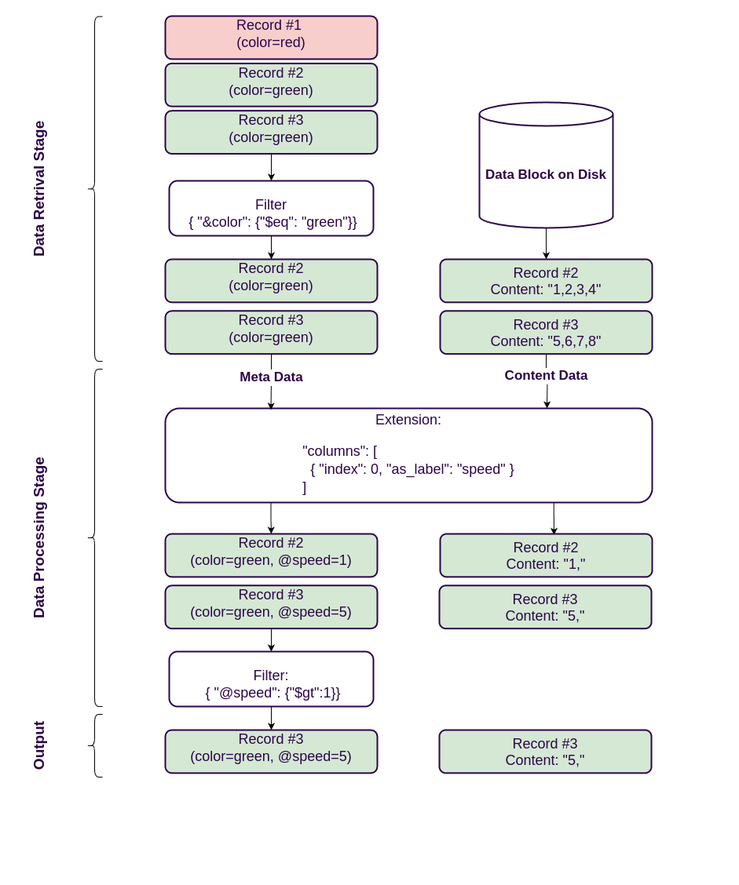

<head>
  <link rel="canonical" href="https://www.reduct.store/docs/extensions" />
</head>

ReductStore has an [**extension**](./glossary#extension) system that allows you to extend the functionality of ReductStore with custom plugins that
can process data during querying on the storage side. For example, you can use extensions to manipulate data in columnar formats such as CSV, scale images, search for text in blobs, and more.

In this documentation, we will cover basic concepts of the extension system and how to interact with it using query parameters.

## Querying with Extensions

A use can interact with the extension system using the `ext` query parameter and the name of the extension in JSON format
when querying the data. The `ext` paramater is avialable in all the official ReductStore SDKs but for learning purposes, we will use JSON request body in this example.

```json
{
  "ext": {
    "select": {
      "columns": [{ "index": 0 }]
    }
  }
}
```

This request will use the `select` extension to select the first column of the CSV data and return each [**record**](./glossary#record) only with the first column.

The processing of the data isn't the only thing that the extension can do. It can return [**computed labels**](./glossary#computed-label), that can have results of the processing or any other data that can be used in the query condition.

```json
{
  "ext": {
    "select": {
      "columns": [{ "index": 0, "as_label": "speed" }]
    }
  },
  "when": {
    "@speed": { "$gt": 10 }
  }
}
```

This request will use the `select` extension to select the first column of the CSV data and return each record only with the first column.
The `when` condition will filter the records by the value of the first column, which is now available as a label `@speed`.

:::info
You should use the `@` prefix for the computed labels in the `when` condition. The `@` prefix is used to distinguish between the computed labels and the regular labels
that are stored in the database.
:::

## Data Pipeline with Extensions

As you can see in the previous example, the extension can return computed labels that can be used in the query condition.
However, we also use the `when` condition to filter records based on their labels before reading their content.
It would be inefficient to read all the records and pass them to the extension for processing, so the storage engine
have two stages of filtering: the first stage is the filtering the records based on their labels to read and pass them to the extension for processing,
and the second stage is the filtering the records based on the computed labels after they are processed by the extension.



The diagram above shows the data pipeline of the extension system for the following query:

```json
{
  "ext": {
    "select": {
      "columns": [{ "index": 0, "as_label": "speed" }]
    }
  },
  "when": {
    "&color": { "$eq": "green" },
    "@speed": { "$gt": 10 }
  }
}
```

The query engine detects that the `when` contains a condition with a computed label `@speed` and ignores it on the data retrieval stage.
The engine filter data based on the `&color` label and only then reads the record content from the disk and passes it to the extension for processing.
The extension processes the data and assigns the computed label `@speed` to the record so that the engine can use it in the second stage of filtering.

The output of the pipeline is the records that match the both conditions based on the labels and the computed labels.

:::info
The detection of the computed labels happens recursively in the nested queries. If a nested condition contains a computed label, the engine will ignore the whole tree.
:::
