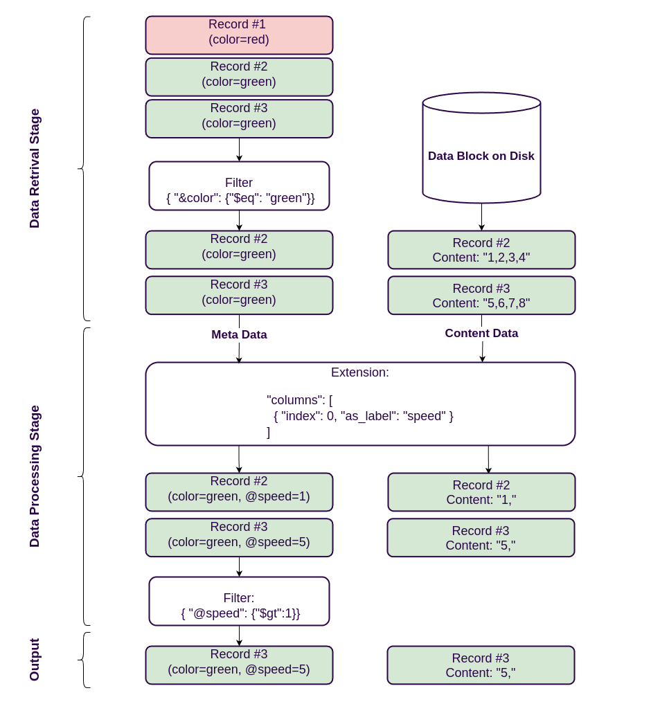

<head>
  <link rel="canonical" href="https://www.reduct.store/docs/extensions" />
</head>

The ReductStore [**extension**](./glossary#extension) system allows you to extend its functionality with custom plugins.
These can process data during querying on the storage side.
For instance, extensions can be used to export ROS messages as MCAP files, manipulate data in columnar formats such as CSV, scale images, search for text in blobs and perform other actions.

This documentation covers the basic concepts of the extension system and explains how to interact with it using query parameters.

## Querying with Extensions

Users can interact with the extension system by using the `#ext` directive in the conditional query and the name of the extension in JSON format when querying the data.

```python
{
  "#ext": {
    "select": {
      "sql": "SELECT column_0 FROM ENTRY()"
    }
  }
}
```

This request uses the `select` extension to query columnar [**records**](./glossary#record), such as CSV, JSON, or Parquet, and return only the selected fields.
CSV records without headers expose fields as `column_0`, `column_1`, and so on.
For CSV records with headers, the extension can infer header presence from the content type parameter `text/csv; header=present`.

However, processing the data is not the only capability of the extension.
It can also return [**computed labels**](./glossary#computed-label), which may contain processing results or any other values useful for filtering entities within records.
For example, ReductROS can extract raw ROS messages as JSON and map a decoded field to `@speed`:

```python
{
  "#ext": {
    "ros": {
      "extract": {
        "topic": "/vehicle/speed",
        "as_label": {
          "speed": "speed"
        }
      }
    },
    "when": {
      "@speed": { "$gt": 10 }
    }
  }
}
```

The `ros` extension reads ROS schema and topic metadata from each entry's `$ros` attachment, emits `application/json` records, and exposes the decoded `speed` field as the computed label `@speed`.
The extension `when` condition then filters the extracted output records by that computed label.

:::info
Extensions that extract computed labels expose them with the `@` prefix.
This distinguishes computed labels from regular labels stored in the database.
:::

## Data Pipeline with Extensions

As you can see from the previous example, an extension can transform queried records before returning them to the client.
The query condition can still filter records based on their labels before reading their content.
It would be inefficient to read all the records and pass them to the extension for processing, so the storage engine
has two filtering stages: the first stage filters the records based on their labels before passing them to the extension for processing.
The second stage involves filtering the records based on the computed labels after they have been processed by the extension.



<small style={{ textAlign: "right" }}>
  Data pipeline with data processing stage for the extension system.
</small>

The above diagram shows the data pipeline for the extension system in response to the following query:

```python
{
  "&robot": { "$eq": "rover-1" },  # filter records before extension processing
  "#ext": {
    "ros": {
      "extract": {
        "topic": "/vehicle/speed",
        "as_label": {
          "speed": "speed"
        }
      }
    },
    "when": {
      "@speed": { "$gt": 10 }      # filter extracted ROS messages
    }
  }
}
```

The query engine uses this condition in the query to retrieve records based on the `&robot` label.
First, the engine filters the data based on the label. Then, it reads the record content from the disk and passes it to the extension for processing.
The extension then extracts the matching raw ROS messages, assigns the computed label `@speed`, and filters the extracted output records by that label.
