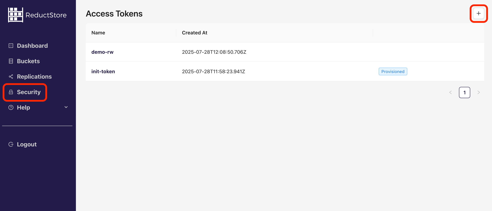
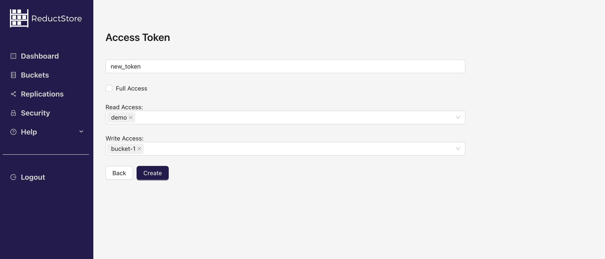
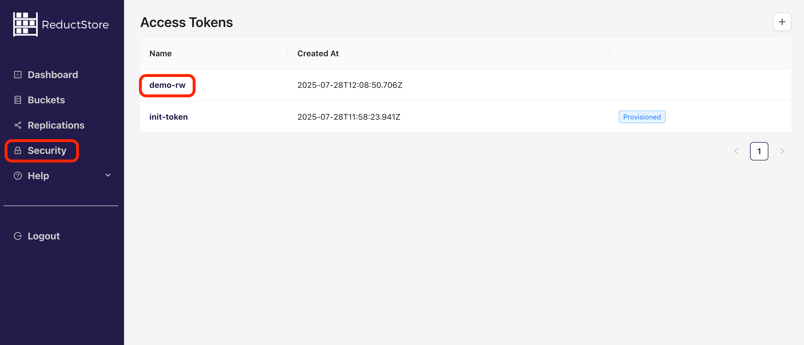
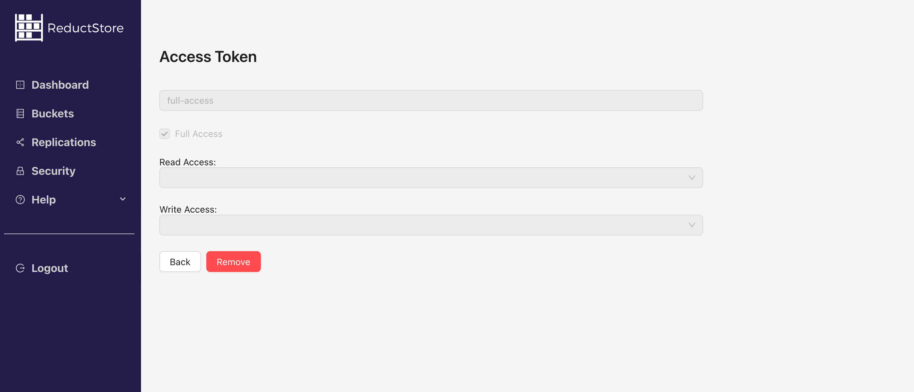

import CodeBlock from "@theme/CodeBlock";
import Tabs from "@theme/Tabs";
import TabItem from "@theme/TabItem";

<head>
  <link
    rel="canonical"
    href="https://www.reduct.store/docs/guides/access-control"
  />
</head>

# Access Control

## Concepts

ReductStore provides straightforward access management based on token authentication and permissions.

### Token Authentication

ReductStore uses token-based authentication to secure the **[HTTP API](../glossary#http-api)**. A client must send a valid token in the `Authorization` header in order to access it.
A ReductStore instance must have an initial token to enable authentication and access management. The initial token is configured using the `RS_API_TOKEN` environment variable and has full access permissions.

Access tokens are immutable and can't be updated. If you need to change the token, you must create a new token and update the clients with the new token. The value of the token is a random string that is generated when the token is created and is only available at that time.

:::info
If you don't need access control, you can disable token authentication by leaving `RS_API_TOKEN` unset.
:::

### Permissions and Access Control

Each token has a set of permissions that define what actions can be performed with the token:

- `full_access`: Allows a client to perform any action on the API without any restrictions.

- `read`: Allows a client to read data from specific buckets. The list of buckets that can be accessed for reading is defined when the token is created.

- `write`: Allows a client to write data to specific buckets, which includes adding new entries or deleting existing ones. The list of buckets that can be accessed for writing is defined when the token is created.

The table below shows the list of operations that can be performed for different permissions:

| Operation                | Anonymous          | No permissions     | Read               | Write              | Full Access        |
| ------------------------ | ------------------ | ------------------ | ------------------ | ------------------ | ------------------ |
| Alive check              | :white_check_mark: | :white_check_mark: | :white_check_mark: | :white_check_mark: | :white_check_mark: |
| Server Status            | :x:                | :white_check_mark: | :white_check_mark: | :white_check_mark: | :white_check_mark: |
| List Buckets             | :x:                | :x:                | :white_check_mark: | :x:                | :white_check_mark: |
| Get Bucket               | :x:                | :x:                | :white_check_mark: | :x:                | :white_check_mark: |
| Create Bucket            | :x:                | :x:                | :x:                | :x:                | :white_check_mark: |
| Update Bucket Settings   | :x:                | :x:                | :x:                | :x:                | :white_check_mark: |
| Rename Bucket            | :x:                | :x:                | :x:                | :x:                | :white_check_mark: |
| Remove Bucket            | :x:                | :x:                | :x:                | :x:                | :white_check_mark: |
| Read Data                | :x:                | :x:                | :white_check_mark: | :x:                | :white_check_mark: |
| Update Data              | :x:                | :x:                | :x:                | :white_check_mark: | :white_check_mark: |
| Write Data               | :x:                | :x:                | :x:                | :white_check_mark: | :white_check_mark: |
| Rename Entry             | :x:                | :x:                | :x:                | :white_check_mark: | :white_check_mark: |
| Remove Entry             | :x:                | :x:                | :x:                | :white_check_mark: | :white_check_mark: |
| Manage Tokens            | :x:                | :x:                | :x:                | :x:                | :white_check_mark: |
| Manage Replication Tasks | :x:                | :x:                | :x:                | :x:                | :white_check_mark: |

:::note
`Anonymous` refers to clients that don't send an **[access token](../glossary#access-token)** in the `Authorization` header.
:::

## Managing Tokens

Here you will find examples of how to create, browse, retrieve, and delete access tokens using the ReductStore SDKs, REST API, **[CLI](../glossary#cli)** and **[Web Console](../glossary#web-console)**.

Note that all the examples are written for a local ReductStore instance available at **`http://127.0.0.1:8383`** with the API token `my-token`.

For more information on setting up a local ReductStore instance, see the **[Getting Started](../getting-started/index.mdx)** guide.

### Creating a Token

An access token can be created using the SDKs, CLI client, Web Console, or REST API. The token name must be unique within the store, and a client must have full access permission. You can also provision a token using environment variables. See the examples below:

import CreatTokenCLI from "!!raw-loader!../examples/cli/access_control_create_token.sh";
import CreateTokenPy from "!!raw-loader!../examples/py/src/access_control_create_token.py";
import CreateTokenJs from "!!raw-loader!../examples/js/src/access_control_create_token.mjs";
import CreateTokenGo from "!!raw-loader!../examples/go/src/access_control_create_token.go";
import CreateTokenRust from "!!raw-loader!../examples/rs/examples/access_control_create_token.rs";
import CreateTokenCpp from "!!raw-loader!../examples/cpp/src/access_control_create_token.cc";
import CreateTokenCurl from "!!raw-loader!../examples/curl/access_control_create_token.sh";
import CreateTokenProvisioned from "!!raw-loader!../examples/provisioning/access_control_create.yml";

<Tabs>
    <TabItem value="CLI">
        <CodeBlock language="bash">
            {CreatTokenCLI}
        </CodeBlock>
    </TabItem>
    <TabItem value="Web Console">
        Steps to create a new access token using the Web Console:
        1. Open the Web Console at `http://127.0.0.1:8383` in your browser.
        2. Click on the **"Security"** tab in the left sidebar.
        3. Click on the plus icon in the top right corner to create a new token:
        
        4. Fill in the token name and select the permissions for the token:
        
        5. Click on the **"Create"** button to create the token.
        6. Copy the token value and save it in a secure place.{" "}
    </TabItem>
    <TabItem value="Python">
        <CodeBlock language="python">
            {CreateTokenPy}
        </CodeBlock>
    </TabItem>
    <TabItem value="JavaScript">
        <CodeBlock language="javascript">
            {CreateTokenJs}
        </CodeBlock>
    </TabItem>
    <TabItem value="Go">
        <CodeBlock language="go">
            {CreateTokenGo}
        </CodeBlock>
    </TabItem>
    <TabItem value="Rust">
        <CodeBlock language="rust">
            {CreateTokenRust}
        </CodeBlock>
    </TabItem>
    <TabItem value="C++">
        <CodeBlock language="cpp">
            {CreateTokenCpp}
        </CodeBlock>
    </TabItem>
    <TabItem value="cURL">
        <CodeBlock language="bash">
            {CreateTokenCurl}
        </CodeBlock>
    </TabItem>
    <TabItem value="Provisioning">
        <CodeBlock language="yaml">
            {CreateTokenProvisioned}
        </CodeBlock>
    </TabItem>

</Tabs>

:::info
The token value is generated when the token is created and is only available at that time.
:::

### Browsing Tokens

You can list all the access tokens available in the store using the SDKs, CLI client, Web Console, or REST API. The client must have full access permission. See the examples below:

import BrowseTokensCLI from "!!raw-loader!../examples/cli/access_control_browse_tokens.sh";
import BrowseTokensPy from "!!raw-loader!../examples/py/src/access_control_browse_tokens.py";
import BrowseTokensJs from "!!raw-loader!../examples/js/src/access_control_browse_tokens.mjs";
import BrowseTokensGo from "!!raw-loader!../examples/go/src/access_control_browse_tokens.go";
import BrowseTokensRust from "!!raw-loader!../examples/rs/examples/access_control_browse_tokens.rs";
import BrowseTokensCpp from "!!raw-loader!../examples/cpp/src/access_control_browse_tokens.cc";
import BrowseTokensCurl from "!!raw-loader!../examples/curl/access_control_browse_tokens.sh";

<Tabs>
    <TabItem value="CLI">
        <CodeBlock language="bash">
            {BrowseTokensCLI}
        </CodeBlock>
    </TabItem>
    <TabItem value="Web Console">
        Steps to browse access tokens using the Web Console:
        1. Open the Web Console at `http://127.0.0.1:8383` in your browser.
        2. Click on the **"Security"** tab in the left sidebar.
        3. You will see the list of access tokens:
        
        4. Click on the token name to view the token details
    </TabItem>
    <TabItem value="Python">
        <CodeBlock language="python">
            {BrowseTokensPy}
        </CodeBlock>
    </TabItem>
    <TabItem value="JavaScript">
        <CodeBlock language="javascript">
            {BrowseTokensJs}
        </CodeBlock>
    </TabItem>
    <TabItem value="Go">
        <CodeBlock language="go">
            {BrowseTokensGo}
        </CodeBlock>
    </TabItem>
    <TabItem value="Rust">
        <CodeBlock language="rust">
            {BrowseTokensRust}
        </CodeBlock>
    </TabItem>
    <TabItem value="C++">
        <CodeBlock language="cpp">
            {BrowseTokensCpp}
        </CodeBlock>
    </TabItem>
    <TabItem value="cURL">
        <CodeBlock language="bash">
            {BrowseTokensCurl}
        </CodeBlock>
    </TabItem>

</Tabs>

### Removing a Token

You can remove an access token using the SDKs, CLI client, Web Console, or REST API. The token name must exist in the store, and a client must have full access permission. Refer to the following examples:

import RemoveTokenCLI from "!!raw-loader!../examples/cli/access_control_remove_token.sh";
import RemoveTokenPy from "!!raw-loader!../examples/py/src/access_control_remove_token.py";
import RemoveTokenJs from "!!raw-loader!../examples/js/src/access_control_remove_token.mjs";
import RemoveTokenGo from "!!raw-loader!../examples/go/src/access_control_remove_token.go";
import RemoveTokenRust from "!!raw-loader!../examples/rs/examples/access_control_remove_token.rs";
import RemoveTokenCpp from "!!raw-loader!../examples/cpp/src/access_control_remove_token.cc";
import RemoveTokenCurl from "!!raw-loader!../examples/curl/access_control_remove_token.sh";

<Tabs>
    <TabItem value="CLI">
        <CodeBlock language="bash">
            {RemoveTokenCLI}
        </CodeBlock>
    </TabItem>
    <TabItem value="Web Console">
        Steps to remove an access token using the Web Console:
        1. Open the Web Console at `http://127.0.0.1:8383` in your browser.
        2. Click on the **"Security"** tab in the left sidebar.
        3. You will see the list of access tokens:
        
        4. Click on the token name to view the token details:
        
        5. Click on the **"Remove"** button to delete the token.
        6. Confirm the action by typing the token name and clicking on the **"Remove"** button.{" "}

    </TabItem>
    <TabItem value="Python">
        <CodeBlock language="python">
            {RemoveTokenPy}
        </CodeBlock>
    </TabItem>
    <TabItem value="JavaScript">
        <CodeBlock language="javascript">
            {RemoveTokenJs}
        </CodeBlock>
    </TabItem>
    <TabItem value="Go">
        <CodeBlock language="go">
            {RemoveTokenGo}
        </CodeBlock>
    </TabItem>
    <TabItem value="Rust">
        <CodeBlock language="rust">
            {RemoveTokenRust}
        </CodeBlock>
    </TabItem>
    <TabItem value="C++">
        <CodeBlock language="cpp">
            {RemoveTokenCpp}
        </CodeBlock>
    </TabItem>
    <TabItem value="cURL">
        <CodeBlock language="bash">
            {RemoveTokenCurl}
        </CodeBlock>
    </TabItem>

</Tabs>
