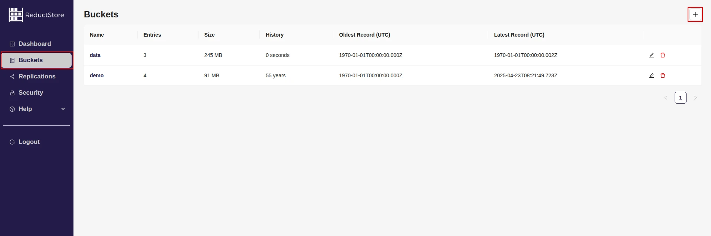

<head>
  <link rel="canonical" href="https://www.reduct.store/docs/guides/buckets"/>
</head>

import CodeBlock from "@theme/CodeBlock";
import Tabs from '@theme/Tabs';
import TabItem from '@theme/TabItem';

# Buckets

## Concepts

A bucket is a container used for data storage and serves as a logical grouping of data. It stores time-series data, with each entry having a unique name. If you're familiar with databases, think of a bucket as a database, and entries as tables.

Given the nature of time-series data, ReductStore partitions data into blocks. Each block, stored in a separate file, contains a set of entries. There are limits to the block size and the number of records it can hold. When a block reaches its limit, a new block is created to store additional data. This method allows ReductStore to store and access data efficiently.

Unlike other blob storage or file systems, ReductStore has a flat hierarchy. It doesn't use folders or directories. Instead, all data is stored in entries, which are grouped by buckets.

## Bucket Settings

Each bucket has settings that determine how data is stored and accessed. These settings include:

- **Quota Type**: This defines the quota type for the bucket. You can set the quota to either NONE or FIFO, with the default being NONE.
- **Quota Size**: This represents the quota size in bytes. The default is 0, which indicates no quota.
- **Max Block Size**: This is the maximum allowable size of a block, in bytes. The default size is 64MB.
- **Maximal Number of Records**: This is the maximum number of records that can be contained in a block. The default number is 256.

### Quota Type

The quota type determines the method of quota enforcement and can be set to either NONE or FIFO.

NONE implies no quota, allowing data to be stored without any restrictions.

FIFO, short for first-in-first-out, enforces the quota by deleting the oldest block to accommodate new data once the quota is reached. ReductStore ensures that the data does not surpass the quota size, refusing to store new data if there's insufficient room.

### Quota Size

The quota size defines the maximum size of the bucket in bytes. It's ignored if the quota type is set to NONE.

### Max Block Size

The max block size determines the maximum size of a block in bytes. Once a block reaches this limit, a new block is created for storing additional data. A record's size isn't restricted by the block size. If a record exceeds the block size, it will be stored in the current block, and a new block will be created for the next record.

The default value is set at 64MB. Typically, there is no need to alter this unless your records exceed the default size. ReductStore pre-allocates the block size during the creation of a new block. As such, it improves performance when multiple records can be stored in a single block.

### Maximal Number of Records

The maximal number of records refers to the maximum number of records that can be stored in a block. When a block reaches this capacity, a new block is created for additional data. The default value is 256. Generally, you don't need to adjust this unless you have numerous small records and an excess of blocks, which could impact search performance.

To optimize search performance, bear in mind that record searching consists of two steps:

- Locating the block that contains the record. This search time is O(log(n)), where n represents the number of blocks.
- Finding the record within the block. This search time is O(m), with m representing the number of records in the block.

If there are too many blocks, the time spent searching for a block could exceed the time spent searching for the record within the block. In such cases, consider increasing the maximal number of records to reduce the total number of blocks.

## Bucket Operations

Here you will find examples of how to create, browse, change settings, and remove buckets using the ReductStore SDKs, CLI client, Web Console, and REST API.
Pay attention that all the examples are written for a local ReductStore instance available at `http://127.0.0.1:8383` with an API token `my-token`.

For more information on how to set up a local ReductStore instance, refer to the [Getting Started](/docs/guides/getting-started) guide.

### Creating a Bucket

A bucket can be created using the SDKs, CLI client, Web Console, or REST API. The bucket name must be unique within the store, and a client must have full access permission if the authentication is enabled. Provisioning a bucket with environment variables is also possible. Refer to the example below:

import CreateBucketPy from "!!raw-loader!./examples/py/src/buckets_create.py";
import CreateBucketJs from "!!raw-loader!./examples/js/src/buckets_create.mjs";
import CreateBucketRs from "!!raw-loader!./examples/rs/examples/buckets_create.rs";
import CreateBucketCpp from "!!raw-loader!./examples/cpp/src/buckets_create.cc";
import CreateBucketCLI from "!!raw-loader!./examples/cli/buckets_create.sh";
import CreateBucketProvision from "!!raw-loader!./examples/provisioning/buckets_create.yml";
import CreateBucketCurl from "!!raw-loader!./examples/curl/buckets_create.sh";

<Tabs>
  <TabItem value="CLI">
    <CodeBlock language="bash">
      {CreateBucketCLI}
    </CodeBlock>
  </TabItem>
  <TabItem value="Web Console">
    Steps to create a bucket using the Web Console:
    1. Open the Web Console by opening https://127.0.0.1:8383 in your browser.
    2. Click on the **"Buckets"** tab in the left sidebar.
    3. Click on the plus icon to create a new bucket in the top right corner.

    

    4. In the **"Add a new bucket"** dialog, enter the bucket name and settings.
    5. Click on the "Create" button.

  </TabItem>
  <TabItem value="Python">
    <CodeBlock language="python">
      {CreateBucketPy}
    </CodeBlock>
  </TabItem>
  <TabItem value="JavaScript">
    <CodeBlock language="javascript">
      {CreateBucketJs}
    </CodeBlock>
  </TabItem>
  <TabItem value="Rust">
    <CodeBlock language="rust">
      {CreateBucketRs}
    </CodeBlock>
  </TabItem>
  <TabItem value="C++">
    <CodeBlock language="cpp">
      {CreateBucketCpp}
    </CodeBlock>
  </TabItem>
  <TabItem value="cURL">
    <CodeBlock language="bash">
      {CreateBucketCurl}
    </CodeBlock>
  </TabItem>
  <TabItem value="Provisioning">
    <CodeBlock language="yml">
      {CreateBucketProvision}
    </CodeBlock>
  </TabItem>
</Tabs>

### Browse Buckets

You might want to view the list of buckets in your store or see the details of a specific bucket. This can be done by using the SDKs, CLI client, Web Console, or REST API. For listing all buckets, a client must have a valid access token if the authorization is enabled.

import ListBucketsCLI from "!!raw-loader!./examples/cli/buckets_browse.sh";
import ListBucketsPy from "!!raw-loader!./examples/py/src/buckets_browse.py";
import ListBucketsJs from "!!raw-loader!./examples/js/src/buckets_browse.mjs";
import ListBucketsRs from "!!raw-loader!./examples/rs/examples/buckets_browse.rs";
import ListBucketsCpp from "!!raw-loader!./examples/cpp/src/buckets_browse.cc";
import ListBucketsCurl from "!!raw-loader!./examples/curl/buckets_browse.sh";

<Tabs>
  <TabItem value="CLI">
    <CodeBlock language="shell">
      {ListBucketsCLI}
    </CodeBlock>
  </TabItem>
  <TabItem value="Web Console">
    TODO
  </TabItem>
  <TabItem value="Python">
    <CodeBlock language="python">
      {ListBucketsPy}
    </CodeBlock>
  </TabItem>
  <TabItem value="JavaScript">
    <CodeBlock language="javascript">
      {ListBucketsJs}
    </CodeBlock>
  </TabItem>
  <TabItem value="Rust">
    <CodeBlock language="rust">
      {ListBucketsRs}
    </CodeBlock>
  </TabItem>
  <TabItem value="C++">
    <CodeBlock language="cpp">
      {ListBucketsCpp}
    </CodeBlock>
  </TabItem>
  <TabItem value="cURL">
    <CodeBlock language="bash">
      {ListBucketsCurl}
    </CodeBlock>
  </TabItem>
</Tabs>

### Changing Bucket Settings

Bucket settings can be modified using the SDKs, CLI client, Web Console, or REST API.
A client must have full access permission to change the settings if the authorization is enabled.
The settings that can be modified include the quota type, quota size, max block size, and maximal number of records.
You can not change the bucket name.

import ChangeBucketCLI from "!!raw-loader!./examples/cli/buckets_change.sh";
import ChangeBucketPy from "!!raw-loader!./examples/py/src/buckets_change.py";
import ChangeBucketJs from "!!raw-loader!./examples/js/src/buckets_change.mjs";
import ChangeBucketRs from "!!raw-loader!./examples/rs/examples/buckets_change.rs";
import ChangeBucketCpp from "!!raw-loader!./examples/cpp/src/buckets_change.cc";
import ChangeBucketCurl from "!!raw-loader!./examples/curl/buckets_change.sh";

<Tabs>
  <TabItem value="CLI">
    <CodeBlock language="shell">
      {ChangeBucketCLI}
    </CodeBlock>
  </TabItem>
  <TabItem value="Web Console">
    TODO
  </TabItem>
  <TabItem value="Python">
    <CodeBlock language="python">
      {ChangeBucketPy}
    </CodeBlock>
  </TabItem>
  <TabItem value="JavaScript">
    <CodeBlock language="javascript">
      {ChangeBucketJs}
    </CodeBlock>
  </TabItem>
  <TabItem value="Rust">
    <CodeBlock language="rust">
      {ChangeBucketRs}
    </CodeBlock>
  </TabItem>
  <TabItem value="C++">
    <CodeBlock language="cpp">
      {ChangeBucketCpp}
    </CodeBlock>
  </TabItem>
  <TabItem value="cURL">
    <CodeBlock language="bash">
      {ChangeBucketCurl}
    </CodeBlock>
  </TabItem>
</Tabs>

:::note
You can't change settings for provisioned buckets. You should unprovision it first.
:::

### Removing a Bucket

A bucket can be deleted using the SDKs, CLI client, Web Console, or REST API. A client must have full access permission to delete a bucket if the authorization is enabled.

import RemoveBucketCLI from "!!raw-loader!./examples/cli/buckets_remove.sh";
import RemoveBucketPy from "!!raw-loader!./examples/py/src/buckets_remove.py";
import RemoveBucketJs from "!!raw-loader!./examples/js/src/buckets_remove.mjs";
import RemoveBucketRs from "!!raw-loader!./examples/rs/examples/buckets_remove.rs";
import RemoveBucketCpp from "!!raw-loader!./examples/cpp/src/buckets_remove.cc";
import RemoveBucketCurl from "!!raw-loader!./examples/curl/buckets_remove.sh";

<Tabs>
  <TabItem value="CLI">
    <CodeBlock language="shell">
      {RemoveBucketCLI}
    </CodeBlock>
  </TabItem>
  <TabItem value="Web Console">
    TODO
  </TabItem>
  <TabItem value="Python">
    <CodeBlock language="python">
      {RemoveBucketPy}
    </CodeBlock>
  </TabItem>
  <TabItem value="JavaScript">
    <CodeBlock language="javascript">
      {RemoveBucketJs}
    </CodeBlock>
  </TabItem>
  <TabItem value="Rust">
    <CodeBlock language="rust">
      {RemoveBucketRs}
    </CodeBlock>
  </TabItem>
  <TabItem value="C++">
    <CodeBlock language="cpp">
      {RemoveBucketCpp}
    </CodeBlock>
  </TabItem>
  <TabItem value="cURL">
    <CodeBlock language="bash">
      {RemoveBucketCurl}
    </CodeBlock>
  </TabItem>
</Tabs>

:::note
You can't remove a provisioned bucket. You should unprovision it first.
:::