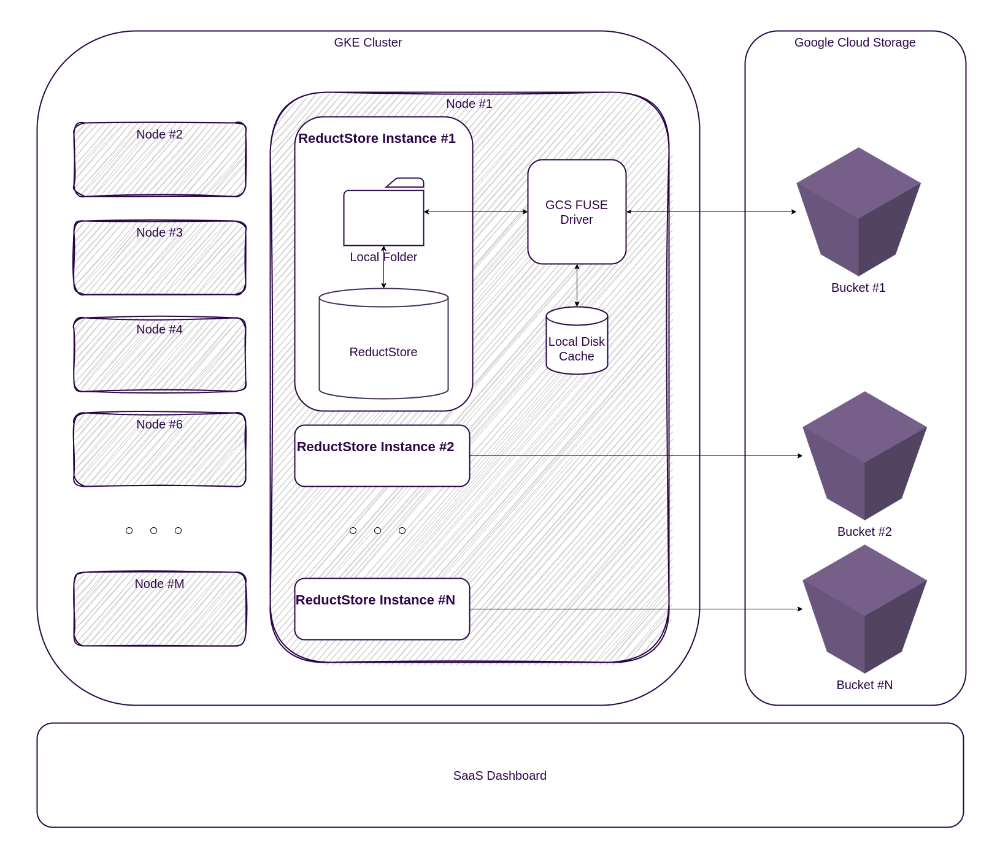

import TabItem from "@theme/TabItem";
import Tabs from "@theme/Tabs";

# Deploy on ReductStore Cloud

<head>
  <link
    rel="canonical"
    href="https://www.reduct.store/docs/guides/cloud/saas"
  />
</head>

ReductStore is available as a SaaS offering, allowing you to deploy ReductStore instances on-demand without having to manage the underlying infrastructure.
This guide provides information about the architecture and instructions for deploying and managing ReductStore as a SaaS instance on ReductStore Cloud.

## Overview

The ReductStore Cloud uses a multi-tenant architecture on GKE (Google Kubernetes Engine) clusters, where each instance is isolated from others and stores data in a dedicated GCS (Google Cloud Storage) bucket.
Its infrastructure provides automatic scaling, elastic storage, and high availability for ReductStore instances.



The ReductStore Cloud architecture consists of the following components:

- **ReductStore Instance**: A single instance of ReductStore deployed on a GKE cluster.
- **GCS Bucket**: A dedicated Google Cloud Storage bucket for storing time series data.
- **GKE Cluster**: A managed Kubernetes cluster running on Google Cloud Platform.
- **GKE Node**: A virtual machine instance running on the GKE cluster.
- **SaaS Portal**: A web-based portal for managing ReductStore instances.

The connection between the ReductStore instance and the GCS bucket is implemented using the GCS FUSE driver, which mounts the GCS buckets as volumes in the ReductStore instance.
The driver has a local cache on a node that stores frequently accessed data, reducing the latency of read and write operations.

The cluster is managed by Google Kubernetes Engine (GKE), which provides automatic scaling, monitoring, and logging for the ReductStore instances.

As a user you don't have access to the cluster and internal components, however you can manage the ReductStore instances using [the SaaS portal](https://cloud.reduct.store).
The portal allows you to create, start, stop, and delete ReductStore instances, as well as monitor the resource usage and access the logs.

## Plan Subscription

Before deploying ReductStore as a SaaS instance, you must register for a ReductStore account and subscribe to a plan.

1. Sign up for a ReductStore account at **[cloud.reduct.store](https://cloud.reduct.store/signup)** with the following information:

   

2. Select a plan that suits your needs and subscribe to it. Click on the **Pricing** tab for a corresponding plan to see more details and subscribe:

   

3. Once you have subscribed to a plan, the **Dashboard** button will become active. Click it to access the SaaS Dashboard.

## Deploy ReductStore Instance

Once you have registered and subscribed to a plan, you can deploy a ReductStore instance on the ReductStore Cloud.

1. In the Resources section of the left sidebar, click the ReductStore resource and then click the Create button:

   

2. In the Create ReductStore Instance dialog, provide the following information:

   - **Cloud Provider**: Select the cloud provider where the ReductStore instance will be deployed. Currently only Google Cloud Platform (GCP) is supported.
   - **Region**: Select the region where you want to deploy the ReductStore instance.
   - **API Token**: Specify the API token for interacting with the ReductStore instance. You can generate a new API token by clicking the Generate button.

   

3. Click the **Create ReductStore Instance** button to deploy the ReductStore instance.
4. Wait for the deployment to complete. Once the instance is deployed, you can access it by clicking on the instance in the list of instances.

## Access ReductStore Instance

After deploying the ReductStore instance, you can access it using the web console or the HTTP API.
To do this, you will need the URL of the ReductStore instance and the API token you provided during deployment.

1. Click the instance in the list of instances to open the instance details.
2. Click the **Connectivity** tab to copy the URL of the ReductStore instance:

   

### With Web Console

Open the URL in your browser to access the ReductStore Web Console, then log in with the API token you provided during the deployment:

    

:::info
The URL of the ReductStore instance doesn't have the schema prefix. Some browsers may attempt to use HTTP instead of HTTPS, resulting in a connection error.
Make sure to use the **https://** prefix when accessing the ReductStore instance.
:::

### With Reduct CLI

You can also access the ReductStore instance using the Reduct CLI. Install the CLI and use the following command to connect to the instance:

1. Install the Reduct CLI as described in the **[Download Page](/download)**.
2. Add an alias for the ReductStore instance with the following command:
   ```bash
   reduct-cli alias add saas-instance --url https://<instance-url> --token <api-token>
   ```
3. Check the connection to the instance with the following command:
   ```bash
   reduct-cli server status saas-instance
   ```

### With Client SDKs

The ReductStore Client SDKs allow you to connect to and interact with the ReductStore instance programmatically.
The SDKs are available for multiple programming languages and provide a convenient way to work with the ReductStore API:

- **[Python SDK](../../getting-started/with-python)**: For Python applications.
- **[JavaScript SDK](../../getting-started/with-javascript)**: For JavaScript and Node.js applications.
- **[Rust SDK](../../getting-started/with-rust)**: For Rust applications.
- **[C++ SDK](../../getting-started/with-cpp)**: For C++ applications.

## Manage ReductStore Instance

You can manage the ReductStore instance through the SaaS portal. The portal allows you to start, stop, and delete the instance, as well as monitor resource usage and access logs.

### Start/Stop Instance

If you don't need the ReductStore instance temporarily, you can stop it to save resources.

1. Click the instance in the list of instances to open the instance details.
2. Click the checkbox next to the instance name to select it
3. Click the **Actions** button and select **Stop** to stop the instance:

   

If you need to access the instance again, you can start it using the same procedure by selecting **Start** from the **Actions** menu.

:::info
When you stop the ReductStore instance, the data stored in the GCS bucket is preserved. You can start the instance again to access the data.
You will only be charged for the storage used by the GCS bucket while the instance was stopped.
:::

### Delete Instance

If you no longer need the ReductStore instance, you can delete it to free up resources.

1. Click the instance in the list of instances to open the instance details.
2. Click the checkbox next to the instance name to select it
3. Click the **Actions** button and select **Delete** to delete the instance.

:::danger
When you delete the ReductStore instance, the data stored in the GCS bucket is also deleted and cannot be recovered. Be sure to back up the data before deleting the instance.
If you need help with data backup, contact the ReductStore **[support team](mailto:support@reduct.store)**.
:::

## Next Steps

After deploying ReductStore as an instance, you can start storing and querying time-series data. Check our **[Guides](../index.mdx)** to learn more about the ReductStore features and how to use them.
