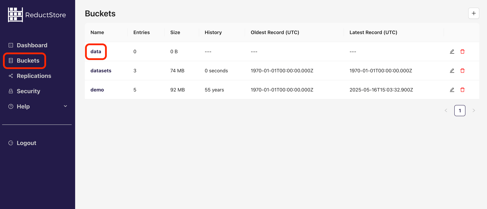
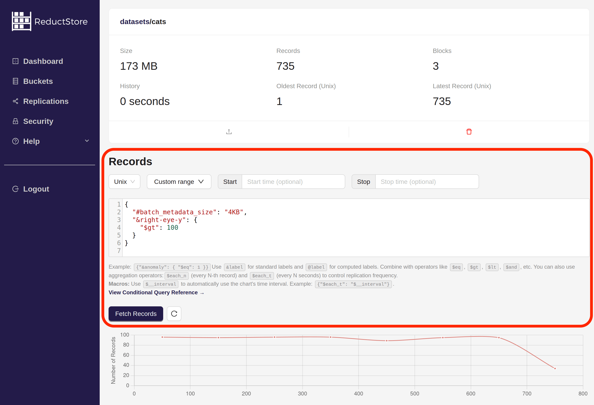
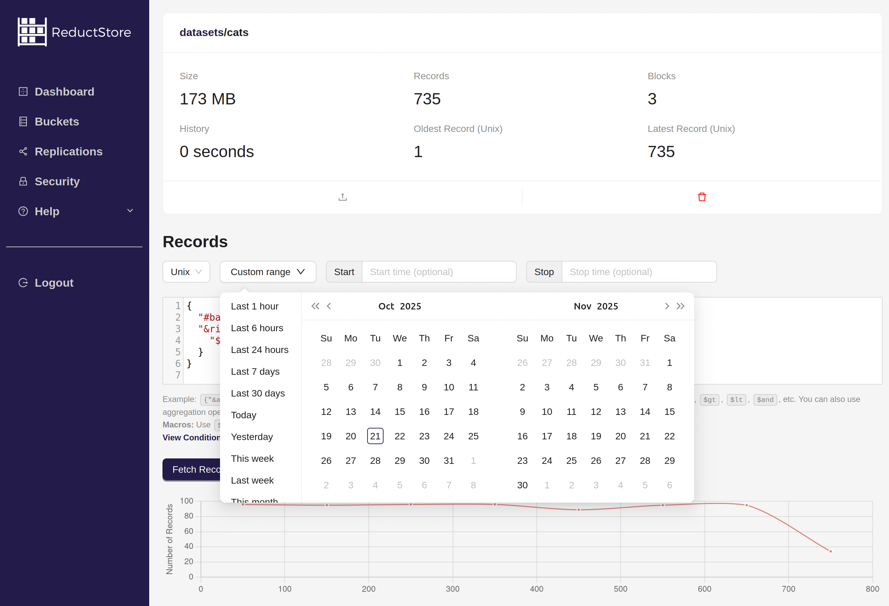
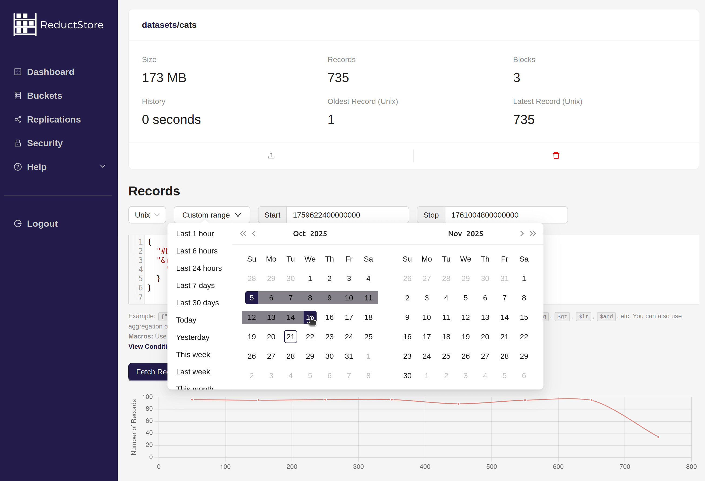
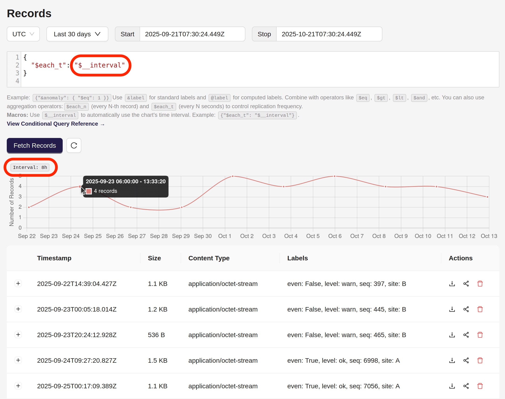
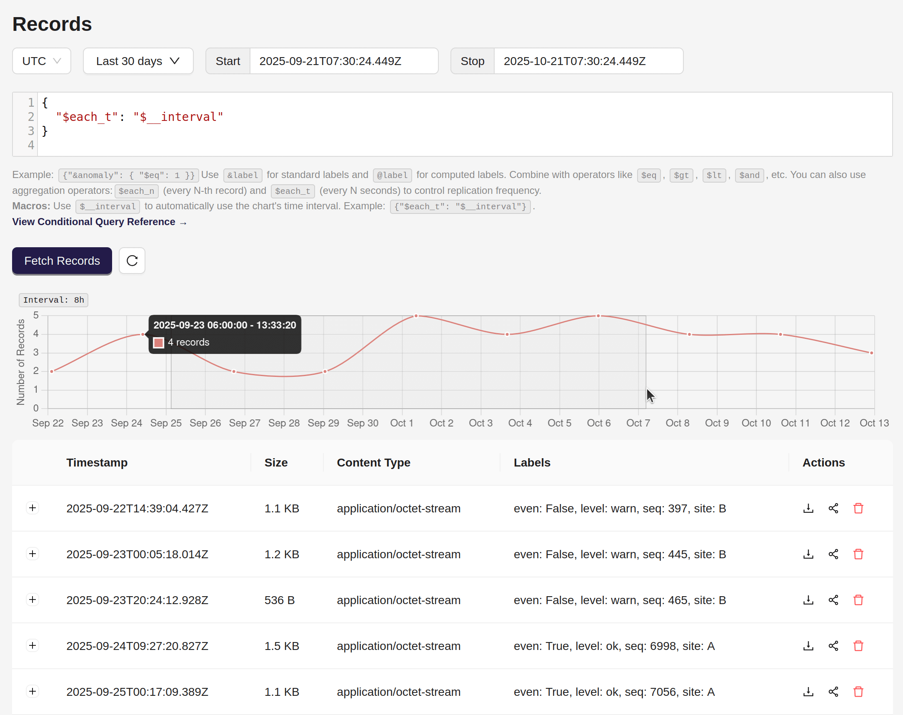
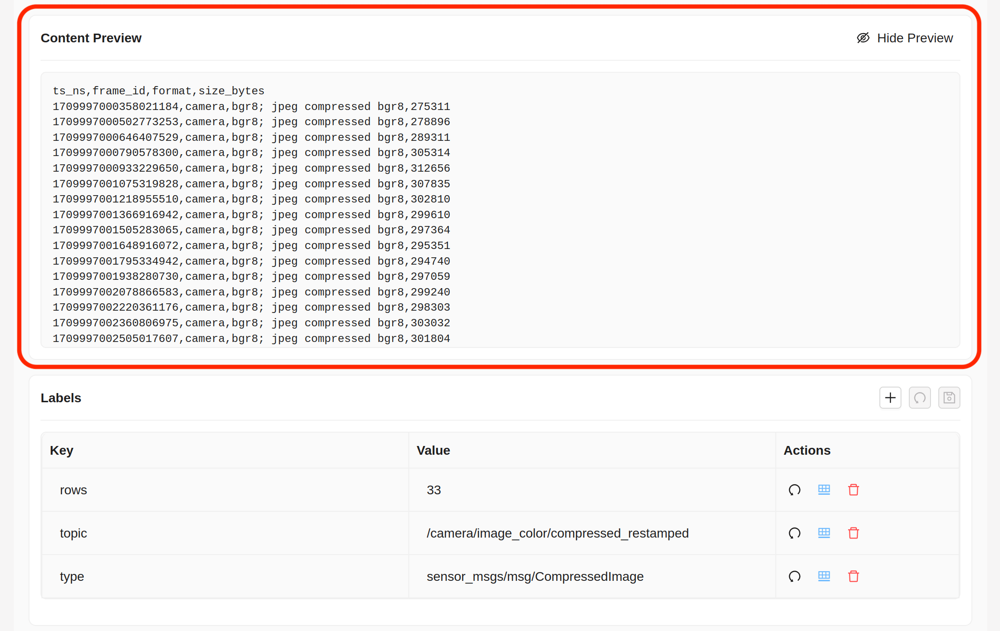

import CodeBlock from "@theme/CodeBlock";
import Tabs from "@theme/Tabs";
import TabItem from "@theme/TabItem";

<head>
  <link
    rel="canonical"
    href="https://www.reduct.store/docs/guides/data-querying"
  />
</head>

# Data Querying From ReductStore Database

ReductStore is a time series database that provides efficient data retrieval capabilities. This guide explains how to query data from ReductStore using the **[CLI](../glossary#cli)**, **[HTTP API](../glossary#http-api)**, and SDKs.

## Concepts

ReductStore provides an efficient data retrieval solution by **[batching](../glossary#batching)** multiple records within a specified time interval into a single HTTP request, which is beneficial for managing large volumes of data as it reduces the number of requests and overall delay.

The query process is designed as an iterator, returning a batch of records in each iteration. This method allows data to be processed in segments, an approach that is useful when managing large datasets.

While it is possible to retrieve a **[record](../glossary#record)** by its timestamp, this method is less optimal than querying by a time range due to the lack of batching. However, this approach can be useful for querying specific versions of non-time series records, such as AI models, configurations, or file versions, when timestamps are used as identifiers.

## Query Parameters

Data can be queried using the ReductStore CLI, SDKs or HTTP API. The query parameters are the same for all interfaces and
are divided into two categories: filter and control parameters.

### Filter Parameters

Filter parameters are used to select records based on specific criteria. You can combine multiple filter parameters to create complex queries. This is the list of filter parameters, sorted by priority:

| Parameter | Description             | Type             | Default                                                                 |
| --------- | ----------------------- | ---------------- | ----------------------------------------------------------------------- |
| `start`   | Start time of the query | Timestamp        | The timestamp of the first record in the **[entry](../glossary#entry)** |
| `stop`    | Stop time of the query  | Timestamp        | The timestamp of the last record in the entry                           |
| `when`    | Conditional query       | JSON-like object | No condition                                                            |

**Time Range**

The time range is defined by the `start` and `stop` parameters.
Records with a timestamp equal to or greater than `start` and less than `stop` are included in the result.
If the `start` parameter is not set, the query starts from the begging of the entry.
If the `stop` parameter is not set, the query continues to the end of the entry.
If both `start` and `stop` are not set, the query returns the entire entry.

### Control Parameters

There are also more advanced parameters available in the SDKs and HTTP API to control the query behavior:

| Parameter       | Description                                                                          | Type    | Default |
| --------------- | ------------------------------------------------------------------------------------ | ------- | ------- |
| `ttl`           | Time-to-live of the query. The query is automatically closed after TTL               | Integer | 60      |
| `head`          | Retrieve only metadata                                                               | Boolean | False   |
| `continuous`    | Keep the query open for continuous data retrieval                                    | Boolean | False   |
| `poll_interval` | Time interval in seconds for polling data in continuous mode data in continuous mode | Integer | 1       |
| `strict`        | Enable strict mode for conditional queries                                           | Boolean | False   |

**TTL (Time-to-Live)**

The `ttl` parameter determines the time-to-live of a query. The query is automatically closed when the specified time has elapsed since it was created. This prevents memory leaks by limiting the number of open queries. The default TTL is 60 seconds.

**Head Flag**

The `head` flag is used to retrieve only metadata. When set to `true`, the query returns the records' metadata, excluding the actual data. This parameter is useful when you want to work with labels without downloading the content of the records.

**Continuous Mode**

The `continuous` flag is used to keep the query open for continuous data retrieval. This mode is useful when you need to monitor data in real-time. The SDKs provide `poll_interval` parameter to specify the time interval for polling data in continuous mode. The default interval is 1 second.

**Strict Mode**

The `strict` flag is used to enable strict mode for conditional queries in the `where` parameter. In strict mode, the query fails if the condition is invalid or contains an unknown field.
When the strict mode is disabled, the invalid condition is considered as `false` and the unknown field is ignored.

## Typical Data Querying Cases

This section provides guidance on implementing typical data querying cases using the ReductStore CLI, SDKs, or HTTP API. All examples are designed for a local ReductStore instance, accessible at `http://127.0.0.1:8383` using the API token 'my-token'.

For more information on setting up a local ReductStore instance, see the **[Getting Started](../getting-started)** guide.

### Querying Data by Time Range

The most common use case is to query data within a specific time range:

import TimeRangeQueryPy from "!!raw-loader!../examples/py/src/data_querying_time_range.py";
import TimeRangeQueryJs from "!!raw-loader!../examples/js/src/data_querying_time_range.mjs";
import TimeRangeQueryGo from "!!raw-loader!../examples/go/src/data_querying_time_range.go";
import TimeRangeQueryRs from "!!raw-loader!../examples/rs/examples/data_querying_time_range.rs";
import TimeRangeQueryCpp from "!!raw-loader!../examples/cpp/src/data_querying_time_range.cc";
import TimeRangeQueryCLI from "!!raw-loader!../examples/cli/data_querying_time_range.sh";
import TimeRangeQueryCurl from "!!raw-loader!../examples/curl/data_querying_time_range.sh";

<Tabs>
  <TabItem value="Python">
    <CodeBlock language="python">{TimeRangeQueryPy}</CodeBlock>
  </TabItem>
  <TabItem value="JavaScript">
    <CodeBlock language="javascript">{TimeRangeQueryJs}</CodeBlock>
  </TabItem>
    <TabItem value="Go">
    <CodeBlock language="go">{TimeRangeQueryGo}</CodeBlock>
    </TabItem>
  <TabItem value="Rust">
    <CodeBlock language="rust">{TimeRangeQueryRs}</CodeBlock>
  </TabItem>
  <TabItem value="C++">
    <CodeBlock language="cpp">{TimeRangeQueryCpp}</CodeBlock>
  </TabItem>
  <TabItem value="CLI">
    <CodeBlock language="bash">{TimeRangeQueryCLI}</CodeBlock>
  </TabItem>
  <TabItem value="Web Console">

    1. Open the Web Console at `http://127.0.0.1:8383` in your browser.
    2. Enter the API token if the authorization is enabled.
    3. Select the bucket that contains the data you want to query:
    
    4. You will see a list of all the entries in the bucket
    5. Click on the entry you want to query
    6. On the entry page you will see the query panel:
    
    7. Enter the time range in the date picker or manually in the input fields
      - You can also use the **Time Preset** dropdown to select a predefined time range, such as "Last 24 hours" or "Last 7 days". The time range will be automatically filled in the input fields.
      
      - Or you can select a time range using the **Customize** option.
      
    8. Click the **Fetch Records** button to execute the query
    9. You will see the meta information about the records that match the time range. You can
       click on the download icon to download content of the record.

  </TabItem>
  <TabItem value="cURL">
    <CodeBlock language="bash">{TimeRangeQueryCurl}</CodeBlock>
  </TabItem>
</Tabs>

### Querying Record by Timestamp

The simplest way to query a record by its timestamp is to use the `read` method provided by the ReductStore SDKs or HTTP API:

import ReadRecordPy from "!!raw-loader!../examples/py/src/data_querying_timestamp.py";
import ReadRecordJs from "!!raw-loader!../examples/js/src/data_querying_timestamp.mjs";
import ReadRecordGo from "!!raw-loader!../examples/go/src/data_querying_timestamp.go";
import ReadRecordRs from "!!raw-loader!../examples/rs/examples/data_querying_timestamp.rs";
import ReadRecordCpp from "!!raw-loader!../examples/cpp/src/data_querying_timestamp.cc";
import ReadRecordCurl from "!!raw-loader!../examples/curl/data_querying_timestamp.sh";

<Tabs>
  <TabItem value="Python">
    <CodeBlock language="python">{ReadRecordPy}</CodeBlock>
  </TabItem>
  <TabItem value="JavaScript">
    <CodeBlock language="javascript">{ReadRecordJs}</CodeBlock>
  </TabItem>
  <TabItem value="Go">
    <CodeBlock language="go">{ReadRecordGo}</CodeBlock>
  </TabItem>
  <TabItem value="Rust">
    <CodeBlock language="rust">{ReadRecordRs}</CodeBlock>
  </TabItem>
  <TabItem value="C++">
    <CodeBlock language="cpp">{ReadRecordCpp}</CodeBlock>
  </TabItem>
  <TabItem value="Web Console">

    1. To find a specific timestamp, you can first browse the records using the `$__interval` macro in the Web Console. The macro automatically adjusts the [**$each_t operator**](/docs/conditional-query/aggregation-operators#each_t) based on the zoom level of the graph.
    
    2. You can zoom in the graph to select a specific time range by clicking and dragging the mouse over the graph area:
    
    3. On the record list below the graph, click on the record with the desired timestamp to preview its content:
    

  </TabItem>
  <TabItem value="cURL">
    <CodeBlock language="bash">{ReadRecordCurl}</CodeBlock>
  </TabItem>
</Tabs>

### Using Labels to Filter Data

Filtering data by labels is another common use case. You can use the `when` parameter to filter records based on labels.
ReductStore supports a wide range of operators for conditional queries, including equality, comparison, and logical operators. Refer to the **[Conditional Query Reference](../conditional-query/index.mdx)** for more information.

For example, consider a data set with annotated photos of celebrities. We want to retrieve the first 10 photos of celebrities taken after 2006 with a score less than 4:

import FilterQueryPy from "!!raw-loader!../examples/py/src/data_querying_filter.py";
import FilterQueryJs from "!!raw-loader!../examples/js/src/data_querying_filter.mjs";
import FilterQueryGo from "!!raw-loader!../examples/go/src/data_querying_filter.go";
import FilterQueryRs from "!!raw-loader!../examples/rs/examples/data_querying_filter.rs";
import FilterQueryCpp from "!!raw-loader!../examples/cpp/src/data_querying_filter.cc";
import FilterQueryCLI from "!!raw-loader!../examples/cli/data_querying_filter.sh";
import FilterQueryCurl from "!!raw-loader!../examples/curl/data_querying_filter.sh";

<Tabs>
  <TabItem value="Python">
    <CodeBlock language="python">{FilterQueryPy}</CodeBlock>
  </TabItem>
  <TabItem value="JavaScript">
    <CodeBlock language="javascript">{FilterQueryJs}</CodeBlock>
  </TabItem>
    <TabItem value="Go">
        <CodeBlock language="go">{FilterQueryGo}</CodeBlock>
    </TabItem>
  <TabItem value="Rust">
    <CodeBlock language="rust">{FilterQueryRs}</CodeBlock>
  </TabItem>
  <TabItem value="C++">
    <CodeBlock language="cpp">{FilterQueryCpp}</CodeBlock>
  </TabItem>
  <TabItem value="CLI">
    <CodeBlock language="bash">{FilterQueryCLI}</CodeBlock>
  </TabItem>
  <TabItem value="Web Console">

    1. Open the Web Console at `http://127.0.0.1:8383` in your browser.
    2. Enter the API token if the authorization is enabled.
    3. Select the bucket that contains the data you want to query:
    
    4. You will see a list of all the entries in the bucket
    5. Click on the entry you want to query
    6. On the entry page you will see the query panel:
    
    7. Enter the query condition in the "Filter Records (JSON)" input field
    8. Click the **Fetch Records** button to execute the query
    9. You will see the meta information about the records that match the condition. You can
       click on the download icon to download content of the record.

  </TabItem>
  <TabItem value="cURL">
    <CodeBlock language="bash">{FilterQueryCurl}</CodeBlock>
  </TabItem>
</Tabs>

:::info
The `when` condition filters data in the time range defined by the `start` and `stop` parameters. If the `start` and `stop` parameters are not set, the condition is applied to all records in the entry.
Limit your queries to a specific time range to improve performance.
:::
