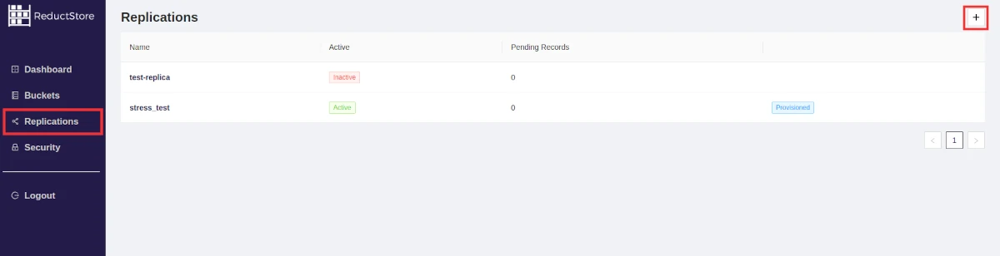

import CodeBlock from "@theme/CodeBlock";
import Tabs from '@theme/Tabs';
import TabItem from '@theme/TabItem';

<head>
    <link rel="canonical" href="https://www.reduct.store/docs/guides/data-replication"/>
</head>

# Data Replication

Data replication is the process of copying data from one database to another. ReductStore provides a simple and efficient append-only replication to stream data from one database to another.

## Concepts

There many way to implement data replication, and ReductStore implements it in a way most suitable for the use case of a real-time IoT or edge computing systems:

- **Append-only**: Data replication in ReductStore is append-only, meaning that data is only added to the destination database and never updated or deleted.
- **Push-based**: Data replication in ReductStore is push-based, meaning that the source database pushes data to the destination database.
- **Condition-based**: Data replication in ReductStore is condition-based, meaning that the source database can define conditions under which data is replicated to the destination database.

The data replication process in ReductStore is based on the concept of a `Replication Task`. A `Replication Task` is a configuration that defines the source and destination databases, the data to be replicated, and the replication conditions.

When a `Replication Task` is created, ReductStore starts a replication process that continuously streams data from the source database to the destination database.

When a new record is arrived to the source database, the HTTP Frontend stores the record in a bucket and registers it in the Transaction Log. The Replication Task periodically checks the Transaction Log for new records and replicates them to the destination database.
After the record is successfully replicated, the Replication Task discards the record from the Transaction Log.
This approach ensures that data is replicated in real-time and that the replication process is fault-tolerant and can recover from failures.

Replication Task can check a record against a condition before replicating it to the destination database by using labels. Labels are key-value pairs that are attached to records in the source database. The Replication Task can define a condition based on the labels of the record, and only replicate the record if the condition is met.

You can use the replication to copy data from one bucket to another one in the same instance. It can be useful to filter and store data in a long-term bucket with bigger **[FIFO quota](/docs/guides/buckets.mdx)**.
## Managing Data Replication Tasks

Here you will find examples of how to create, list, retrieve, update, and delete Replication Tasks using the ReductStore SDKs, REST API, CLI and Web Console.

Pay attention that all the examples are written for a local ReductStore instance available at **`http://127.0.0.1:8383`** with an API token `my-token`.

For more information on how to set up a local ReductStore instance, refer to the **[Getting Started](/docs/getting-started.mdx)** guide.

### Creating a Replication Task

To spin up a new Replication Task, you need to provide the following information:

- **Source Bucket**: The name of the bucket in the source database from which data will be replicated.
- **Remote Bucket**: The name of the bucket in the destination database to which data will be replicated.
- **Remote URL**: The URL of the destination database.
- **Remote Token**: The API token of the destination database.
- **Include Labels**: A list of label-values that the Replication Task will use to filter records. Only records with these labels will be replicated.
- **Exclude Labels**: A list of label-values that the Replication Task will use to filter records. Records with these labels will not be replicated.
- **Entries**: A list of entries that the Replication Task will use to filter records. Only records with these entries will be replicated. If the list is empty, all records will be replicated. You can use the `*` wildcard to match any entry.

Let's create a Replication Task that replicates all records from the `source-bucket` to the `remote-bucket` by using
the ReductStore SDKs, REST API, CLI and Web Console. You can also provision a Replication Task using by using environment variables.

import CreateReplicaCli from "!!raw-loader!./examples/cli/data_replication_create.sh"
import CreateReplicaPy from "!!raw-loader!./examples/py/src/data_replication_create.py"
import CreateReplicaJs from "!!raw-loader!./examples/js/src/data_replication_create.mjs"
import CreateReplicaRs from "!!raw-loader!./examples/rs/examples/data_replication_create.rs"
import CreateReplicaCpp from "!!raw-loader!./examples/cpp/src/data_replication_create.cc"
import CreateReplicaCurl from "!!raw-loader!./examples/curl/data_replication_create.sh"
import CreateReplicaProvision from "!!raw-loader!./examples/provisioning/data_replication_create.yml"

<Tabs>
    <TabItem value="CLI">
        <CodeBlock language="bash">
            {CreateReplicaCli}
        </CodeBlock>
    </TabItem>
    <TabItem value="Web Console">
        Steps to create a replication task using the Web Console:
        1. Open the Web Console at **[http://127.0.0.1:8383](http://127.0.0.1:8383)** in your browser.
        2. Enter the API token if the authorization is enabled.
        3. Click on the **"Replication"** tab in the left sidebar.
        4. Click on the plus icon to create a new bucket in the top right corner:
        
        5. In the **"Create a new replication"** dialog, entre the name of the replication name and settings:

        
        6. Click on the **"Create Replication"** button to create the replication task.
    </TabItem>
    <TabItem value="Python">
        <CodeBlock language="python">
            {CreateReplicaPy}
        </CodeBlock>
    </TabItem>
    <TabItem value="JavaScript">
        <CodeBlock language="javascript">
            {CreateReplicaJs}
        </CodeBlock>
    </TabItem>
    <TabItem value="Rust">
        <CodeBlock language="rust">
            {CreateReplicaRs}
        </CodeBlock>
    </TabItem>
    <TabItem value="C++">
        <CodeBlock language="cpp">
            {CreateReplicaCpp}
        </CodeBlock>
    </TabItem>
    <TabItem value="Curl">
        <CodeBlock language="bash">
            {CreateReplicaCurl}
        </CodeBlock>
    </TabItem>
    <TabItem value="Provisioning">
        <CodeBlock language="yaml">
            {CreateReplicaProvision}
        </CodeBlock>
    </TabItem>
</Tabs>

### Browse Replication Tasks

To list all Replication Tasks, you can use the same methods as for creating a Replication Task.You also can retrieve diagnostics information about the Replication Task such as:

* **Status**: The status of the Replication Task. It can be `running`, `stopped`, `failed`, or `completed`.
* **Number of Pending Records**: The number of records that are waiting to be replicated.
* **Number of Failed Records**: The number of records that failed to be replicated for in the last hour
* **Number of Replicated Records**: The number of records that were successfully replicated for the last hour
* **Error List**: A list of errors that occurred during the replication process for the last hour

:::note
For the first hour of the Replication Task, the `Number of Failed Records` and `Number of Replicated Records` are interpolated.
:::

import BrowseReplicaCLI from "!!raw-loader!./examples/cli/data_replication_browse.sh"
import BrowseReplicaPy from "!!raw-loader!./examples/py/src/data_replication_browse.py"
import BrowseReplicaJs from "!!raw-loader!./examples/js/src/data_replication_browse.mjs"
import BrowseReplicaRs from "!!raw-loader!./examples/rs/examples/data_replication_browse.rs"
import BrowseReplicaCpp from "!!raw-loader!./examples/cpp/src/data_replication_browse.cc"
import BrowseReplicaCurl from "!!raw-loader!./examples/curl/data_replication_browse.sh"

<Tabs>
    <TabItem value="CLI">
        <CodeBlock language="bash">
            {BrowseReplicaCLI}
        </CodeBlock>
    </TabItem>
    <TabItem value="Python">
        <CodeBlock language="python">
            {BrowseReplicaPy}
        </CodeBlock>
    </TabItem>
    <TabItem value="JavaScript">
        <CodeBlock language="javascript">
            {BrowseReplicaJs}
        </CodeBlock>
    </TabItem>
    <TabItem value="Rust">
        <CodeBlock language="rust">
            {BrowseReplicaRs}
        </CodeBlock>
    </TabItem>
    <TabItem value="C++">
        <CodeBlock language="cpp">
            {BrowseReplicaCpp}
        </CodeBlock>
    </TabItem>
    <TabItem value="Curl">
        <CodeBlock language="bash">
            {BrowseReplicaCurl}
        </CodeBlock>
    </TabItem>
</Tabs>

### Removing a Replication Task

You can remove a Replication Task by using the same methods as for creating a Replication Task.

import RemoveReplicaCli from "!!raw-loader!./examples/cli/data_replication_remove.sh"
import RemoveReplicaPy from "!!raw-loader!./examples/py/src/data_replication_remove.py"
import RemoveReplicaJs from "!!raw-loader!./examples/js/src/data_replication_remove.mjs"
import RemoveReplicaRs from "!!raw-loader!./examples/rs/examples/data_replication_remove.rs"
import RemoveReplicaCpp from "!!raw-loader!./examples/cpp/src/data_replication_remove.cc"
import RemoveReplicaCurl from "!!raw-loader!./examples/curl/data_replication_remove.sh"

<Tabs>
    <TabItem value="CLI">
        <CodeBlock language="bash">
            {RemoveReplicaCli}
        </CodeBlock>
    </TabItem>
    <TabItem value="Python">
        <CodeBlock language="python">
            {RemoveReplicaPy}
        </CodeBlock>
    </TabItem>
    <TabItem value="JavaScript">
        <CodeBlock language="javascript">
            {RemoveReplicaJs}
        </CodeBlock>
    </TabItem>
    <TabItem value="Rust">
        <CodeBlock language="rust">
            {RemoveReplicaRs}
        </CodeBlock>
    </TabItem>
    <TabItem value="C++">
        <CodeBlock language="cpp">
            {RemoveReplicaCpp}
        </CodeBlock>
    </TabItem>
    <TabItem value="Curl">
        <CodeBlock language="bash">
            {RemoveReplicaCurl}
        </CodeBlock>
    </TabItem>
</Tabs>

:::info
You can't remove a provisioned Replication Task. Before removing a provisioned Replication Task, you need to
unset the corresponding environment variables and restart the ReductStore instance.
:::

## Manual Data Replication

You can also replicate data manually when you need to copy specific time ranges or records from one bucket to another.
For this purpose, you can use ReductCLI's `cp` command. Here we copy all records from the `src-instance/example-bucket` to the `dst-instance/demo` bucket that have the `anomaly=true` label and don't have the `status=ok` label

import ManualReplica from "!!raw-loader!./examples/cli/data_replication_manual.sh"

<CodeBlock language="bash">
    {ManualReplica}
</CodeBlock>