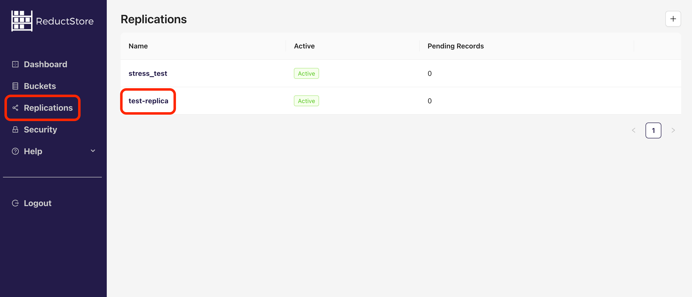
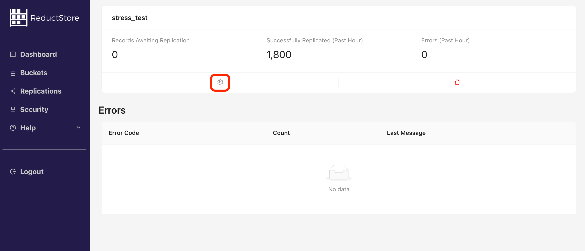
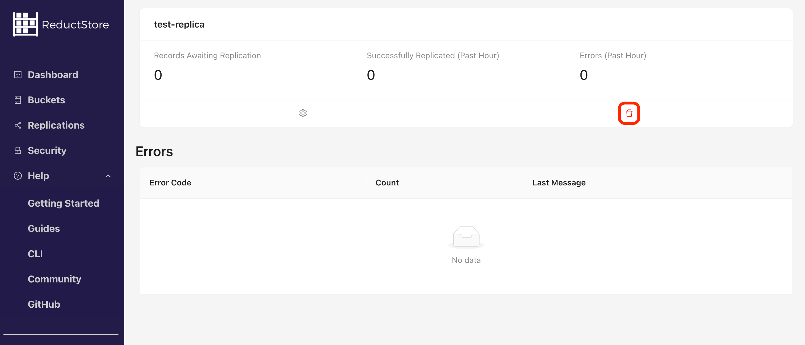

import CodeBlock from "@theme/CodeBlock";
import Tabs from "@theme/Tabs";
import TabItem from "@theme/TabItem";

<head>
  <link
    rel="canonical"
    href="https://www.reduct.store/docs/guides/data-replication"
  />
</head>

# Data Replication With ReductStore

Data **[replication](../glossary#replication)** is a process of copying data from one database to another. ReductStore provides simple and efficient append-only replication to stream data from one **[bucket](../glossary#bucket)** to another one.

## Concepts

The data replication in ReductStore is based on the concept of a **Replication Task**. A replication task is a configurable thread that filters and copies records from a source bucket to a target bucket. The target bucket can belong to the same or a different ReductStore instance. For more information on buckets, see the **[Buckets](/docs/guides/buckets.mdx)** guide.


Once a replication task is created, a ReductStore instance starts a new thread that waits for new records in the source bucket.
When a new **[record](../glossary#record)** arrives, the HTTP frontend stores the record in the source bucket and registers it in a transaction log. The replication task periodically checks the transaction log for new records and replicates them to the target bucket.
For efficiency, the replication task replicates multiple records in a single batch.
Once the record has been successfully replicated, the replication task deletes the record from the transaction log.
This approach ensures that data is replicated in real time and that the replication process is fault-tolerant and can recover from failures.

:::info
The replication engine only replicates new records written or updated to the source bucket after the replication task is created.
It doesn't replicate deletions or existing records in the source bucket.
:::

### Conditional Replication

A replication task can filter records before replicating them to the target bucket. You can specify the following filters:

| Parameter | Description                                                                                                                                                                                                                                                 | Type             |
| --------- | ----------------------------------------------------------------------------------------------------------------------------------------------------------------------------------------------------------------------------------------------------------- | ---------------- |
| `entries` | A list of entries that the replication task will use to filter records. Only records with these entries will be replicated. If the list is empty, all records will be replicated. You can use the `*` wildcard to match any **[entry](../glossary#entry)**. | List of strings  |
| `when`    | A set of conditions that the record must meet to be replicated. The conditions are based on the record labels. For more information on conditional queries, see the **[Conditional Query Reference](/docs/conditional-query/index.mdx)**                    | JSON-like object |

### Usage Example

Data replication may seem complex, but it is actually quite simple. Let's take a simple example:

Imagine we collect high frequency vibration sensor data from an engine in the `sensor-data` bucket.
The data from each sensor is stored in a separate record.
We want to replicate only the data from the `sensor-1` entry to the `remote-data` bucket in another ReductStore instance.
However, we only want to replicate the records if the engine is working and the sensor data is not corrupted.
In this case, the conditional replication settings will be:

```yaml
entries: ["sensor-1"]
where: { "&rms": { "$gt": 2.0 }, "&quality": { "$eq": "ok" } }
```

See the next section for more information on how to create a replication task with conditional replication settings.

## Managing Data Replication Tasks

Here you will find examples of how to create, list, retrieve, update, and delete replication tasks using the ReductStore SDKs, REST API, **[CLI](../glossary#cli)** and **[Web Console](../glossary#web-console)**.

Pay attention that all the examples are written for a local ReductStore instance available at **`http://127.0.0.1:8383`** with API token `my-token`.

For more information on setting up a local ReductStore instance, see the **[Getting Started](../getting-started/index.mdx)** guide.

### Creating a Replication Task

To spin up a new replication task, you must provide the following information:

- **Source Bucket**: The name of the bucket in the source database from which data will be replicated.
- **Remote Bucket**: The name of the bucket in the target database to which data will be replicated.
- **Remote URL**: The URL of the target database.
- **Remote Token**: The API token of the target database.
- **Filter Settings**: See the **[Conditional Replication](#conditional-replication)** section for more information.

Let's create a replication task that replicates all records from the `source-bucket` to the `remote-bucket` by using
the ReductStore SDKs, REST API, CLI and Web Console. You can also provision a Replication Task by using environment variables.

:::info
A created replication task replicates only new records written to the source bucket after the task is created. It doesn't replicate existing records in the source bucket.
However, you can manually replicate existing records using the **[Manual Data Replication](#manual-data-replication)** feature.
:::

import CreateReplicaCli from "!!raw-loader!../examples/cli/data_replication_create.sh";
import CreateReplicaPy from "!!raw-loader!../examples/py/src/data_replication_create.py";
import CreateReplicaJs from "!!raw-loader!../examples/js/src/data_replication_create.mjs";
import CreateReplicaGo from "!!raw-loader!../examples/go/src/data_replication_create.go";
import CreateReplicaRs from "!!raw-loader!../examples/rs/examples/data_replication_create.rs";
import CreateReplicaCpp from "!!raw-loader!../examples/cpp/src/data_replication_create.cc";
import CreateReplicaCurl from "!!raw-loader!../examples/curl/data_replication_create.sh";
import CreateReplicaProvision from "!!raw-loader!../examples/provisioning/data_replication_create.yml";

<Tabs>
  <TabItem value="CLI">
    <CodeBlock language="bash">{CreateReplicaCli}</CodeBlock>
  </TabItem>
  <TabItem value="Web Console">
    Steps to create a replication task using the Web Console:
      1. Open the Web Console at `http://127.0.0.1:8383` in your browser.
      2. Enter the API token if the authorization is enabled.
      3. Click on
    the **"Replication"** tab in the left sidebar.
      4. Click on the plus icon in
    the top right corner to create a new replication task: 
      5. In the **"Create a new
    replication"** dialog, entre the name of the replication name and settings:<br />
      6. Click on the **"Create Replication"** button to create the replication task.

  </TabItem>
  <TabItem value="Python">
    <CodeBlock language="python">{CreateReplicaPy}</CodeBlock>
  </TabItem>
  <TabItem value="JavaScript">
    <CodeBlock language="javascript">{CreateReplicaJs}</CodeBlock>
  </TabItem>
    <TabItem value="Go">
    <CodeBlock language="go">{CreateReplicaGo}</CodeBlock>
    </TabItem>
  <TabItem value="Rust">
    <CodeBlock language="rust">{CreateReplicaRs}</CodeBlock>
  </TabItem>
  <TabItem value="C++">
    <CodeBlock language="cpp">{CreateReplicaCpp}</CodeBlock>
  </TabItem>
  <TabItem value="cURL">
    <CodeBlock language="bash">{CreateReplicaCurl}</CodeBlock>
  </TabItem>
  <TabItem value="Provisioning">
    <CodeBlock language="yaml">{CreateReplicaProvision}</CodeBlock>
  </TabItem>
</Tabs>

### Browse Replication Tasks

You can list all replication tasks and get detailed information about a specific replication task using the ReductStore SDKs, REST API, CLI and Web Console.
The detailed information includes status, current settings and statistics of the replication task:

- **Status**: The status of the replication task. It can be `Active` or `Inactive`. Inactive replication tasks are paused and don't replicate data usually because the target database is unreachable.
- **Provisioned**: Whether the replication task is provisioned or not. Provisioned replication tasks are created using environment variables.
- **Number of Pending Records**: The number of records that are waiting to be replicated.
- **Number of Failed Records**: The number of records that failed to be replicated for in the last hour
- **Number of Replicated Records**: The number of records that were successfully replicated for the last hour
- **Error List**: A list of errors that occurred during the replication process for the last hour

:::note
For the first hour, the `Number of Failed Records` and `Number of Replicated Records` are interpolated.
:::

import BrowseReplicaCLI from "!!raw-loader!../examples/cli/data_replication_browse.sh";
import BrowseReplicaPy from "!!raw-loader!../examples/py/src/data_replication_browse.py";
import BrowseReplicaJs from "!!raw-loader!../examples/js/src/data_replication_browse.mjs";
import BrowseReplicaGo from "!!raw-loader!../examples/go/src/data_replication_browse.go";
import BrowseReplicaRs from "!!raw-loader!../examples/rs/examples/data_replication_browse.rs";
import BrowseReplicaCpp from "!!raw-loader!../examples/cpp/src/data_replication_browse.cc";
import BrowseReplicaCurl from "!!raw-loader!../examples/curl/data_replication_browse.sh";

<Tabs>
  <TabItem value="CLI">
    <CodeBlock language="bash">{BrowseReplicaCLI}</CodeBlock>
  </TabItem>
  <TabItem value="Web Console">
    Steps to browse a replication task using the Web Console:
      1. Open the Web Console at `http://127.0.0.1:8383` in your browser.
      2. Enter the API token if the authorization is enabled.
      3. Click on the **"Replication"** tab in the left sidebar.
      4. You will see a list of all replication tasks with their status
      5. Click on a specific replication task in the list: 
      6. You will see the details of the replication task: 
      7. You can also see or update the replication task settings by clicking he **cog icon(⚙️)** in the replication task panel.

  </TabItem>
  <TabItem value="Python">
    <CodeBlock language="python">{BrowseReplicaPy}</CodeBlock>
  </TabItem>
  <TabItem value="JavaScript">
    <CodeBlock language="javascript">{BrowseReplicaJs}</CodeBlock>
  </TabItem>
    <TabItem value="Go">
        <CodeBlock language="go">{BrowseReplicaGo}</CodeBlock>
    </TabItem>
  <TabItem value="Rust">
    <CodeBlock language="rust">{BrowseReplicaRs}</CodeBlock>
  </TabItem>
  <TabItem value="C++">
    <CodeBlock language="cpp">{BrowseReplicaCpp}</CodeBlock>
  </TabItem>
  <TabItem value="cURL">
    <CodeBlock language="bash">{BrowseReplicaCurl}</CodeBlock>
  </TabItem>
</Tabs>

### Replication modes

Replication tasks can be switched between modes via the SDKs or HTTP API without recreating the task:

- `enabled`: Replicates incoming records to the target bucket (default).
- `paused`: Collects new transactions without sending them until you resume the task.
- `disabled`: Ignores new transactions; no new data is queued or sent.

Switch modes when a target is under maintenance or recovering. Provisioned replications keep the mode defined by their environment variables; update those variables if you need to change their behavior.

import UpdateReplicaModePy from "!!raw-loader!../examples/py/src/data_replication_mode.py";
import UpdateReplicaModeJs from "!!raw-loader!../examples/js/src/data_replication_mode.mjs";
import UpdateReplicaModeGo from "!!raw-loader!../examples/go/src/data_replication_mode.go";
import UpdateReplicaModeRs from "!!raw-loader!../examples/rs/examples/data_replication_mode.rs";
import UpdateReplicaModeCpp from "!!raw-loader!../examples/cpp/src/data_replication_mode.cc";
import UpdateReplicaModeCurl from "!!raw-loader!../examples/curl/data_replication_mode.sh";

<Tabs>
  <TabItem value="Python">
    <CodeBlock language="python">{UpdateReplicaModePy}</CodeBlock>
  </TabItem>
  <TabItem value="JavaScript">
    <CodeBlock language="javascript">{UpdateReplicaModeJs}</CodeBlock>
  </TabItem>
  <TabItem value="Go">
    <CodeBlock language="go">{UpdateReplicaModeGo}</CodeBlock>
  </TabItem>
  <TabItem value="Rust">
    <CodeBlock language="rust">{UpdateReplicaModeRs}</CodeBlock>
  </TabItem>
  <TabItem value="C++">
    <CodeBlock language="cpp">{UpdateReplicaModeCpp}</CodeBlock>
  </TabItem>
  <TabItem value="cURL">
    <CodeBlock language="bash">{UpdateReplicaModeCurl}</CodeBlock>
  </TabItem>
</Tabs>

### Removing a Replication Task

You can remove a replication task by using the ReductStore SDKs, REST API, CLI and Web Console. Once you remove a replication task, the replication process stops immediately, and the transaction log is deleted from the database.

:::danger
Removing a task deletes its transaction log and drops any queued (unsynced) records. If you only need a temporary stop, switch the task to `paused` or `disabled` instead of deleting it.
:::

:::info
You can't remove a provisioned replication task. Before removing it, you need to
unset the corresponding environment variables and restart the ReductStore instance.
:::

import RemoveReplicaCli from "!!raw-loader!../examples/cli/data_replication_remove.sh";
import RemoveReplicaPy from "!!raw-loader!../examples/py/src/data_replication_remove.py";
import RemoveReplicaJs from "!!raw-loader!../examples/js/src/data_replication_remove.mjs";
import RemoveReplicaGo from "!!raw-loader!../examples/go/src/data_replication_remove.go";
import RemoveReplicaRs from "!!raw-loader!../examples/rs/examples/data_replication_remove.rs";
import RemoveReplicaCpp from "!!raw-loader!../examples/cpp/src/data_replication_remove.cc";
import RemoveReplicaCurl from "!!raw-loader!../examples/curl/data_replication_remove.sh";

<Tabs>
  <TabItem value="CLI">
    <CodeBlock language="bash">{RemoveReplicaCli}</CodeBlock>
  </TabItem>
  <TabItem value="Web Console">
    Steps to remove a replication task using the Web Console:
      1. Open the Web Console at `http://127.0.0.1:8383` in your browser.
      2. Enter the API token if the authorization is enabled.
      3. Click on the **"Replication"** tab in the left sidebar.
      4. You will see a list of all replication tasks with their status
      5. Click on a specific replication task in the list: 
      6. Click on the **"Remove"** button in the replication task panel. 
      7. Confirm the deletion by typing the replication task name and clicking on the **Remove** button:<br />

  </TabItem>
  <TabItem value="Python">
    <CodeBlock language="python">{RemoveReplicaPy}</CodeBlock>
  </TabItem>
  <TabItem value="JavaScript">
    <CodeBlock language="javascript">{RemoveReplicaJs}</CodeBlock>
  </TabItem>
    <TabItem value="Go">
        <CodeBlock language="go">{RemoveReplicaGo}</CodeBlock>
    </TabItem>
  <TabItem value="Rust">
    <CodeBlock language="rust">{RemoveReplicaRs}</CodeBlock>
  </TabItem>
  <TabItem value="C++">
    <CodeBlock language="cpp">{RemoveReplicaCpp}</CodeBlock>
  </TabItem>
  <TabItem value="cURL">
    <CodeBlock language="bash">{RemoveReplicaCurl}</CodeBlock>
  </TabItem>
</Tabs>

## Manual Data Replication

You can also manually replicate data if you need to copy specific time periods or records from one bucket to another.
To do this, you can use ReducerCLI's `cp` command. Here we'll copy all records from the `src-instance/example-bucket` to the `dst-instance/demo` bucket that have the `anomaly=true` label and do not have the `status=ok` label.

import ManualReplica from "!!raw-loader!../examples/cli/data_replication_manual.sh";

<Tabs>
  <TabItem value="CLI">
    <CodeBlock language="bash">{ManualReplica}</CodeBlock>
  </TabItem>
</Tabs>
