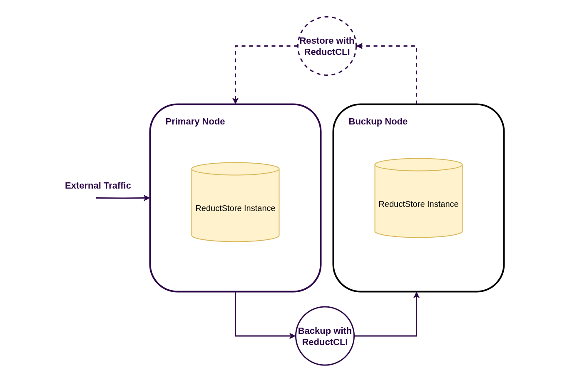
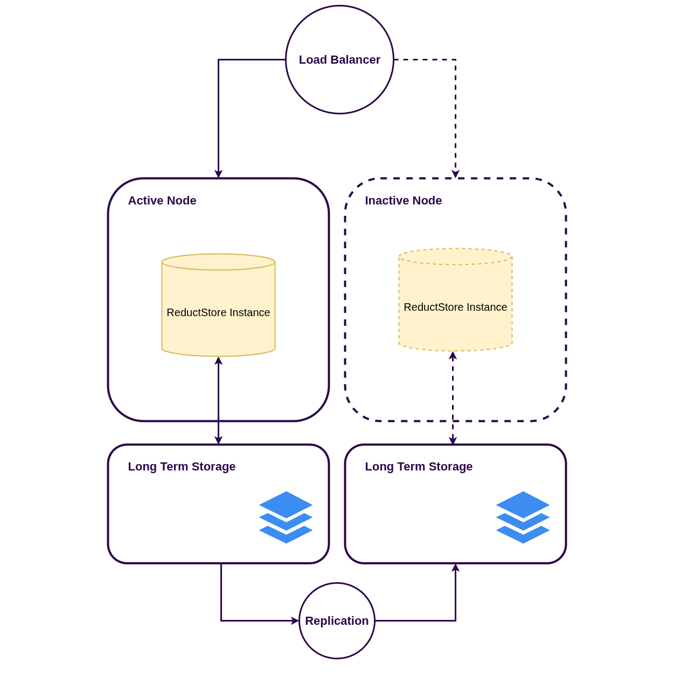
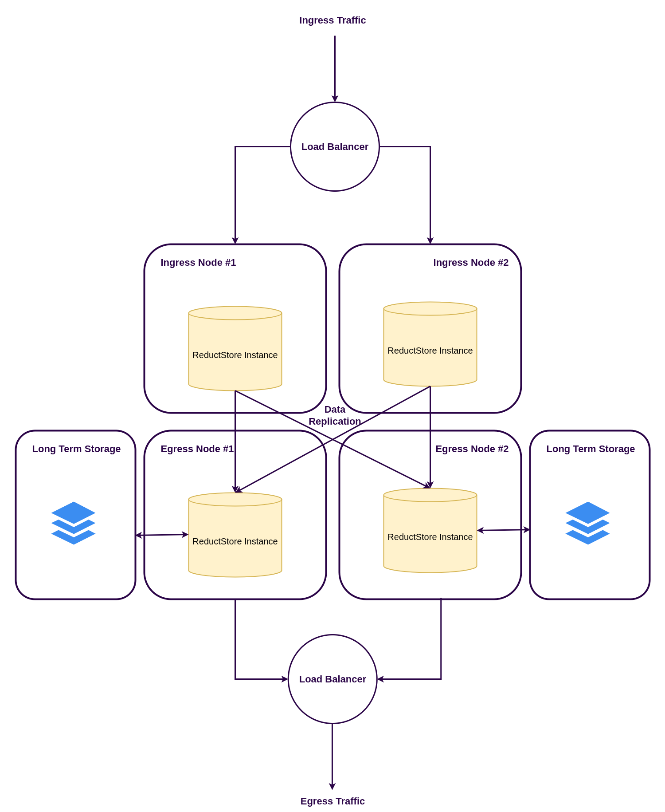

import CodeBlock from "@theme/CodeBlock";
import Tabs from "@theme/Tabs";
import TabItem from "@theme/TabItem";

<head>
  <link
    rel="canonical"
    href="https://www.reduct.store/docs/guides/disaster-recovery"
  />
</head>

# Disaster Recovery

This guide explains how to set up disaster recovery for ReductStore to ensure data resilience and availability.
It covers the following types of disasters:

1. **Hardware Failure**: Physical damage to the server or storage devices.
2. **Data Corruption**: Logical errors that lead to data being unreadable or inconsistent.
3. **Network Outage**: Loss of connectivity that prevents access to the ReductStore instance.
4. **Operational Errors**: Mistakes made by users or administrators that lead to data loss or corruption.

ReductStore provides several strategies to mitigate these risks which will be described in this guide.
In the table below, you can see the available strategies and their effectiveness against different types of disasters.

| Disaster Recovery Strategy                 | Description                                                                                    | Downtime      | Hardware Failure | Data Corruption | Network Outage | Operational Errors |
| ------------------------------------------ | ---------------------------------------------------------------------------------------------- | ------------- | ---------------- | --------------- | -------------- | ------------------ |
| Data Loss Detection and Automated Recovery | Mechanisms to detect data loss and recover automatically to keep an instance working           | seconds       | ✅ (limited)     | ✅ (limited)    | ❌             | ❌                 |
| Cold Backup via File System                | Copying data as files                                                                          | minutes/hours | ✅               | ✅              | ❌             | ✅                 |
| Hot Backup via CLI                         | Copying data with ReductStore CLI to a backup instance                                         | zero          | ✅               | ✅              | ❌             | ✅                 |
| Pilot light Instance                       | Prepared second instance to switch the HTTP traffic when the primary instance is not available | minutes       | ✅               | ❌              | ✅             | ❌                 |
| Active-Active Setup                        | Multiple active ReductStore instances to ensure high availability and redundancy               | zero          | ✅               | ✅              | ✅             | ✅                 |

## Data Loss Detection And Automated Recovery

ReductStore’s disaster recovery strategy begins with detecting data loss. The core principle is: whatever happens, detect and isolate the problem as early as possible, and continue operating with unaffected data.

Detection and isolation are based on the internal storage structure and format, which you can learn more about in the **[How Does It Work](../how-does-it-work#blocks)** section.
These mechanisms operate during both instance startup and I/O operations.

### Startup Data Loss Detection

When a ReductStore instance starts, the storage engine performs the following checks:

- Verifies and replays Write-Ahead Logs (WALs)
- Updates indexes
- Validates data integrity

This process helps recover from the following scenarios:

1. **Power Failure or Crash**:

- If ReductStore was not shut down properly, the engine detects incomplete WALs and restores the data to the last consistent state.

2. **File System Corruption**:

- Each index file has a CRC to verify its integrity. If corrupted, the engine will detect this and recreate it from **[block](../glossary#block)** descriptors.
- If the number or size of data blocks doesn’t match the index file, it will be rebuilt using the block descriptors.
- If the storage engine detects a corrupted block descriptor during the index rebuild, it will remove the corrupted block and continue with the rest of the data.

### Runtime Data Loss Detection

During I/O operations, ReductStore checks the integrity of block descriptors.
If corruption is detected:

- The storage engine aborts the current I/O operation.
- A `500 Internal Server Error` is returned.
- The issue is logged for administrative review.

An administrator can inspect the logs and take corrective actions such as removing the corrupted block or restoring it from a backup.

:::note
Not every I/O operation will trigger a check. The checks are preformed when a block descriptor is read from disk to an in-memory cache.
:::

### Content Integrity

The detection mechanisms described above ensure the integrity of metadata and block descriptors—essential for the reliable functioning of the storage engine.

However, they **do not verify the actual content** of stored **[records](../glossary#record)**, to avoid performance penalties.
To ensure content-level integrity, users can implement their own checksum or hash validation and attach them as **[labels](../glossary#label)** to records:

```python
md5_hash = md5(data).hexdigest()
ts = time.time()
await bucket.write(
    "entry_name",
    data,
    timestamp=ts,
    labels={
        "md5": md5_hash,
    },
)
```

## Cold Backup via File System

A robust backup and restore strategy is essential for disaster recovery—especially in scenarios involving data corruption or loss.
This strategy includes creating regular file backups of the ReductStore instance and restoring them when necessary.

Due to architectural constraints of the ReductStore storage engine, **file backups can only be created or restored when the instance is stopped**.
This ensures data consistency by preventing write operations during the process but also introduces downtime.

### Backup Process

Backups are performed by copying the entire ReductStore data directory (`RS_DATA_PATH`), which contains all data and configuration files necessary for recovery.

To create a backup:

1. Shut down the ReductStore instance to ensure data consistency.
2. Copy the entire `RS_DATA_PATH` directory to your backup location.
3. Restart the ReductStore instance after the backup is complete.

#### Backup Verification

It is highly recommended to verify each backup to ensure it can be restored successfully.
To test a backup:

1. Copy the backup to a new directory.
2. Start a new ReductStore instance with the copied data:
   ```bash
   RS_DATA_PATH=/path/to/backup reductstore
   ```
3. Check the logs for any startup errors.
4. Verify data accessibility, for example:
   ```bash
   curl http://127.0.0.1:8383/api/v1/list`
   ```

### Restore Process

Restoring from a backup involves copying data from a backup directory into the ReductStore data directory.
Restoration can be done fully or partially, depending on your recovery requirements:

- **Full Restore:** Restores the entire instance, including all **[buckets](../glossary#bucket)**, **[replication](../glossary#replication)** tasks, and configurations.
- **Bucket Restore:** Restores a specific bucket.
- **Entry Restore:** Restores a specific **[entry](../glossary#entry)** within a bucket.

:::warning
ReductStore must be stopped before performing any restore operation.
:::

#### Full Restore

To perform a full restore, follow these steps:

1. Stop the ReductStore instance.
2. Remove the current data directory or rename it for backup.
3. Copy the backup data directory to the original ReductStore data directory.
4. Start the ReductStore instance.

#### Bucket Restore

To restore a specific bucket, follow these steps:

1. Stop the ReductStore instance.
2. Remove the bucket directory from the current data directory. It is located at `RS_DATA_PATH/<bucket_name>`.
3. Copy the backup bucket directory to the original ReductStore data directory.
4. Start the ReductStore instance.

#### Entry Restore

To restore a specific entry within a bucket, follow these steps:

1. Stop the ReductStore instance.
2. Remove the entry file from the current bucket directory. It is located at `RS_DATA_PATH/<bucket_name>/<entry_name>`.
3. Copy the backup entry file to the original bucket directory.
4. Start the ReductStore instance.

## Hot Backup via CLI

The **hot backup** strategy uses the ReductStore **[CLI](../glossary#cli)** to copy data from a live instance to a secondary (backup) instance.
This method allows you to back up data **without stopping** the ReductStore instance, minimizing downtime.

While this approach offers more flexibility and control—such as specifying time ranges for incremental backups—it **does not copy instance configuration** (e.g., bucket definitions, replication rules, etc.).



This method is a good option for:

- Incremental backups based on time ranges
- Automated, scheduled backups

### Prerequisites

To use this strategy:

- Install the ReductStore CLI (see [Download Documentation](/download))
- Create **aliases** for both your primary and backup instances:

```bash
reduct-cli alias add primary -L <URL of the primary instance> --token <API token>
reduct-cli alias add backup -L <URL of the backup instance> --token <API token>
```

### Backup Process

To copy data from a bucket on the primary instance to the backup instance, use the `cp` command:

```bash
reduct-cli cp primary/<bucket_name> backup/<bucket_name> \
  --start <OPTIONAL start timestamp> \
  --stop <OPTIONAL end timestamp>
```

This command supports copying data for a full bucket or within a specific time range, enabling incremental or scheduled backups.

### Restore Process

To restore a bucket from the backup instance to the primary instance, run the `cp` command in reverse:

```bash
reduct-cli cp backup/<bucket_name> primary/<bucket_name> \
  --start <OPTIONAL start timestamp> \
  --stop <OPTIONAL end timestamp>
```

## Pilot Light

A **pilot light** instance is a secondary ReductStore instance that remains on standby and is ready to take over HTTP traffic if the primary instance becomes unavailable.
This strategy minimizes downtime and enables fast recovery from network outages or hardware failures.



To implement a pilot light setup, you will need the following components:

1. **Load Balancer** – to route HTTP traffic between the primary and pilot light instances.
2. **Monitoring System** – to detect failures in the primary instance and trigger failover.
3. **Data Replication Tool** – to synchronize data between the primary and standby instances.

### Load Balancer

A load balancer is responsible for directing HTTP traffic to the appropriate ReductStore instance.
It must be configured to:

- Route traffic to the primary instance under normal conditions.
- Automatically or manually switch to the pilot light instance if the primary becomes unavailable.

### Monitoring System

A monitoring system detects failures in the primary instance.
It should:

- Monitor for `5xx` HTTP error codes and network connectivity.
- Alert administrators or trigger automatic failover when the primary instance becomes unreachable.

### Data Replication

Data replication ensures the pilot light instance has an up-to-date copy of the data.
Replication tools must be chosen based on the storage configuration used by ReductStore, and should:

- Continuously sync data between primary and secondary instances.
- Provide logging or alerts if synchronization falls behind or fails.

### Switching to the Pilot Light

Failover to the pilot light instance can be **manual or automatic**, depending on how the load balancer and monitoring system are configured.

Regardless of the approach, the switch must follow this order to prevent data loss or corruption:

1. **Ensure the primary instance is fully stopped**, if it is still running.
2. **Verify that replication is complete** and the pilot light instance has the most recent data.
3. **Start the pilot light instance**, if it’s not already running, and ensure it's healthy.
4. **Route traffic to the pilot light** via the load balancer.

:::warning
The primary and pilot light instances should not be run simultaneously on the same dataset without proper coordination—this may cause data inconsistencies.
:::

## Active-Active Setup

An **active-active setup** involves deploying multiple ReductStore instances and replicating data between them.
This strategy provides **high availability**, **redundancy**, and **fast disaster recovery**, but it requires additional resources and infrastructure to support the setup.



The active-active architecture typically consists of two layers:

1. **Ingress Layer** – ReductStore instances optimized for high-performance ingestion with small storage capacity. These act as buffers and replicate data to the egress layer.
2. **Egress Layer** – ReductStore instances with high storage capacity, responsible for long-term storage and query handling.

Each layer has its own endpoints.
Clients must use the **ingress endpoint** for writing data and the **egress endpoint** for reading data.

### Ingress Layer

The ingress layer handles incoming data and replicates it to all egress instances.
Each ingress instance is identically configured with replication tasks pointing to all egress targets.

- Ingress nodes have limited storage and act primarily as buffers.
- The load balancer distributes write requests across the ingress instances.
- Because each ingress instance replicates data to all egress instances, the dataset in the egress layer remains consistent.

### Egress Layer

The egress layer stores replicated data and handles queries.

- Each egress instance has full, synchronized data.
- The load balancer distributes read requests across the egress instances to ensure scalability and fault tolerance.

### Configuration

While ReductStore supports data replication, it does **not synchronize instance configurations** automatically.
Because all instances in this setup must be configured identically, you should provision:

- Buckets
- Replication tasks
- Permissions (if applicable)

Use tools such as **Terraform**, **Ansible**, **ReductStore CLI**, or **[SDKs](../glossary#sdk)** to automate and enforce configuration consistency.

### Load Balancing Requirements

Proper load balancing is critical to the reliability and performance of an active-active setup. The load balancer must route all **requests from the same client** to the **same instance** during a session (stickiness).

This is important for two reasons:

1. **Query Iteration**
   The ReductStore HTTP query API works as an iterator over multiple requests. If requests are routed to different instances, the iterator state will be lost or invalid.

2. **Write Performance**
   ReductStore is optimized for time-ordered writes. If a client sends data to different ingress nodes out of order, it may degrade performance and efficiency.
