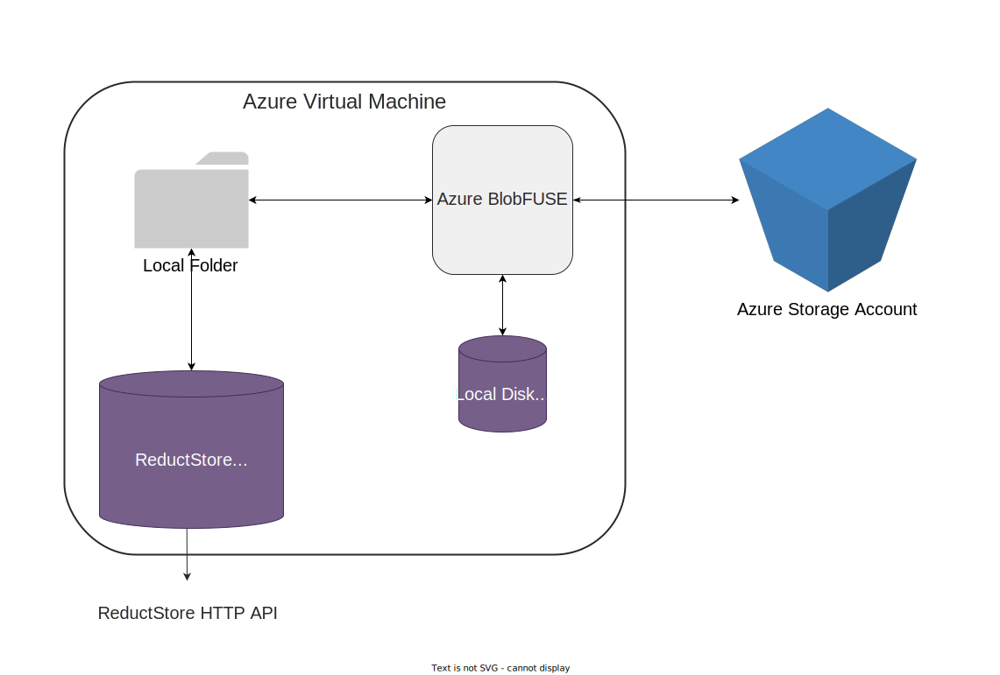
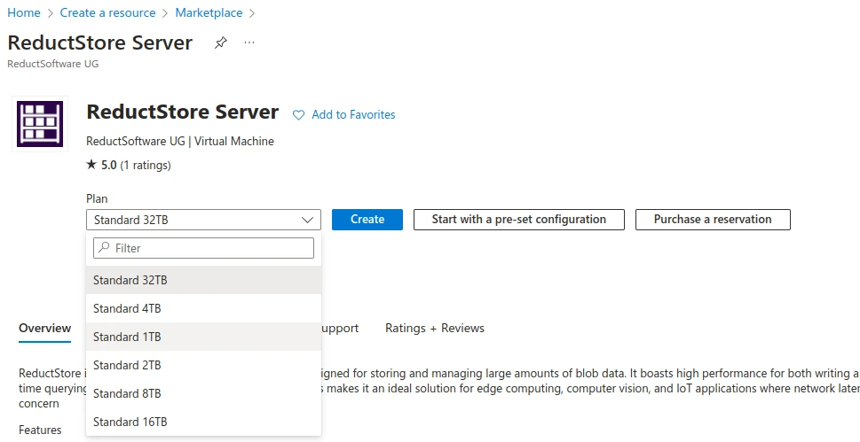
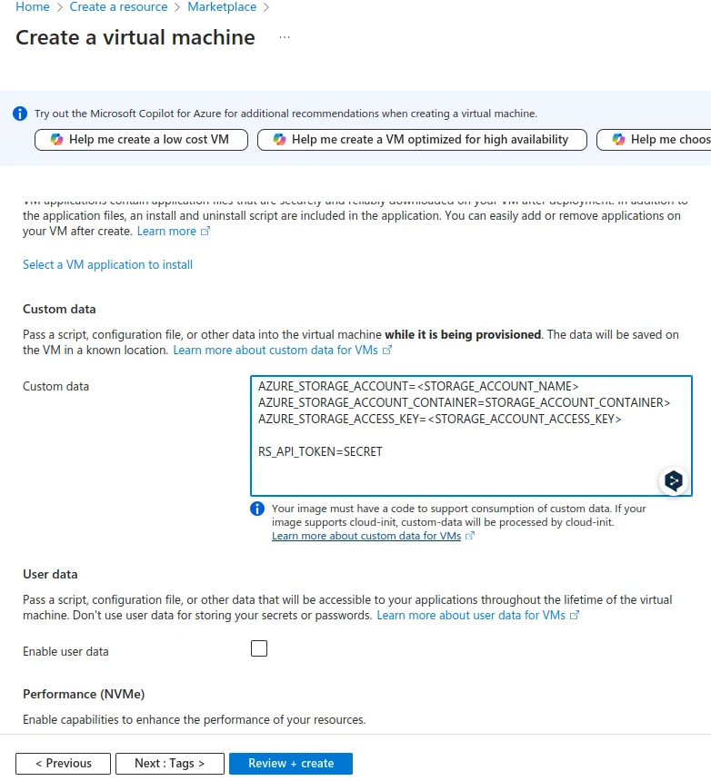

import TabItem from "@theme/TabItem";
import Tabs from "@theme/Tabs";

# Deploy as Azure Virtual Machine

<head>
    <link rel="canonical" href="https://www.reduct.store/docs/integration/azure-vm"/>
</head>

[ReductStore](https://www.reduct.store) is available as a virtual machine on the **[**Azure Marketplace**](https://azuremarketplace.microsoft.com/de-de/marketplace/apps/reductstorellc1689939980623.reductstore-server?tab=overview)**,
providing Azure customers with an easy way to deploy out-of-the-box ReductStore instances on Azure VMs.

The following guide provides instructions on how to deploy ReductStore as a virtual machine on Azure using the Azure CLI or Azure Portal.

## Overview

The virtual machine is pre-configured with ReductStore and all the necessary dependencies to store data in Azure storage accounts.
This provides a low cost storage solution that is easy to provision and scale as the data is stored away from the virtual machine.



ReductStore doesn't have native support for Azure Storage Accounts, but the virtual machine is preconfigured with [Azure BlobFuse](https://learn.microsoft.com/en-us/azure/storage/blobs/blobfuse2-what-is) to mount the Azure Storage Account as a local file system.
It uses a local disk cache to optimise read and write operations by reducing the number of requests to the Azure Storage Account.

## Virtual Machine Requirements

Before creating the virtual machine, you should choose the size of the virtual machine according to your requirements.
The minimum requirements for the virtual machine are:

* RAM: 1 GB
* CPU: 1 vCPUs
* Disk: 32 GB HDD

You will also need an Azure storage account to store the data. If you don't have one, you can create one in the Azure portal.

## Provisioning

The Virtual Machine uses [custom data](https://learn.microsoft.com/en-us/azure/virtual-machines/custom-data) for provisioning where you must provide credentials for the Azure Storage Account in
the dotenv format:

```dotenv
AZURE_STORAGE_ACCOUNT=<STORAGE_ACCOUNT_NAME>
AZURE_STORAGE_ACCOUNT_CONTAINER=<STORAGE_ACCOUNT_CONTAINER>
AZURE_STORAGE_ACCESS_KEY=<STORAGE_ACCOUNT_ACCESS_KEY>
```

Read more about environment variables in the [Azure BlobFuse documentation](https://github.com/Azure/azure-storage-fuse?tab=readme-ov-file#environment-variables).

Additionally, you can configure and provision ReductStore's resources in the same way. Read the [Configuration](/docs/configuration.mdx) page for more information.

## Deployment Steps

The following steps describe how to deploy ReductStore as a virtual machine on Azure using the Azure CLI or Azure Portal.

:::warning
**Disclaimer:** The guide contains instructions on how to deploy ReductStore as a virtual machine on Azure and doesn't cover the security and performance aspects of the deployment. You should review and modify the deployment to meet your needs.
:::

<Tabs>
    <TabItem value="Azure CLI">
        1. First create a resource group:
        ```bash
        az group create --name myResourceGroup --location westeurope
        ```

        2. Select the plan you want to use (Sku column):
        ```bash
        az vm image list --publisher reductsoftware -o table --all
        ```

        3. You must accept the [Terms and Conditions](https://www.reduct.store/terms) of the Azure Marketplace offering before creating the virtual machine.
        ```bash
        az vm image terms accept --publisher reductsoftware -f reductstore-server --plan [PLAN_NAME]
        ```

        The `[PLAN_NAME]` is the name of the plan you want to use. You can find it in the image Urn, for example, `reductstore-01tb-std`.

        4. Create the `custom_data.env` file with the custom data

        5. Create the virtual machine:
        ```bash
        az vm create \
        --resource-group myResourceGroup \
        --name myVM \
        --image reductsoftware:reductstore-server:[PLAN_NAME]:[VERSION] \
        --size Standard_A2_v2 \
        --admin-username azureuser \
        --generate-ssh-keys \
        --custom-data custom_data.env
        ```

        6. Open the HTTPS port in the network security group:
        ```bash
        az vm open-port --port 443 --resource-group myResourceGroup --name myVM --priority 800
        ```

        7. Locate the public IP address of the virtual machine:
        ```bash
        az network public-ip list -g myResourceGroup -o table
        ```

        8. Go to the public IP address in your browser to access the ReductStore web interface.

        9. Accept the self-signed SSL certificate to access the web interface.
    </TabItem>
    <TabItem value="Azure Portal">
        1. Go to the Azure Portal and click Create a Resource.

        2. Search for "ReductStore" and select the "ReductStore Server" offering.

        3. Click 'Create' and select the plan you wish to use.

        

        4. Fill in the required fields according to your requirements.

        5. Click 'Advanced' and add the custom data with the Azure storage account credentials and ReductStore
        configuration:

        

        6. Click Review + Create and then Create to create the virtual machine.

        7. When the deployment is complete, go to the resource and find the public IP address.

        8. Go to the public IP address in your browser to access the ReductStore web interface.

        9. Accept the self-signed SSL certificate to access the web interface.
    </TabItem>
</Tabs>


## Best Practices

### SSL Certificate

The virtual machine generates a self-signed SSL certificate at the first boot. It is recommended that you replace it with a valid SSL certificate to secure communication with the virtual machine.
Copy the SSL certificate and key to the virtual machine in the following paths

```bash
sudo cp valid_cert.pem /usr/local/lib/reductstore/certs/cert.crt
sudo cp valid_cert_key.pem /usr/local/lib/reductstore/certs/cert.key
```

And restart the ReductStore service:

```bash
sudo systemctl restart reductstore
```

### Enable ReductStore Token Authentication

By default, ReductStore is configured with token authentication disabled. It is recommended that you enable token authentication to secure communication with the virtual machine.
Add the following environment variable to your custom data:

```dotenv
RS_API_TOKEN=<API TOKEN>
```

## Next Steps

After deploying ReductStore as a virtual machine, you can start storing and querying time-series data. Check our **[Guides](/docs/guides/index.mdx)** to learn more about the ReductStore features and how to use them.