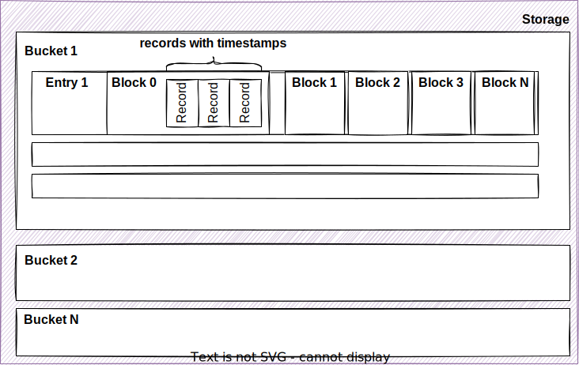

<head>
  <link rel="canonical" href="https://www.reduct.store/docs/how-does-it-work" />
</head>

# 💡 Basic Concepts Behind ReductStore

## What Is Time Series Blob Storage?

ReductStore is a time series database designed specifically for storing and managing large amounts of unstructured data. It uses an **[HTTP API](./http-api)** and stores the data as blobs. This means:

- ReductStore has no information about the format of the stored data. So, you can write whatever you want, but the storage can't aggregate your data. You have to read the same data, what you have written.
- The **[HTTP API](./http-api)** provides a simple and portable way to communicate with the storage engine, but the engine doesn't provide any query language to access the data. However, you can use labels for filtering data in requests.

In comparison to other S3-like object storage, ReductStore works differently:

- **Access By Time.** Each record in an entry is written with a timestamp and to read it you need to know the entry name and time.
- **Flat Storage Structure.** It doesn't have a tree-like structure for data. There are only buckets and entries with unique names in them.
- **Batching Data.** It doesn't store each record as a single file. It batches them into blocks of a fixed size so that it can store small objects more efficiently. You don't waste disk space because of the minimum size of file system blocks. Moreover, ReductStore pre-allocate blocks space to increase performance for write operations.
- **Forward Writing.** The engine records data fastest if it only needs to append records to the current block. It means that, for better performance, you should always write data with the newest timestamps.
- **Strong FIFO Quota.** When you have intensive write operations, you may run out of disk space quickly. The engine removes the oldest block in a bucket as soon as the amount of the data reaches a specified quota limit.

## Internal Structure

As was mentioned above, ReductStore has flat structure:

#### Bucket

A container for entries which provides the following storage settings:

- **Maximum block size.** The storage engine creates a new block after the size of the current block reaches this limit. A block might be bigger than this size because the storage engine can write a belated record.
- **Maximum number of records.** When the current block has more records than this limit, the storage engine creates a new block.
- **Quota type.** The storage supports two quota types:
  - No quota. The bucket will grow to consume as much free disk space as is available - relative to how much data is written.
  - FIFO. The bucket removes the oldest block of some entry when it reaches the quota limit.
- **Quota size.**

A user can manage bucket with [**Bucket API**](./http-api/bucket-api).

#### Entry

An entry represents a source of data. For example, It might be an image from a camera or the output of an AI model. The entry should have a unique name so that a user can address it with the [**Entry API.**](./http-api/entry-api)

**Block**

A block of records with a unique ID. The storage engine batches the records by blocks for a few reasons:

- Reduce overhead of storing short records. If you store a small chunk of information as separate files they always consume at least one block of the file system. Typically it is 4 kilobytes. So if you have a blob with only 5 bytes of data, it consumes 4 kilobytes as a file anyway.
- Search records quickly. The storage engine finds a requested block first, then the record.

#### Record

A blob with a timestamp and meta information such as content type and labels.

## HTTP API

ReductStore provides an HTTP API for managing buckets, entries, and tokens. You can use it to create, read, update, and delete buckets and entries. You can also use it to generate tokens to access the storage.
Unlike other blob storages, ReductStore also provides an advanced API for efficient data access:

- **Iterate over records.** You can iterate over records in an entry by specifying a time range and a number of records. This is useful when you need to read a large amount of data. The storage engine returns records in chunks of fixed size. This allows you to read and process data in chunks without loading all the data into memory.
- **Filter records by labels.** You can filter records by labels. This is useful when you need to read only a portion of the data. For example, you can filter records by a label representing anomaly detection results. This allows you to read only records with anomalies and ignore the rest of the data.
- **Batch records.** You can write a batch of records in a single request. This is useful when you need to read or write a large number of small records and reduce the number of requests to the storage engine.

## Replication

ReductStore supports append-only replication. The storage engine doesn't support replication of deletions. It means that if you delete a bucket or an entry in the source bucket, the storage engine doesn't delete it in the destination bucket.
We recommend to use replication for data reduction. For example, you can label records in the source bucket and replicate only records with a specific label to the destination bucket where you can store them for a long time.

Some more details about replication:

- **Bucket replication.** You can only replicate a bucket to another bucket. The destination bucket can be in the same storage or in another storage.
- **Append-only.** The storage engine doesn't support replication of deletions.
- **Write-Ahead Log.** The storage engine uses a write-ahead log to replicate data. It means that the storage engine writes data to the log first and then replicates it to the destination bucket. If the destination bucket is unavailable, the storage engine stores data in the log until the destination bucket becomes available again.
- **Filtering.** You can filter records by labels when you replicate a bucket. This is useful when you need to replicate only a portion of the data.

You can manage replications by using the [**Replication API**](./http-api/replication-api) or provision them with environment variables. See [**Configuration**](./configuration) for more details.

## Security

ReductStore provides a simple way to manage access to the storage. It uses tokens for authentication and authorization. You can generate tokens with the [**Token API**](./http-api/token-authentication) and use them to access the data.
A user can disable the token authorization and use the storage without authentication. In this case, the storage engine doesn't check the token and allows access to all data.
