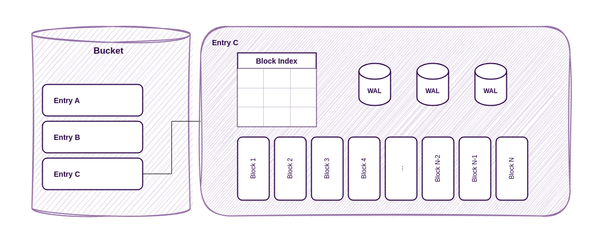
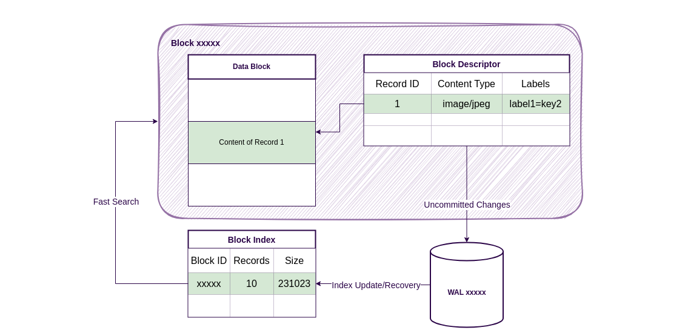

<head>
  <link rel="canonical" href="https://www.reduct.store/docs/how-does-it-work" />
</head>

# 💡 Basic Concepts Behind ReductStore

## What Is Time Series Object Storage?

ReductStore is a time series database designed specifically for storing and managing large amounts of unstructured data. It uses an **[HTTP API](./http-api/index.mdx)** and stores the data as blobs. This means:

- ReductStore has no information about the format of the stored data. So, you can write whatever you want, but the storage can't aggregate your data. You have to read the same data, what you have written.
- The **[HTTP API](./http-api/index.mdx)** provides a simple and portable way to communicate with the storage engine.

In comparison to other S3-like object storage, ReductStore works differently:

- **Indexing By Time.** Each **[record](./glossary#record)** in an **[entry](./glossary#entry)** is written with a unique timestamp. The storage engine is optimised for reading data by time ranges.
- **Flat Storage Structure.** It doesn't have a tree-like structure for data.
  There are only buckets and entries with unique names in them.
- **Batching Data.** Historical data is usually written forward and queried by time range.
  Batching can be used to optimise ingestion, retrieval and storage.
  The **[HTTP API](./glossary#http-api)** provides endpoints to write and query data in batches, reducing the number of requests and HTTP overhead.
  The storage engine batches objects into blocks of fixed size so that it can store small objects more efficiently.
  You don't waste disk space because of the minimum file system **[block](./glossary#block)** size. In addition, ReductStore pre-allocates block space to improve performance during write operations.
- **Forward Writing.** The engine records data fastest if it only needs to append records to the current block.
  It means that, for better performance, you should always write data with the newest timestamps.
- **Labels.** A record can have labels that are used as annotations for the data.
- **Data Querying.** You can filter records by labels using the [**Conditional Query**](./conditional-query/index.mdx) language.
- **Strong FIFO Quota.** When you have intensive write operations, you may run out of disk space quickly.
  The engine removes the oldest block in a **[bucket](./glossary#bucket)** as soon as the amount of the data reaches a specified quota limit.

Compared to other time series databases:

- **Blob Optimization.** Most time series databases have poor support for storing blobs and are optimised only for analytical needs.
  ReductStore is designed to store and manage large amounts of unstructured data.
  There's no limit to the size of data you can store. You can store images, videos or any other type of data in the storage engine.
- **No Aggregation.** ReductStore doesn't provide any aggregation functionality.
  You can't calculate averages, sums or other statistics on the data stored in the storage engine.
  You must read all the data and calculate the statistics on the client side.

All these features make ReductStore a perfect solution for applications when you have continuous data streams and need to store and manage large amounts of unstructured data.

## Storage Engine

### Buckets

A bucket is a container for data with a unique name and settings for storage.

<small style={{ textAlign: "right" }}>
  An example of a ReductStore instance with two buckets.
</small>

If you're familiar with SQL databases, you can think of a bucket as a database.
Buckets are used to separate data with different purposes or sources, and for data **[replication](./glossary#replication)**.
In the image above you can see an instance with two buckets:

- Bucket A is an ingest bucket with a **[FIFO quota](./glossary#fifo-quota)** of 10GB, it acts as a ring buffer for ingested data.
  When the bucket reaches its quota limit, the storage engine removes the oldest block of data.
- Bucket B is a long term storage bucket with a hard quota of 1TB, it receives data from Bucket A and stores it for a long time.
  When the bucket reaches the quota limit, the storage engine stops writing data to the bucket.

The buckets have many settings that you can configure. Read more about them in the [**Buckets Guide**](./guides/buckets.mdx).

### Entries

An entry represents a source of data and has a unique name within a bucket. You can think of an entry as a table in an SQL database.
Entries are used to separate data with different sources or purposes within a bucket.
They are completely independent and can be used in parallel without conflict.

<small style={{ textAlign: "right" }}>
  Internal structure of ReductStore entry.
</small>

The entries are responsible for **[batching](./glossary#batching)** data and storing it in blocks.
The storage engine writes data into the current block until it reaches the block limits.
It then creates a new block and updates the block index.
Because the index is only updated when the block is full, all changes are stored in the write-ahead logs to prevent data loss.

### Records

A record is a piece of data stored in an entry.
Each record has:

- **Metadata**: the timestamp, content type and labels.
- **Content**: the actual data.

You can think of a record as a row in an SQL database.
Records are used to store data in the storage engine.
This is equivalent to an object or blob.

### Blocks

The storage engine stores data in blocks.
In this way, ReductStore partitions data based on time to optimise storage and access.

The partitioning data allows the search and access of data to be optimised by time and time ranges.
The storage engine can quickly locate the required block using the timestamp in the block index, then load its descriptor into the memory cache and find the required record in it.
Since most data is requested by time range, the storage engine can reuse the same descriptor for multiple requests and stream the contents of the records from the data block into the HTTP response.

Blocks are also used to optimise data storage and access. The storage engine stores records in blocks of a fixed size so that it can store small objects more efficiently.
You don't waste disk space because of the minimum file system block size.
In addition, ReductStore pre-allocates block space to improve performance during write operations.

<small style={{ textAlign: "right" }}>
  Internal structure of data block in ReductStore.
</small>

A block consists of two files:

- **Block Descriptor** - contains meta-information about the records stored in the block, such as record timestamps, content types and labels.
  It also contains information about where the contents of the records are stored in the data block.
- **Data Block** - contains the actual data records.
  The records are stored in the block in the order in which they were written.

Storing data and meta-information in separate files has the following advantages:

- Descriptors are small and cached in memory.
  This allows the storage engine to update the descriptor in memory by appending new records to the WALs and synchronising with the disk only when the block is full.
- The storage engine writes the contents of the records directly to the data block.
  We don't have to write the data twice, once in the WALs and once in the block descriptor.
- When the required record is found in the descriptor, the storage engine streams the content of the record from the data block into the HTTP response.

The partitioning of data into blocks is based on two criteria:

- **Maximum block size** - the storage engine creates a new block when the current block reaches the maximum size.
- **Maximum number of records** - the storage engine creates a new block when the current block reaches the maximum number of records.

## HTTP API

ReductStore provides an [**HTTP API**](./http-api/index.mdx) for interacting with the storage engine. As mentioned above, the ReductStore HTTP API has the following features

- **Iterating over Records.** A client doesn't read all the data at once. Instead, it requests it in batches or record by record.
  This allows the client to read large amounts of data without running out of memory or overloading the network and storage.
- **Filtering Records by Labels.** A client can filter records by labels using the [**Conditional Query**](./conditional-query/index.mdx) language.
- **Batching Records.** A client can write and read data in batches. This reduces the number of requests and the HTTP overhead for small records.

See the [**HTTP API Reference**](./http-api/index.mdx) to learn more about the API.

:::info
For convenience, we provide [**Client SDKs**](./getting-started/index.mdx#what-is-next) for many popular programming languages. You can use them to interact with the database without writing HTTP requests manually.
:::

## Data Replication

ReductStore supports append-only replication. The storage engine doesn't support replication of deletions. It means that if you delete a bucket or an entry in the source bucket, the storage engine doesn't delete it in the destination bucket.
We recommend to use replication for data reduction. For example, you can label records in the source bucket and replicate only records with a specific label to the destination bucket where you can store them for a long time.

Some more details about replication:

- **Bucket replication.** You can only replicate a bucket to another bucket. The destination bucket can be in the same storage or in another storage.
- **Append-only.** The storage engine doesn't support replication of deletions.
- **Write-Ahead Log.** The storage engine uses a write-ahead log to replicate data. It means that the storage engine writes data to the log first and then replicates it to the destination bucket. If the destination bucket is unavailable, the storage engine stores data in the log until the destination bucket becomes available again.
- **Filtering.** The storage engine supports filtering records using the [**Conditional Query**](./conditional-query/index.mdx) language, so that you can replicate only records that match the query.

You can manage replications by using the Replication API or provision them with environment variables. See the [**Replication Guide**](./guides/data-replication.mdx) for more details.

## Security

In order to manage access to the storage, ReductStore uses access tokens for authentication and authorization. You can generate tokens with the [**Token API**](./http-api/token-authentication.mdx) and use them to access the data.
A user can disable the token authorization and use the storage without authentication. In this case, the storage engine doesn't check the token and allows access to all data.

For more details, read the [**Access Control Guide**](./guides/access-control.mdx).
