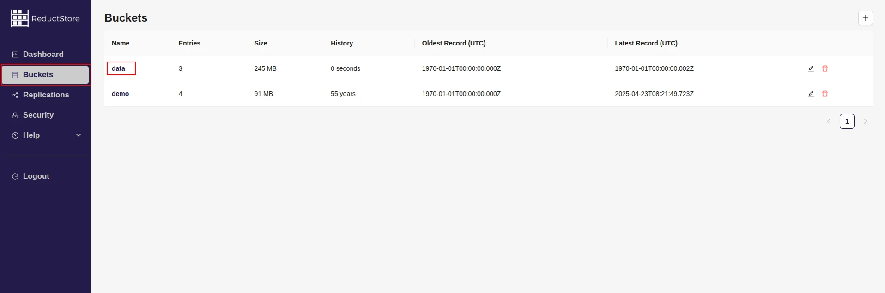
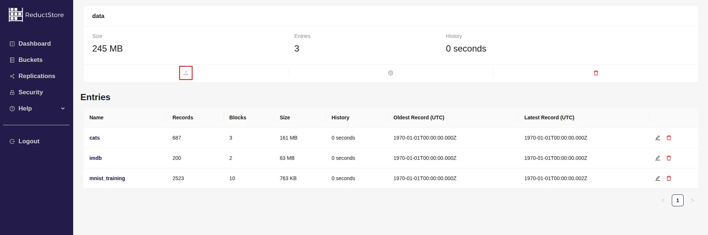

import CodeBlock from "@theme/CodeBlock";
import Tabs from "@theme/Tabs";
import TabItem from "@theme/TabItem";

<head>
  <link
    rel="canonical"
    href="https://www.reduct.store/docs/guides/data-ingestion"
  />
</head>

# Data Ingestion With ReductStore

Data ingestion is the process of collecting, transferring, and loading data into a system. In ReductStore, data ingestion is the first step in storing data. This guide provides an overview of data ingestion in ReductStore and explains how to ingest data using the ReductStore SDKs or the **[HTTP API](../glossary#http-api)**.

## Concepts

Data ingestion in ReductStore is based on HTTP API. Each **[record](../glossary#record)** is sent as a binary object in the body of the POST request
and must have the following information:

- Bucket name, which must exist in the instance.
- Entry name, which is a unique identifier of a data source in the **[bucket](../glossary#bucket)**. If the **[entry](../glossary#entry)** doesn't exist, it will be created.
- Timestamp as a Unix timestamp in microseconds, which is used for sorting and querying data. Must be unique for each record.

Additionally, a writer can add the following information:

- Labels as key-value pairs which can be used for annotating and querying data
- Content type which can be used for data interpretation

ReductStore uses a streaming approach to ingest data. The storage engine receives the data in chunks and streams them in a file system. This enables efficient data ingestion and reduces the memory footprint of the server.

:::info
In case of little size records, ReductStore provides a batch ingestion mode. In this mode, the server receives a batch of records in a single request to reduce the overhead of the HTTP protocol.
:::

### Limitations

The following limitations are applied to the data ingestion process:

- Currently, records and their metadata are immutable. Once a record is ingested successfully, it cannot be overwritten or changed.
- ReductStore doesn't have any limitations on the size of the record, however, the metadata is sent in the HTTP headers of the request and the size of the headers can be limited by the server or client configuration.
- The storage engine needs to know the total size of a record in advance, even if it's sent in chunks. This allows it to reserve the right amount of space for optimal performance

## Typical Data Ingestion Cases

In this section, you can learn how to implement typical data ingestion cases using the ReductStore SDKs or HTTP API. Please note that all examples have been created for a local ReductStore instance accessible at `http://127.0.0.1:8383` using the API token 'my-token'.

For more information on how to set up a local ReductStore instance, refer to the [**Getting Started**](../getting-started/index.mdx) guide.

### Simple Data Ingestion

The simplest way to write data into ReductStore is by sending an entire single record. In this case, the record is transmitted as a binary object in the body of the POST request.

import SimplePy from "!!raw-loader!../examples/py/src/data_ingestion_simple.py";
import SimpleJs from "!!raw-loader!../examples/js/src/data_ingestion_simple.mjs";
import SimpleGo from "!!raw-loader!../examples/go/src/data_ingestion_simple.go";
import SimpleRs from "!!raw-loader!../examples/rs/examples/data_ingestion_simple.rs";
import SimpleCpp from "!!raw-loader!../examples/cpp/src/data_ingestion_simple.cc";
import SimpleCurl from "!!raw-loader!../examples/curl/data_ingestion_simple.sh";

<Tabs>
    <TabItem value="Python">
        <CodeBlock language="python">{SimplePy}</CodeBlock>
    </TabItem>
    <TabItem value="JavaScript">
        <CodeBlock language="javascript">{SimpleJs}</CodeBlock>
    </TabItem>
    <TabItem value="Go">
        <CodeBlock language="go">{SimpleGo}</CodeBlock>
    </TabItem>
    <TabItem value="Rust">
        <CodeBlock language="rust">{SimpleRs}</CodeBlock>
    </TabItem>
    <TabItem value="C++">
        <CodeBlock language="cpp">{SimpleCpp}</CodeBlock>
    </TabItem>
    <TabItem value="Web Console">

        1. Open the Web Console at `http://127.0.0.1:8383` in your browser.
        2. Enter the API token if the authorization is enabled.
        3. Click on the **"Buckets"** tab in the left sidebar.
        4. You will see a list of all buckets in the store.
        5. Click on a specific bucket in the list:
        
        6. Open the upload file modal by clicking on **Upload Icon** in the bucket panel:
        
        7. In the upload file modal, select the entry name or create a new one and select the file to upload:{" "}
        8. Click on the **Upload File** button to upload the file.
        9. Optionally, you can set timestamp and content type for the record.
        If the timestamp is not set, the current time will be used. If the content type is not set, the Web Console will
        try to detect it automatically.

    </TabItem>
    <TabItem value="cURL">
        <CodeBlock language="bash">{SimpleCurl}</CodeBlock>
    </TabItem>

</Tabs>

### Streaming Data

For large records, using the streaming approach is recommended. Here, a client application sends a record in chunks, avoiding loading the entire record into memory. This approach is particularly beneficial for real-time data ingestion, where data is received from a stream and needs to be sent to ReductStore without buffering.

:::info
Despite sending the record in chunks, the size of the record must be known beforehand due to the limitations mentioned above.
:::

import StreamingPy from "!!raw-loader!../examples/py/src/data_ingestion_streaming.py";
import StreamingJs from "!!raw-loader!../examples/js/src/data_ingestion_streaming.mjs";
import StreamingGo from "!!raw-loader!../examples/go/src/data_ingestion_streaming.go";
import StreamingRs from "!!raw-loader!../examples/rs/examples/data_ingestion_streaming.rs";
import StreamingCpp from "!!raw-loader!../examples/cpp/src/data_ingestion_streaming.cc";

<Tabs>
  <TabItem value="Python">
    <CodeBlock language="python">{StreamingPy}</CodeBlock>
  </TabItem>
  <TabItem value="JavaScript">
    <CodeBlock language="javascript">{StreamingJs}</CodeBlock>
  </TabItem>
  <TabItem value="Go">
    <CodeBlock language="go">{StreamingGo}</CodeBlock>
  </TabItem>
  <TabItem value="Rust">
    <CodeBlock language="rust">{StreamingRs}J</CodeBlock>
  </TabItem>
  <TabItem value="C++">
    <CodeBlock language="cpp">{StreamingCpp}</CodeBlock>
  </TabItem>
</Tabs>

### Annotating Data

ReductStore allows you to annotate records by adding labels. Labels, which are key-value pairs, can be used to filter and query data. You can also specify the data type by adding a content type to the record, which can help interpret the data on the client side.

import AnnotatingPy from "!!raw-loader!../examples/py/src/data_ingestion_annotating.py";
import AnnotatingJs from "!!raw-loader!../examples/js/src/data_ingestion_annotating.mjs";
import AnnotatingGo from "!!raw-loader!../examples/go/src/data_ingestion_annotating.go";
import AnnotatingRs from "!!raw-loader!../examples/rs/examples/data_ingestion_annotating.rs";
import AnnotatingCpp from "!!raw-loader!../examples/cpp/src/data_ingestion_annotating.cc";
import AnnotatingCurl from "!!raw-loader!../examples/curl/data_ingestion_annotating.sh";

<Tabs>
    <TabItem value="Python">
        <CodeBlock language="python">{AnnotatingPy}</CodeBlock>
    </TabItem>
    <TabItem value="JavaScript">
        <CodeBlock language="javascript">{AnnotatingJs}</CodeBlock>
    </TabItem>
    <TabItem value="Go">
        <CodeBlock language="go">{AnnotatingGo}</CodeBlock>
    </TabItem>
    <TabItem value="Rust">
        <CodeBlock language="rust">{AnnotatingRs}</CodeBlock>
    </TabItem>
    <TabItem value="C++">
        <CodeBlock language="cpp">{AnnotatingCpp}</CodeBlock>
    </TabItem>
    <TabItem value="Web Console">

        1. Open the Web Console at `http://127.0.0.1:8383` in your browser.
        2. Enter the API token if the authorization is enabled.
        3. Click on the **"Buckets"** tab in the left sidebar.
        4. You will see a list of all buckets in the store.
        5. Click on a specific bucket in the list:
        
        6. Open the upload file modal by clicking on **Upload Icon** in the bucket panel:
        
        7. In the upload file modal, select the entry name or create a new one and select the file to upload:{" "}

        8. Click on the **Add Label** button to add a label and its value to the record. You can add multiple labels by
        clicking the button multiple times.
        9. Click on the **Upload File** button to upload the file.
        10. Optionally, you can set timestamp and content type for the record.
        If the timestamp is not set, the upload time will be used. If the content type is not set, the Web Console will
        try to detect it automatically.

    </TabItem>
    <TabItem value="cURL">
        <CodeBlock language="bash">{AnnotatingCurl}</CodeBlock>
    </TabItem>

</Tabs>

### Batching Data

For smaller records, it is recommended to use batch ingestion mode. This mode allows a client application to send a batch of records in a single request, reducing the HTTP protocol overhead.

If the request is valid but one or more records contain errors, the server does not return an HTTP error. Instead, it provides a map of the records with errors so that the client side can verify them.

import BatchPy from "!!raw-loader!../examples/py/src/data_ingestion_batch.py";
import BatchJs from "!!raw-loader!../examples/js/src/data_ingestion_batch.mjs";
import BatchGo from "!!raw-loader!../examples/go/src/data_ingestion_batch.go";
import BatchRs from "!!raw-loader!../examples/rs/examples/data_ingestion_batch.rs";
import BatchCpp from "!!raw-loader!../examples/cpp/src/data_ingestion_batch.cc";

<Tabs>
  <TabItem value="Python">
    <CodeBlock language="python">{BatchPy}</CodeBlock>
  </TabItem>
  <TabItem value="JavaScript">
    <CodeBlock language="javascript">{BatchJs}</CodeBlock>
  </TabItem>
  <TabItem value="Go">
    <CodeBlock language="go">{BatchGo}</CodeBlock>
  </TabItem>
  <TabItem value="Rust">
    <CodeBlock language="rust">{BatchRs}</CodeBlock>
  </TabItem>
  <TabItem value="C++">
    <CodeBlock language="cpp">{BatchCpp}</CodeBlock>
  </TabItem>
</Tabs>
