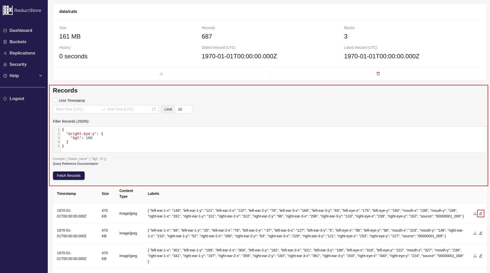
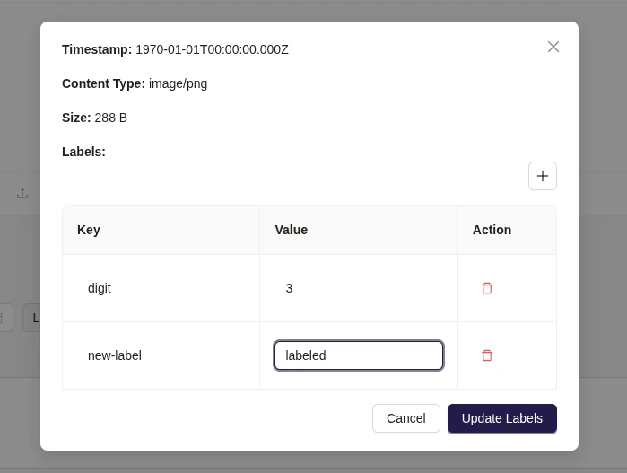
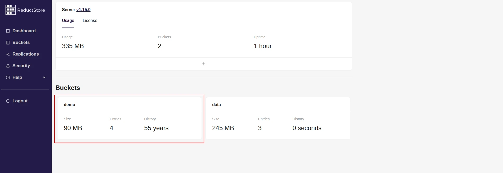
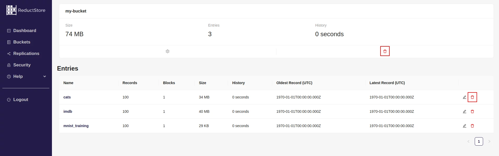
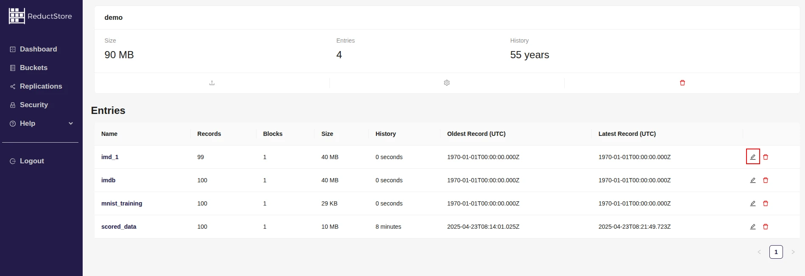
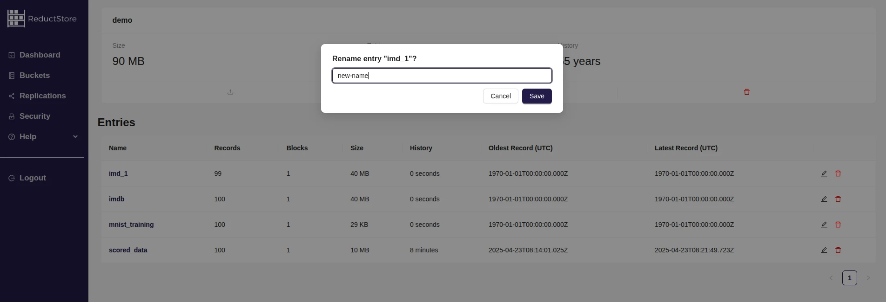

import CodeBlock from "@theme/CodeBlock";
import Tabs from "@theme/Tabs";
import TabItem from "@theme/TabItem";

<head>
  <link
    rel="canonical"
    href="https://www.reduct.store/docs/guides/data-management"
  />
</head>

# Data Management With ReductStore

ReductStore provides a set of methods to manage data in the database. This guide provides an overview of typical data management operations in ReductStore and explains how to perform them using the ReductStore SDKs or the **[HTTP API](../glossary#http-api)**.

## Changing Labels

ReductStore doesn't allow you to change the contents of records, but it does allow you to change the labels of existing records.
You can add, remove or update labels for a single **[record](../glossary#record)** or for a batch of records to avoid HTTP requests overhead.

:::note
You should send a label as an empty string to remove it.
:::

import ChangeLabelsPy from "!!raw-loader!../examples/py/src/data_management_update_labels.py";
import ChangeLabelsJs from "!!raw-loader!../examples/js/src/data_management_update_labels.mjs";
import ChangeLabelsGo from "!!raw-loader!../examples/go/src/data_management_update_labels.go";
import ChangeLabelsRs from "!!raw-loader!../examples/rs/examples/data_management_update_labels.rs";
import ChangeLabelsCpp from "!!raw-loader!../examples/cpp/src/data_management_update_labels.cc";
import ChangeLabelsCurl from "!!raw-loader!../examples/curl/data_management_update_labels.sh";

<Tabs>
  <TabItem value="Python">
    <CodeBlock language="python">{ChangeLabelsPy}</CodeBlock>
  </TabItem>
  <TabItem value="JavaScript">
    <CodeBlock language="javascript">{ChangeLabelsJs}</CodeBlock>
  </TabItem>
    <TabItem value="Go">
        <CodeBlock language="go">{ChangeLabelsGo}</CodeBlock>
    </TabItem>
  <TabItem value="Rust">
    <CodeBlock language="rust">{ChangeLabelsRs}</CodeBlock>
  </TabItem>
  <TabItem value="C++">
    <CodeBlock language="cpp">{ChangeLabelsCpp}</CodeBlock>
  </TabItem>
    <TabItem value="Web Console">

    1. Open the Web Console at `http://127.0.0.1:8383` in your browser.
    2. Enter the API token if the authorization is enabled.
    3. Select the bucket that contains the data you want to query:
    
    4. You will see a list of all the entries in the bucket
    5. Click on the entry you want to query
    6. On the entry page you will see the query panel:
    
    7. Enter the time range in the date picker or manually in the input fields
    8. Click the **Fetch Records** button to execute the query
    9. You will see the meta information about the records that match the time range.
    10. Click on the **Edit** icon in the record row to open the edit panel: 
    11. In the edit panel you can add, remove or update labels for the record.
    12. Click on the **Update Labels** button to save the changes.

  </TabItem>
  <TabItem value="cURL">
    <CodeBlock language="bash">{ChangeLabelsCurl}</CodeBlock>
  </TabItem>
</Tabs>

## Deleting Data

The ReductStore API allows you to delete specific records from an **[entry](../glossary#entry)**, an entire entry, or an entire **[bucket](../glossary#bucket)**.
You can do this using the Client SDKs, the Reduct **[CLI](../glossary#cli)**, or the HTTP API.

### Deleting Entry or Bucket

The following examples show how to delete the entire entry or the entire bucket:

import DeleteDataPy from "!!raw-loader!../examples/py/src/data_management_delete_data.py";
import DeleteDataJs from "!!raw-loader!../examples/js/src/data_management_delete_data.mjs";
import DeleteDataGo from "!!raw-loader!../examples/go/src/data_management_delete_data.go";
import DeleteDataRs from "!!raw-loader!../examples/rs/examples/data_management_delete_data.rs";
import DeleteDataCpp from "!!raw-loader!../examples/cpp/src/data_management_delete_data.cc";
import DeleteDataCli from "!!raw-loader!../examples/cli/data_management_delete_data.sh";
import DeleteDataCurl from "!!raw-loader!../examples/curl/data_management_delete_data.sh";

<Tabs>
  <TabItem value="CLI">
    <CodeBlock language="bash">{DeleteDataCli}</CodeBlock>
  </TabItem>
  <TabItem value="Web Console">

    1. Open the Web Console at `http://127.0.0.1:8383` in your browser.
    2. Enter the API token if the authorization is enabled.
    3. Select a bucket that you want to delete or that contains an entry to be deleted:
    
    4. You will see a list of all the entries in the bucket
    5. To delete the entire bucket, click on the red **bin** icon in the bucket panel. If you want to delete an entry, click on the red **bin** icon in the entry row:
    
    6. Then confirm the deletion by typing the bucket or entry name and clicking on the **Remove** button:

  </TabItem>
    <TabItem value="Python">
      <CodeBlock language="python">{DeleteDataPy}</CodeBlock>
    </TabItem>
    <TabItem value="JavaScript">
      <CodeBlock language="javascript">{DeleteDataJs}</CodeBlock>
    </TabItem>
    <TabItem value="Go">
      <CodeBlock language="go">{DeleteDataGo}</CodeBlock>
    </TabItem>
    <TabItem value="Rust">
      <CodeBlock language="rust">{DeleteDataRs}</CodeBlock>
    </TabItem>
    <TabItem value="C++">
      <CodeBlock language="cpp">{DeleteDataCpp}</CodeBlock>
    </TabItem>
  <TabItem value="cURL">
    <CodeBlock language="bash">{DeleteDataCurl}</CodeBlock>
  </TabItem>
</Tabs>

### Deleting Specific Records

You can remove a single record from an entry or a set of records by specifying their timestamps.

import DeleteRecordsPy from "!!raw-loader!../examples/py/src/data_management_delete_records.py";
import DeleteRecordsJs from "!!raw-loader!../examples/js/src/data_management_delete_records.mjs";
import DeleteRecordsGo from "!!raw-loader!../examples/go/src/data_management_delete_records.go";
import DeleteRecordsRs from "!!raw-loader!../examples/rs/examples/data_management_delete_records.rs";
import DeleteRecordsCpp from "!!raw-loader!../examples/cpp/src/data_management_delete_records.cc";
import DeleteRecordsCurl from "!!raw-loader!../examples/curl/data_management_delete_records.sh";
import DeleteRecordsCli from "!!raw-loader!../examples/cli/data_management_delete_records.sh";

<Tabs>
  <TabItem value="CLI">
    <CodeBlock language="bash">{DeleteRecordsCli}</CodeBlock>
  </TabItem>
  <TabItem value="Python">
    <CodeBlock language="python">{DeleteRecordsPy}</CodeBlock>
  </TabItem>
    <TabItem value="Go">
        <CodeBlock language="go">{DeleteRecordsGo}</CodeBlock>
    </TabItem>
  <TabItem value="JavaScript">
    <CodeBlock language="javascript">{DeleteRecordsJs}</CodeBlock>
  </TabItem>
  <TabItem value="Rust">
    <CodeBlock language="rust">{DeleteRecordsRs}</CodeBlock>
  </TabItem>
  <TabItem value="C++">
    <CodeBlock language="cpp">{DeleteRecordsCpp}</CodeBlock>
  </TabItem>
  <TabItem value="cURL">
    <CodeBlock language="bash">{DeleteRecordsCurl}</CodeBlock>
  </TabItem>
</Tabs>

### Deleting Records in a Time Range

You can delete records in a specific time range by specifying the start and end timestamps, and you can use query parameters to filter the records:

| Parameter | Description                                | Type             | Default                                        |
| --------- | ------------------------------------------ | ---------------- | ---------------------------------------------- |
| `start`   | Remove records from                        | Timestamp        | The timestamp of the first record in the entry |
| `end`     | Remove records until                       | Timestamp        | The timestamp of the last record in the entry  |
| `when`    | Condition, remove a record when it is true | JSON-like object | No condition                                   |

All the listed parameters are the same as the query parameters for the `query` method. Read more about the querying data in the **[Querying Data](data-querying.mdx#filter-parameters)** guide.

The following examples show how to delete records in a specific time range:

import DeleteRecordsRangePy from "!!raw-loader!../examples/py/src/data_management_delete_query.py";
import DeleteRecordsRangeJs from "!!raw-loader!../examples/js/src/data_management_delete_query.mjs";
import DeleteRecordsRangeGo from "!!raw-loader!../examples/go/src/data_management_delete_query.go";
import DeleteRecordsRangeRs from "!!raw-loader!../examples/rs/examples/data_management_delete_query.rs";
import DeleteRecordsRangeCpp from "!!raw-loader!../examples/cpp/src/data_management_delete_query.cc";
import DeleteRecordsRangeCurl from "!!raw-loader!../examples/curl/data_management_delete_query.sh";
import DeleteRecordsRangeCli from "!!raw-loader!../examples/cli/data_management_delete_query.sh";

<Tabs>
  <TabItem value="CLI">
    <CodeBlock language="bash">{DeleteRecordsRangeCli}</CodeBlock>
  </TabItem>
  <TabItem value="Python">
    <CodeBlock language="python">{DeleteRecordsRangePy}</CodeBlock>
  </TabItem>
  <TabItem value="JavaScript">
    <CodeBlock language="javascript">{DeleteRecordsRangeJs}</CodeBlock>
  </TabItem>
    <TabItem value="Go">
        <CodeBlock language="go">{DeleteRecordsRangeGo}</CodeBlock>
    </TabItem>
  <TabItem value="Rust">
    <CodeBlock language="rust">{DeleteRecordsRangeRs}</CodeBlock>
  </TabItem>
  <TabItem value="C++">
    <CodeBlock language="cpp">{DeleteRecordsRangeCpp}</CodeBlock>
  </TabItem>
  <TabItem value="cURL">
    <CodeBlock language="bash">{DeleteRecordsRangeCurl}</CodeBlock>
  </TabItem>
</Tabs>

:::warning
Deleting records in a time range is a heavy operation and may take a long time to complete because it copies the retained records to new blocks and deletes the old ones.
:::

## Renaming Entries

An entry can be renamed using the SDKs, CLI client, **[Web Console](../glossary#web-console)**, or REST API. A client must have write permission to a bucket to rename its entries if the authorization is enabled.

import RenameEntryCLI from "!!raw-loader!../examples/cli/data_management_rename_entries.sh";
import RenameEntryPy from "!!raw-loader!../examples/py/src/data_management_rename_entries.py";
import RenameEntryJs from "!!raw-loader!../examples/js/src/data_management_rename_entries.mjs";
import RenameEntryGo from "!!raw-loader!../examples/go/src/data_management_rename_entries.go";
import RenameEntryRs from "!!raw-loader!../examples/rs/examples/data_management_rename_entries.rs";
import RenameEntryCpp from "!!raw-loader!../examples/cpp/src/data_management_rename_entries.cc";
import RenameEntryCurl from "!!raw-loader!../examples/curl/data_management_rename_entries.sh";

<Tabs>
  <TabItem value="CLI">
    <CodeBlock language="shell">{RenameEntryCLI}</CodeBlock>
  </TabItem>

  <TabItem value="Web Console">

    1. Open the Web Console at `http://127.0.0.1:8383` in your browser.
    2. Enter the API token if the authorization is enabled.
    3. Select the bucket that contains the entry you want to rename:
    
    4. You will see a list of all the entries in the bucket
    5. Click on the edit icon in the entry row:
    
    6. Rename the entry and click on the **Save** button:
    

  </TabItem>

  <TabItem value="Python">
    <CodeBlock language="python">{RenameEntryPy}</CodeBlock>
  </TabItem>
  <TabItem value="JavaScript">
    <CodeBlock language="javascript">{RenameEntryJs}</CodeBlock>
  </TabItem>
    <TabItem value="Go">
        <CodeBlock language="go">{RenameEntryGo}</CodeBlock>
    </TabItem>
  <TabItem value="Rust">
    <CodeBlock language="rust">{RenameEntryRs}</CodeBlock>
  </TabItem>
  <TabItem value="C++">
    <CodeBlock language="cpp">{RenameEntryCpp}</CodeBlock>
  </TabItem>
  <TabItem value="cURL">
    <CodeBlock language="bash">{RenameEntryCurl}</CodeBlock>
  </TabItem>
</Tabs>
